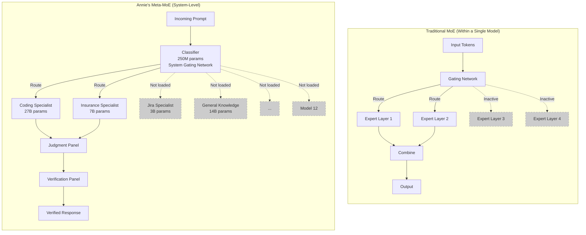
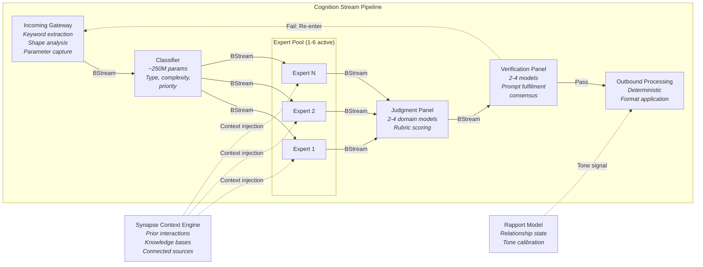
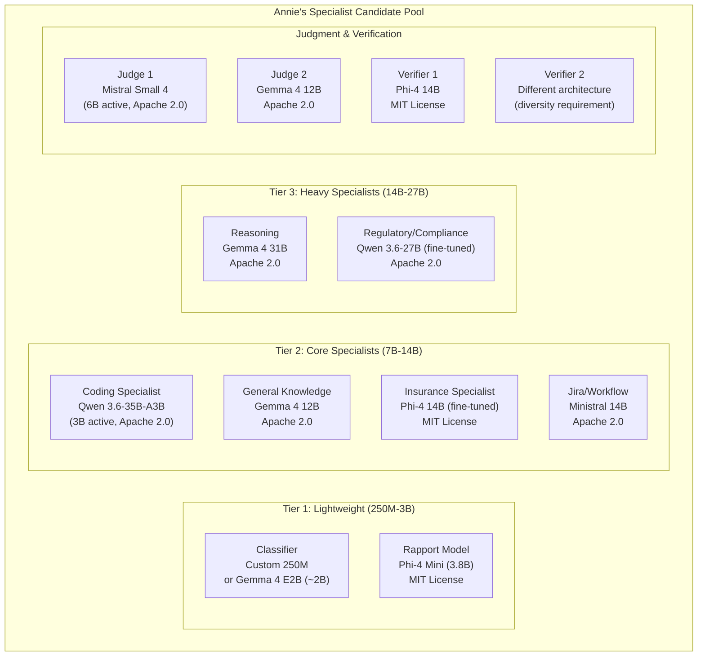
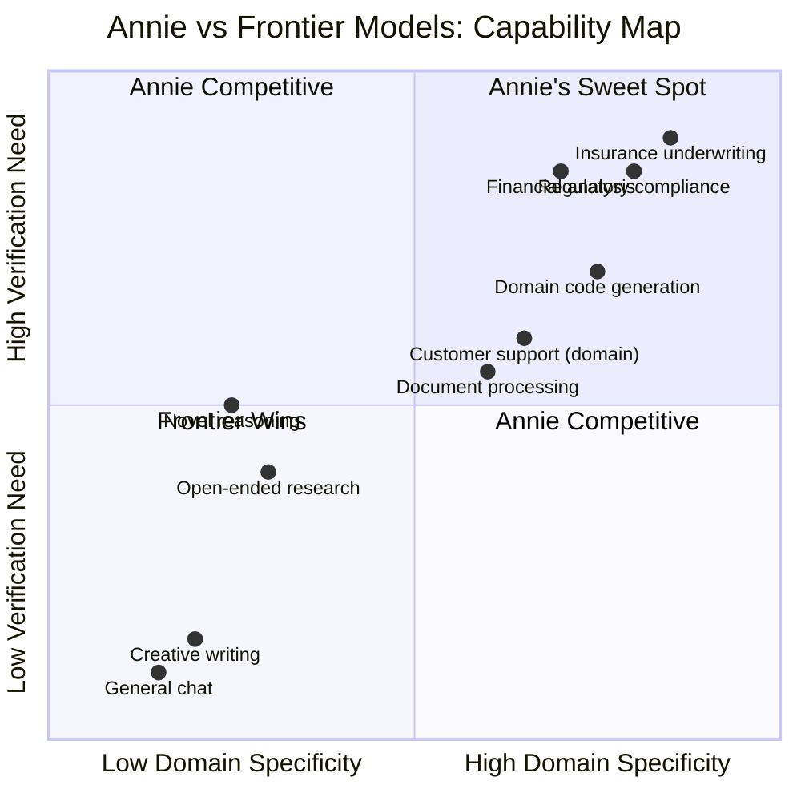

# Annie Architecture: Hierarchical Mixture of Experts for Sovereign AI

## Executive Summary

Annie (Agentic Neural Network Intelligence Engine) is a hierarchical Mixture of Experts system that applies the same sparse-activation principle driving frontier AI efficiency -- route to the right expert, activate only what you need -- at the level of entire models rather than neural network layers. The architecture consists of one sovereign base model (sparse MoE, pre-trained from scratch) fine-tuned into five unique domain specialist variants, plus Qwen 3.6:27B with extensive additional training. These six physical models (1 base + 5 fine-tuned variants + Qwen) fill twelve logical pipeline roles -- classifier, domain experts, judgment models, verification models, rapport model, etc. -- with some models serving multiple roles. The base model was trained from scratch on 1.5 trillion tokens of Paul/Evari-specific domain data plus 15 trillion tokens of open-source permissible datasets. The five unique fine-tunes derived from that base handle core domain specialisation (coding, insurance, general knowledge, regulatory compliance, etc.), while Qwen 3.6:27B (27 billion parameters) serves as the largest specialist for complex reasoning tasks. The total initial training investment was a modest capital outlay -- orders of magnitude below frontier training costs -- covering cloud GPU compute for base model pre-training and internal server hardware for fine-tuning, post-training, and continuous improvement. A lightweight classifier acts as the system-level gating network, routing simple queries to a fast path and complex work through a multi-stage pipeline of parallel expert processing, score-based consensus judging, and closed-loop verification.

This architecture makes three bets that diverge from the industry's default of "buy API access to the biggest model available." First, that a portfolio of cheap, domain-tuned specialists coordinated through consensus will match or exceed frontier model quality on defined domain tasks -- a bet supported by a growing body of research showing ensembles of small models outperforming single large models in both accuracy and compute efficiency. Second, that verification matters more than speed for consequential work -- that an AI coworker who checks her own work before responding is more valuable than one who answers instantly and is wrong 14% of the time. Third, that sovereign deployability on customer-controlled infrastructure is not a nice-to-have but an operational requirement, validated by the Fable 5 service suspension that left dependent organisations without AI capability overnight.

The result is a system that runs on modest hardware (consumer GPUs for individual specialists), costs orders of magnitude less than frontier API access at scale, can be deployed entirely within a customer's jurisdiction with no external dependencies, and produces verified, consensus-backed responses for high-stakes domain work -- while still delivering sub-second responses for simple queries through intelligent complexity-based routing.

## The Core Insight: Meta-MoE

The Mixture of Experts architecture has become dominant at the frontier because it solves a fundamental efficiency problem: a dense model activates every parameter for every token, but most parameters are irrelevant to most inputs. MoE models partition their parameters into specialist groups and route each token to only the relevant experts. DeepSeek V4-Pro activates 49 billion of its 1.6 trillion total parameters per token. Mixtral 8x7B activates roughly 13 billion of its 47 billion. The principle is simple: keep a large catalogue of expertise, but only pay the compute cost for what you actually need.

Annie applies this identical principle one level higher. Instead of routing tokens to expert sublayers within a single model, Annie routes entire prompts to specialist models within a system-level expert pool. The classifier is the gating network. The 1-6 loaded models at any moment are the top-k routing selection. The full catalogue of twelve specialists (extensible to hundreds or thousands) is the expert pool. And because each specialist model can itself use internal MoE architecture (as models like Qwen 3.6-35B-A3B and Mistral Small 4 do), the active parameter count at any moment is a fraction of a fraction of total system capacity.

This matters because it combines the efficiency gains of MoE with properties that intra-model MoE cannot provide: each specialist can be independently trained, fine-tuned, replaced, or upgraded without touching the rest of the system. A new domain (say, healthcare compliance) is added by training a new specialist and registering it in the catalogue -- not by retraining a trillion-parameter model. The cost of adding a 7B specialist is \$50K-\$500K. The cost of retraining a frontier model is \$500M or more.

The research literature has begun to formalise this concept. Quirke et al.'s "Beyond Monoliths: Expert Orchestration for More Capable, Democratic, and Safe Language Models" (submitted to NeurIPS 2025) argues that expert orchestration delivers superior performance to monolithic models, with clearer evaluation metrics, narrower input spaces for testing, and more effective application of specialised human expertise. Chai et al.'s "An Expert is Worth One Token" (ACL 2024) demonstrated that representing expert LLMs as tokens in a meta-LLM's vocabulary -- literally lifting MoE routing from layers to entire models -- outperforms existing multi-LLM collaboration paradigms across six expert domains.

## Architecture Deep Dive

### The Cognition Stream

Every component in Annie communicates through a single backbone: the Cognition Stream, implemented on Bellerophon BStream. This is a deliberate architectural choice. Rather than building custom orchestration logic to coordinate twelve models, a classifier, judgment panels, and verification panels, Annie treats the entire pipeline as a series of messages flowing through a durable, observable stream.

Bellerophon provides several properties that would be expensive and error-prone to build from scratch:

- **Durability**: Every message (prompt, classification, expert response, judgment, verification result) is persisted. Nothing is lost if a component crashes or is restarted.
- **Replay**: Any point in the pipeline can be replayed from the stream. This makes debugging straightforward -- you can trace exactly what the classifier decided, what each expert produced, how the judgment panel scored them, and whether verification passed or failed.
- **Backpressure**: If experts are slower than incoming prompts, the stream manages queueing and flow control rather than dropping requests or overwhelming GPU memory.
- **Observability**: Every stage transition is a stream event. Latency, throughput, error rates, and routing decisions are measurable without custom instrumentation.
- **Decoupling**: Components subscribe to the message types they care about. The classifier does not need to know which experts are loaded. Experts do not need to know about the judgment panel. This makes the system genuinely composable.

The alternative -- direct API calls between components with custom retry logic, circuit breakers, and state management -- would produce a system that works identically in the happy path but fails unpredictably under load, is opaque to debugging, and requires custom code for every new interaction pattern. Every mature distributed system eventually builds or adopts a messaging backbone. Annie starts with one.

### The Classification Layer

The classifier is the smallest model in the system (~250M parameters) and the most critical. It makes two decisions that determine everything downstream: how complex is this prompt, and what domain(s) does it belong to?

**Fast path**: Low-complexity, general queries -- greetings, simple factual lookups, clarification questions -- skip the consensus pipeline entirely. A single appropriate expert responds directly. This is how Annie achieves sub-second latency for the majority of interactions. Research from FrugalGPT (Chen et al., 2023) and RouteLLM (UC Berkeley et al., 2024) demonstrates that intelligent routing can deliver 85-98% cost reduction while maintaining quality, precisely because most queries do not require the full weight of the system.

**Full pipeline**: High-complexity knowledge work, domain-specific tasks, anything with consequences -- flows through expert processing, judgment, and verification. The latency cost is measured in seconds to minutes, but the output is consensus-verified.

This is not a novel pattern. It is the same complexity-based routing that every well-designed customer service operation uses (tier 1 handles simple queries, escalates complex ones) and that every MoE model uses internally (route easy tokens cheaply, hard tokens to more experts). Annie applies it at the system level with the classifier as the gating function.

The classifier's small size is a feature: it loads instantly, runs on minimal hardware, and can be retrained cheaply as the domain catalogue evolves. At 250M parameters, it adds negligible latency to every request while determining whether the response requires \$0.001 or \$0.10 of compute.

### Expert Orchestration

Annie maintains a catalogue of twelve specialist models (today), of which one to six are loaded into GPU or CPU memory at any given time. The classifier's complexity and domain signals determine which experts engage and how many work in parallel on the same prompt.

For a low-complexity coding question, a single coding specialist responds. For a high-complexity insurance coverage determination that touches regulatory compliance, multiple specialists may engage in parallel: the insurance domain expert, a regulatory specialist, and a general reasoning model. Each expert writes its response back to the Cognition Stream independently.

**Why small specialists beat one big generalist on domain tasks**: The research is clear on this point. Microsoft's Phi-3 Technical Report (2024) showed that a 3.8B parameter model trained on curated data rivals Mixtral 8x7B and GPT-3.5 on standard benchmarks. Research published at arXiv (2505.24189, 2025) found that fine-tuning a small language model can outperform prompting a frontier LLM on domain-specific tasks. Apple's production architecture uses a ~3B on-device model with runtime-swappable LoRA adapters for task specialisation -- effectively system-level MoE deployed at billion-device scale.

The efficiency argument is quantitative. Kondratyuk et al. (Google AI, 2020) demonstrated that on ImageNet, an ensemble of two EfficientNet-B5 models matches EfficientNet-B7 accuracy using approximately 50% fewer FLOPs, with the efficiency gap widening as models get larger. SLM-MUX (Wang et al., 2024) showed that just two small language models can outperform Qwen 2.5 72B on GPQA and GSM8K. The "Blending Is All You Need" study (Chai Research, 2024) demonstrated that an ensemble of three models totalling ~25B parameters outperformed ChatGPT (175B+) in real-world user retention and engagement over 30 days of A/B testing.

**Model loading and unloading**: Not all twelve specialists need to be resident in memory simultaneously. The classifier's domain signals determine which models are needed. Frequently-used specialists remain loaded; niche specialists are loaded on demand. With modern quantisation (Q4/Q8) and frameworks like vLLM, a 7B model loads in seconds. The Cognition Stream's backpressure management ensures prompts queue gracefully during model loading rather than failing.

**Tool use during expert processing**: During inference, Annie's specialist models operate in two tiers. Internal platform tools (Synapse context queries, knowledge base searches, internal platform APIs) execute immediately as part of expert processing. External tools (reading files on customer systems, calling customer APIs, writing and executing code in external environments, querying external databases) are returned as tool call requests in the expert's response -- similar to how frontier models return tool_use blocks. These external requests are resolved at judgment time and executed by the client, not by Annie. All tool inputs and outputs flow through the same judgment and verification pipeline as generated text responses, ensuring that all external actions are evaluated and verified before reaching the user.

### Score-Based Consensus

When multiple experts produce responses to the same prompt, the Judgment Panel evaluates them. This is not a simple majority vote. Two to four domain-specific models are selected based on the prompt's classification, and each scores the expert responses against rubrics -- structured evaluation criteria specific to the domain and task type.

The highest-scoring response wins. This could be a single expert's response used verbatim, or an amalgamation that draws from multiple expert outputs. The judgment is published back to the Cognition Stream with full scoring details, making every decision auditable.

**Why consensus beats single-pass inference**: The evidence is substantial. Wang et al.'s "Self-Consistency" paper (ICLR 2023) demonstrated that sampling multiple reasoning paths and selecting the most consistent answer improves accuracy by 17.9% on GSM8K, 11.0% on SVAMP, and 12.2% on AQuA. Verga et al.'s Panel of LLM Evaluators (PoLL) showed that a panel of three small, diverse models from different providers outperformed a single large judge across six datasets while reducing intra-model bias at significantly lower cost. The Language Model Council (Zhao et al., 2024) demonstrated that a council of LLMs that evaluate each other produces rankings more robust and less biased than any individual judge.

**Why rubrics matter**: Research from "Beyond the Illusion of Consensus" (2026) revealed that model-level agreement masks fragile sample-level agreement, and that dynamically generated rubrics with domain-knowledge grounding increase agreement by 22-27% depending on domain. "Rubric Is All You Need" (ACM ICER 2025) confirmed that question-specific rubrics outperform generic evaluation criteria. Annie's rubrics are domain-specific by design -- an insurance coverage determination is judged against different criteria than a code review.

**The independence problem -- and Annie's structural advantage**: A critical 2025 study ("Nine Judges, Two Effective Votes") found that nine frontier LLMs from seven model families provide only about two independent votes' worth of information because they make correlated errors. This dramatically limits the theoretical gains from consensus. Annie has a structural advantage here: its specialists are genuinely different models, trained on different data for different domains, with different architectures and parameter counts. A 3B insurance specialist and a 14B coding model and a 7B general knowledge model are far less likely to share correlated failure modes than three versions of GPT-4. The literature confirms this: diverse panels from different providers outperform homogeneous panels, and cross-model probes significantly enhance error detection where within-model consistency fails (Tan et al., EMNLP 2025).

### Closed-Loop Verification

After the Judgment Panel selects or synthesises a response, the Verification Panel performs a distinct function: it compares the judged response against the original prompt and determines whether the response actually fulfils what was asked. Two to four models must reach consensus on this binary question.

If verification passes, the response is published to the outbound stream. If it fails, the original prompt re-enters the pipeline from scratch, and the current result is discarded.

**Why this matters for high-stakes domains**: In insurance, a coverage determination that misinterprets a policy exclusion costs real money. In government, an incorrect regulatory interpretation has legal consequences. In finance, a flawed risk assessment can trigger material losses. These are domains where getting the answer right matters more than getting it fast.

The evidence supports verification as a powerful quality lever. Meta AI's Chain-of-Verification (2023) improved factual accuracy by 4-8% across question types. VeriFY (2026) achieved 9.7-53.3% hallucination reduction by teaching models to reason about factual uncertainty through consistency-based self-verification. A multi-modal fact-verification framework (2025) demonstrated 67% hallucination reduction without sacrificing response quality. "Sample, Scrutinize and Scale" (2025) showed that scaling verification at inference time allowed Gemini v1.5 to surpass o1-Preview performance on reasoning benchmarks.

The generate-verify-refine loop -- treating the system's own output as a hypothesis to be tested rather than an answer to be delivered -- is emerging as a recognised pattern in the literature. Annie implements this structurally: generation (experts), verification (the panel), and refinement (re-entry on failure) are separate stages with separate models, connected through the Cognition Stream.

**The discard-and-restart limitation**: Currently, when verification fails, the entire response is discarded and the prompt starts fresh. This is wasteful -- the failed response contains information about what went wrong that could guide a better second attempt. The improvement roadmap includes feeding verification failure signals back to experts as additional context on re-entry, enabling targeted refinement rather than blind restart. The current approach is conservative by design: it guarantees that a failed response cannot contaminate a second attempt, at the cost of redundant computation.

### Synapse and the Rapport Model

**Synapse Context Engine** searches prior prompts, responses, knowledge bases, and connected sources to provide situational context to every expert. When an insurance specialist processes a coverage question, Synapse provides the relevant policy documents, prior interactions about the same account, and applicable regulatory guidance. This context is injected alongside the prompt, giving each expert full situational awareness rather than treating every interaction as isolated.

**The Rapport Model** is one of the twelve specialist models, but it serves a unique function: it tracks the relationship state between Annie and each individual user. Rather than a binary toggle between "formal" and "casual," the Rapport Model understands where each relationship sits on a continuum and calibrates Annie's communication style accordingly.

A new or unknown user receives clinical, professional responses. As interactions accumulate and rapport builds, Annie's full personality emerges -- warm, direct, bantery communication that reflects a genuine working relationship. A high-rapport user asking a simple question gets a different tone than a first-time user asking the same question, even though the factual content is identical.

This is a meaningful differentiator. Research published in Nature (Scientific Reports, 2026) found that personalisation -- remembering preferences and prior interactions -- significantly enhances emotional bonding, satisfaction, and trust. Three experimental studies (n=643) on emotional AI found that empathic conversational agents are perceived as warmer and more competent, positively influencing satisfaction and word-of-mouth. McKinsey's personalisation research documents 5-15% revenue lift on average from personalised interactions.

The Rapport Model makes Annie feel like a coworker who knows you, not a stateless API that treats every request as a fresh transaction. This is deliberate alignment with the "AI coworker" paradigm that 76% of executives already use to frame agentic AI (BCG, November 2025).

### Sleep Cycles and Continuous Learning

Prompts and responses are never discarded. Every interaction -- the original prompt, the classification decision, each expert's response, the judgment scores, the verification outcome -- persists in the Cognition Stream. During off-peak periods (sleep cycles), this data is used to train and refine the specialist models.

This creates a flywheel: more interactions produce more training data, which produces better specialists, which produce better responses, which build more rapport and trust, which drives more interactions. The flywheel spins faster with small models because fine-tuning a 7B model on domain-specific interaction data costs under \$5 per run and takes hours rather than weeks. A frontier model cannot be continuously refined from customer interactions at any reasonable cost.

The sleep cycle pattern also means that Annie's specialists improve specifically on the domains and query types that her actual users care about, rather than improving on abstract benchmarks. A deployment serving insurance professionals will develop increasingly sharp insurance expertise. A deployment serving software engineers will sharpen on coding tasks. The same architecture adapts to radically different use cases through the data it processes.

## Architectural Decisions and Tradeoffs

| Decision | Alternative Considered | Why Annie Chose This | Honest Tradeoff |
|---|---|---|---|
| **Multi-model ensemble** | Single large model (e.g., 70B+ generalist) | Ensembles of small models outperform single large models on domain tasks at lower cost (Kondratyuk et al. 2020, SLM-MUX 2024, Chai Research 2024). Independent training, replacement, and upgrade of individual specialists. | Higher system complexity. Coordination overhead. No single model's coherence across an extended multi-turn conversation -- context must be managed externally through Synapse. |
| **Asynchronous pipeline** | Synchronous request-response | Quality verification requires multiple stages that take time. The "coworker" model aligns with how knowledge workers actually operate. The market is moving toward async agents (\$26B Devin valuation, GitHub Copilot agent mode). | Users accustomed to ChatGPT-speed responses may find latency jarring for complex queries. Requires UX that sets expectations and communicates progress. Simple queries must still be fast (solved by fast path). |
| **Small specialists (250M-27B)** | One large generalist (70B+) | Specialists match or exceed generalist performance on defined domain tasks at 5-50x lower inference cost. Each fits on a consumer GPU. Training cost per specialist: \$2K-\$500K vs \$500M+ for frontier. | Weaker on novel, cross-domain reasoning that requires broad world knowledge. A 7B insurance specialist will not match Opus 4.8 on open-ended creative writing. Annie must know her boundaries. |
| **Score-based consensus pipeline** | Single-pass inference | Multi-model consensus improves accuracy by 4-18% depending on task (Wang et al. 2023). Panels of diverse small models outperform single large judges (Verga et al. 2024). Domain-specific rubrics increase agreement by 22-27% (2026). | 2-5x compute cost per complex query compared to single-pass. Latency increases linearly with pipeline stages. Consensus quality depends on genuine model diversity -- homogeneous panels provide minimal benefit. |
| **Bellerophon BStream backbone** | Custom orchestration / direct API calls | Durability, replay, backpressure, and observability out of the box. Every message auditable. Decoupled components enable independent scaling and deployment. | Dependency on Bellerophon platform. Additional infrastructure to operate. Message serialisation overhead (negligible compared to model inference, but non-zero). |
| **Score-based judgment with rubrics** | Simple majority voting / single judge | Rubric-based evaluation is more reliable and domain-appropriate than unstructured voting. Dynamically generated rubrics outperform static ones. Scoring is auditable and explainable. | Rubric design requires domain expertise. Poor rubrics produce poor judgments. Rubric maintenance is an ongoing cost as domains evolve. |
| **Discard-and-restart on verification failure** | Incremental refinement of failed response | Conservative: prevents contamination of second attempt by failed first attempt. Simpler to reason about correctness. | Wasteful: discards information about what went wrong. Redundant computation on re-entry. Improvement roadmap includes targeted refinement using failure signals. |

## Value Propositions

### Sovereign Deployability

Annie runs entirely on customer-controlled infrastructure. Every component -- the classifier, all specialist models, the judgment and verification panels, the Cognition Stream, the Synapse context engine -- deploys on hardware the customer owns and operates. No data leaves the customer's jurisdiction. No external API call is required for any inference.

This is not an abstract compliance checkbox. When Fable 5's service was suspended, organisations dependent on its API lost AI capability overnight with no recourse. Annie at L3-L4 sovereignty (see [SOTA Landscape](annie/sota-landscape.mdx)) means the customer can disconnect from the internet entirely and the system continues to function. For government, defence, healthcare, and financial services organisations operating under data residency requirements, this is a hard requirement, not a preference.

The \$301.6 billion projected sovereign AI infrastructure market by 2040 consists primarily of hardware and cloud plays. Annie provides the model-layer product that makes sovereign infrastructure useful -- the part that turns GPUs into an AI coworker.

### Cost Efficiency

The cost differential between Annie and frontier API access is not marginal; it is structural.

| | Frontier API (Opus 4.8) | Frontier API (Gemini 3.1 Pro) | Annie Self-Hosted |
|---|---|---|---|
| **Input cost per MTok** | \$5.00 | \$2.00-4.00 | Electricity + amortised hardware |
| **Output cost per MTok** | \$25.00 | \$12.00-18.00 | Electricity + amortised hardware |
| **At 100M tokens/day** | \$1,500-5,000/day | \$700-2,200/day | \$50-200/day |
| **Annual cost at scale** | \$550K-1.8M | \$255K-800K | \$18K-73K |
| **Training a new domain** | Not possible | Not possible | \$2K-500K per specialist |
| **Hardware investment** | None (API) | None (API) | \$5K-200K (one-time) |

At 100M tokens per day, Annie's self-hosted cost is 10-100x lower than frontier API access. The break-even on hardware investment occurs within weeks to months depending on usage volume. And unlike API access, the marginal cost of additional inference approaches zero once hardware is provisioned -- there is no per-token charge.

*Cost assumptions: 50/50 input/output token ratio, no prompt caching, standard context lengths (\<32K), no batch discounts for API pricing. Annie self-hosted estimates assume Australian electricity at A\$0.30/kWh and amortised hardware over 3 years. Actual costs will vary by workload profile. A detailed cost model with customer-specific assumptions should be built for each partner conversation.*

Annie's consensus pipeline does multiply compute per complex query by 2-5x compared to single-pass inference. But 5x the cost of self-hosted inference on consumer GPUs is still dramatically cheaper than 1x the cost of frontier API access.

### Domain Extensibility

Adding a new domain to Annie means training a new specialist model and registering it in the catalogue. The existing classifier is updated (or retrained -- at 250M parameters, this is cheap and fast) to recognise the new domain. No other component changes. The judgment and verification panels work with any domain because they evaluate against rubrics, not against hard-coded domain knowledge.

This composability means Annie can serve radically different markets from the same architecture. An insurance deployment and a software engineering deployment share the pipeline, the Cognition Stream, the consensus mechanism, and the verification loop. They differ only in which specialists are loaded and which rubrics are configured.

For customers, this means new capabilities are additive, not replacement. A deployment that starts with three specialists can grow to twelve or fifty as needs evolve, without rearchitecting anything.

**Annie is a platform, not a model.** This distinction matters strategically. Annie ships with Evari's own sovereign models as proof of concept, but the twelve pipeline roles are open slots. A bank brings their own risk model. A defence contractor plugs in a classified domain specialist. A health service adds a clinical decision model. Each customer's models run through the same classification, consensus, and verification pipeline. The architecture is the product. The models are replaceable components. This means Annie's value grows with every customer who brings their own expertise to the platform, and every new model on the platform is additional compute demand on the infrastructure that hosts it.

### Quality Through Verification

Annie's closed-loop verification is not a marketing feature; it is a structural property of the pipeline. Every complex response is evaluated by multiple models against rubrics before it reaches the user. Responses that fail verification are rejected and regenerated.

The evidence for multi-model verification is strong: Chain-of-Verification reduces hallucination by 4-8% (Meta AI, 2023). VeriFY achieves 9.7-53.3% hallucination reduction (2026). Multi-agent consistency verification reduces Expected Calibration Error by 49-74% across medical benchmarks (2026). The Six Sigma Agent paper (2026) mathematically proves that consensus voting with n independent agents reduces error to O(p^(ceil(n/2))), enabling exponential reliability gains.

For high-stakes domains where errors have financial, legal, or safety consequences, this is the difference between a useful tool and a liability. The 39% of AI-powered customer service bots that were pulled back or reworked in 2024 due to hallucination errors (ComputerTechReviews, 2025) represent exactly the failure mode that verification prevents.

### Hardware Accessibility

Annie's specialist models run on consumer-grade GPUs. A quantised 7B model requires approximately 5-8GB of VRAM -- well within the capability of an NVIDIA RTX 4070 or equivalent. Even the largest specialists in the current catalogue (27B parameters) fit on a single RTX 4090 or equivalent with Q4 quantisation (~20GB VRAM).

A full Annie deployment serving a mid-sized organisation can run on hardware costing \$5K-\$50K. Compare this to the datacentre-scale infrastructure required for frontier models: DeepSeek V4-Pro's 1.6 trillion parameters require multi-node GPU clusters even with its efficient sparse activation. Fable 5's training infrastructure costs billions. Annie's operational infrastructure costs what a small business spends on office furniture.

### Continuous Improvement

Every interaction makes Annie better at the specific work her users need. Sleep cycle training on accumulated interaction data is cheap (under \$5 per fine-tuning run for a 7B model), fast (hours, not weeks), and targeted (improving on actual user queries, not abstract benchmarks).

This flywheel does not exist with frontier API access. OpenAI and Anthropic train their models on their schedule, optimising for their benchmarks, with no mechanism for a customer's domain-specific interactions to improve the model they are using. Annie's specialists get better at insurance work because they process insurance work. They get better at code review because they perform code reviews. The improvement is automatic, continuous, and domain-specific.

### Tool Capability

Annie's specialist models are not text generators alone — they are agentic. During expert processing, specialists invoke two categories of tools. **Internal platform tools** (Synapse context queries, knowledge base searches, internal platform APIs) execute immediately as part of inference. **External tools** (querying customer databases, calling business APIs, interacting with ticketing systems like Jira, writing and executing code in external environments, retrieving documents from customer systems) are returned as tool call requests in the expert's response -- identical to how frontier models return tool_use blocks. These external requests are resolved at judgment time and executed by the client. Tool inputs and outputs are captured in the Cognition Stream and flow through the same judgment and verification pipeline as generated responses, ensuring all external actions are evaluated for correctness before reaching the user.

### Relationship-Aware Interaction

The Rapport Model transforms Annie from a stateless query processor into a colleague who understands working relationships. Research consistently shows that personalisation and adaptive tone improve satisfaction, trust, and engagement. Annie's approach is not a surface-level "add the user's name to responses" gimmick -- it is a model that understands relationship depth and calibrates communication style across a continuous spectrum.

This matters for the coworker paradigm. Real coworkers develop rapport. They communicate differently with people they have worked with for years versus someone they just met. Annie's Rapport Model replicates this natural dynamic, making the "AI coworker" framing feel genuine rather than aspirational.

## The Specialist Model Landscape

Annie's current specialists are five fine-tunes of the sovereign Workforce base model (sparse MoE, trained from scratch on 1.5T curated Evari tokens + 15T open-source tokens) plus Qwen 3.6:27B. These six physical models fill twelve logical pipeline roles, with some models serving multiple roles. Annie is currently domain-specialised for Evari's insurance technology and platform development work -- expanding to new domains requires training new specialists or customers injecting their own models.

The table below shows the open-source landscape available for customer deployments and future specialist expansion. Because Annie is a platform with model-agnostic slots, any of these models can fill a role in the pipeline (see [SOTA Landscape](annie/sota-landscape.mdx) for detailed analysis).

Key candidates and their fit:

| Role | Model Candidate | Parameters | VRAM (Q4) | License | Key Strength |
|---|---|---|---|---|---|
| Classifier / Gating | Custom or Gemma 4 E2B | ~250M-2B | ~1.5GB | Apache 2.0 | Minimal latency, runs on anything |
| Coding Specialist | Qwen 3.6-35B-A3B | 35B total / 3B active | ~21GB | Apache 2.0 | Beat Gemma 4 26B by 21 points on coding; 1M native context |
| General Reasoning | Gemma 4 31B | 31B dense | ~20GB | Apache 2.0 | 89.2% AIME 2026, 80% LiveCodeBench |
| Domain Specialist (fine-tuned) | Phi-4 14B | 14B dense | ~10GB | MIT | 93.7% GSM8K, strong base for fine-tuning |
| Judgment Panel | Mistral Small 4 | 119B total / 6B active | ~25GB | Apache 2.0 | European sovereign champion; 128 experts/4 active internally |
| Lightweight Tasks | Gemma 4 12B | 12B dense | ~8GB | Apache 2.0 | Strong all-rounder, multimodal variants available |
| Reasoning Specialist | Ministral 14B | 14B dense | ~10GB | Apache 2.0 | 85% AIME 2025 |

All candidates are available under permissive open-source licenses (Apache 2.0 or MIT). All run on consumer GPUs. The catalogue is extensible: as new models are released (the pace is accelerating), Annie can adopt them by training a new specialist or swapping an existing one -- with no changes to the pipeline.

A critical note on the open-weight window: published open-weight models are currently exempt from US export controls (ECCN 4E091), but this could change. Annie's architecture is designed to work with whatever models are available -- if the export landscape shifts, the specialist slots are filled with whatever high-quality models remain accessible. The architecture is model-agnostic by design.

## Annie vs Frontier: An Honest Comparison

Annie is not trying to be a general-purpose frontier model. She is trying to match or exceed frontier performance on defined domain tasks, with verification, at a fraction of the cost, on sovereign infrastructure. Here is where she wins, where she loses, and why the wins matter more for her target market.

*Note: The following chart is a strategic positioning framework showing where Annie's architecture is best suited, not a benchmark. Formal performance measurements will be produced as part of pilot scoping.*

| Dimension | Annie | Frontier (e.g. Opus 4.8, GPT-5.5) | Verdict |
|---|---|---|---|
| **Domain task accuracy** | Consensus-verified, rubric-scored output from domain specialists. Evidence shows ensembles of specialists match or exceed large generalists on defined tasks. | Single-pass inference from a broadly capable model. Higher raw capability on novel tasks. | **Annie wins on defined domains.** The consensus pipeline and domain fine-tuning compensate for individual model size. Frontier wins on novel, undefined tasks. |
| **General reasoning** | Limited by largest specialist (~27B). Weaker on cross-domain synthesis requiring broad world knowledge. | State-of-the-art. Opus 4.8 at 88.6% SWE-Bench, GPT-5.5 at 88.7%. Hundreds of billions of active parameters. | **Frontier wins clearly.** Annie does not compete here and should not pretend to. |
| **Hallucination rate** | Multi-stage verification reduces hallucination by 4-67% depending on method (CoVe, VeriFY, multi-modal verification). Cross-model consensus catches self-consistent errors that single-model approaches miss. | GPT-5.5 reported at 86% hallucination rate on factual recall tasks. Single-pass inference with no structural verification. | **Annie wins on verified output.** The pipeline exists specifically to catch and reject hallucinated responses. |
| **Latency (simple queries)** | Sub-second via fast path (single specialist, no consensus). | Sub-second to seconds depending on provider and model. | **Comparable.** Fast path matches frontier speed. |
| **Latency (complex queries)** | Seconds to minutes (expert processing + judgment + verification). | Seconds (single pass, even with chain-of-thought). | **Frontier wins on speed.** Annie trades latency for verified quality. This is the core tradeoff. |
| **Cost at scale** | \$50-200/day at 100M tokens. Hardware investment \$5K-200K one-time. | \$700-5,000/day at 100M tokens. No hardware investment but perpetual per-token cost. | **Annie wins by 10-100x.** The cost advantage is structural and widens with volume. |
| **Sovereignty** | Full L3-L4 sovereignty. Runs on customer infrastructure. No external dependencies. Annie's base model is trained from scratch with no dependency on external model weights; the fine-tuned domain specialists inherit this sovereign foundation -- the strongest sovereignty position possible. | L1-L2 at best. API dependency. Service can be suspended (demonstrated with Fable 5). Data leaves customer jurisdiction. | **Annie wins absolutely.** This is binary: either you control your AI infrastructure or you do not. Annie's from-scratch base model means no exposure to export controls on external model weights. |
| **Domain extensibility** | Add a specialist (\$2K-500K), update classifier, deploy. No other changes. | Request a feature from the provider. Fine-tuning available for some models at provider-controlled cost. | **Annie wins.** Customer controls their own capability roadmap. |
| **Continuous improvement** | Sleep cycle training on actual user interactions. Specialists improve on the work they do. | Provider trains on their schedule, their data, their priorities. | **Annie wins for domain specialisation.** Frontier wins for general capability advancement. |
| **Explainability** | Every stage logged in the Cognition Stream. Classification, expert responses, judgment scores, verification decisions -- all auditable. | Black box. Some providers offer limited reasoning traces. | **Annie wins.** Full pipeline observability is architecturally guaranteed. |

**The honest summary**: Annie loses to frontier models on general reasoning, creative breadth, and latency for complex queries. She wins on domain task accuracy (with verification), cost, sovereignty, extensibility, continuous domain improvement, and explainability. For organisations whose work is primarily in defined domains where accuracy matters more than speed and sovereignty is a requirement -- insurance, government, finance, healthcare, defence -- Annie's wins are the ones that matter.

### Current Scope and Honest Limitations

Annie is currently 100% specialised for Evari's domain: insurance technology, platform development, and associated regulatory compliance work. All of Annie's current specialist models were trained on interaction data, domain knowledge, and use cases within this scope. Performance and capability outside this domain are untested and unverified. Annie does not include specialists for government intelligence, defence applications, healthcare, or other vertical markets. Deploying Annie into a new domain requires either:

1. **Training new specialists from scratch** for that domain, using domain-specific data, at a cost of \$2,000-\$500,000 per specialist and a timeline of weeks to months depending on data availability and model size.
2. **Customers providing their own specialist models** that are already trained for their use cases, which Annie can orchestrate through its existing pipeline.

The architecture itself is proven and robust. The breadth of domain coverage is not yet proven. This is a pilot activity for a new market and geography (Australia). Partners and customers should expect domain-specific training, model development, and calibration of rubrics as part of any deployment. Initial deployments will improve Annie's capability in their specific domain over time through the sleep cycle training mechanism, but the first deployment into a new sector will require investment in specialist training or customer model contribution.

For organisations evaluating Annie: if your use case falls outside insurance, fintech, and related regulated domains, honest scoping requires discussing what new specialists need to be trained or what models you can provide before committing to a deployment timeline.

## Sources

### Ensemble and Multi-Model Evidence

1. Kondratyuk, D., Tan, M., Brown, M., Gong, B. "When Ensembling Smaller Models is More Efficient than Single Large Models." Google AI, 2020. [arXiv:2005.00570](https://arxiv.org/abs/2005.00570). https://arxiv.org/abs/2005.00570
2. Chai Research. "Blending Is All You Need: Cheaper, Better Alternative to Trillion-Parameters LLM." 2024. [arXiv:2401.02994](https://arxiv.org/abs/2401.02994). https://arxiv.org/abs/2401.02994
3. Jiang, D., Ren, X., Lin, B.Y. "LLM-Blender: Ensembling Large Language Models with Pairwise Ranking and Generative Fusion." ACL 2023. [arXiv:2306.02561](https://arxiv.org/abs/2306.02561). https://arxiv.org/abs/2306.02561
4. Wang, C. et al. "SLM-MUX: Orchestrating Small Language Models for Reasoning." 2024. [arXiv:2510.05077](https://arxiv.org/abs/2510.05077). https://arxiv.org/abs/2510.05077
5. Li et al. "More Agents Is All You Need." 2024. [arXiv:2402.05120](https://arxiv.org/abs/2402.05120). https://arxiv.org/abs/2402.05120

### Cost-Optimised Routing

6. Chen, L. et al. "FrugalGPT: How to Use Large Language Models While Reducing Cost and Improving Performance." Stanford, TMLR 2024. [arXiv:2305.05176](https://arxiv.org/abs/2305.05176). https://arxiv.org/abs/2305.05176
7. UC Berkeley, Anyscale, Canva. "RouteLLM: Learning to Route LLMs with Preference Data." ICLR 2025. [arXiv:2406.18665](https://arxiv.org/abs/2406.18665). https://arxiv.org/abs/2406.18665

### Small Model Capability

8. Microsoft Research. "Phi-3 Technical Report: A Highly Capable Language Model Locally on Your Phone." 2024. https://www.microsoft.com/en-us/research/publication/phi-3-technical-report-a-highly-capable-language-model-locally-on-your-phone/
9. "Fine-Tune an SLM or Prompt an LLM? The Case of Generating Low-Code Workflows." 2025. [arXiv:2505.24189](https://arxiv.org/abs/2505.24189). https://arxiv.org/html/2505.24189v1
10. Apple Machine Learning Research. "Introducing Apple Foundation Models." 2024-2025. https://machinelearning.apple.com/research/introducing-apple-foundation-models

### Mixture of Experts Architecture

11. "A Comprehensive Survey of Mixture-of-Experts: Algorithms, Theory, and Applications." 2025. [arXiv:2503.07137](https://arxiv.org/abs/2503.07137). https://arxiv.org/html/2503.07137v1
12. Quirke, P., Oozeer, N., Bandi, C. et al. "Beyond Monoliths: Expert Orchestration for More Capable, Democratic, and Safe Language Models." Submitted to NeurIPS 2025. [arXiv:2506.00051](https://arxiv.org/abs/2506.00051). https://arxiv.org/abs/2506.00051
13. Chai, Z., Wang, G. et al. "An Expert is Worth One Token: Synergizing Multiple Expert LLMs as Generalist via Expert Token Routing." ACL 2024. [arXiv:2403.16854](https://arxiv.org/abs/2403.16854). https://arxiv.org/abs/2403.16854

### Consensus and Verification

14. Wang, X. et al. "Self-Consistency Improves Chain of Thought Reasoning in Language Models." ICLR 2023. [arXiv:2203.11171](https://arxiv.org/abs/2203.11171). https://arxiv.org/abs/2203.11171
15. Verga et al. "Replacing Judges with Juries: Evaluating LLM Generations with a Panel of Diverse Models (PoLL)." 2024. Referenced in https://eugeneyan.com/writing/llm-evaluators/
16. Zhao, J., Plaza-del-Arco, F.M., Cercas Curry, A. "Language Model Council: Democratically Benchmarking Foundation Models on Highly Subjective Tasks." 2024. [arXiv:2406.08598](https://arxiv.org/abs/2406.08598). https://arxiv.org/abs/2406.08598
17. Meta AI. "Chain-of-Verification Reduces Hallucination in Large Language Models." 2023. [arXiv:2309.11495](https://arxiv.org/abs/2309.11495). https://arxiv.org/abs/2309.11495
18. "Do I Really Know? Learning Factual Self-Verification for Hallucination Reduction (VeriFY)." 2026. [arXiv:2602.02018](https://arxiv.org/abs/2602.02018). https://arxiv.org/abs/2602.02018
19. "Multi-Modal Fact-Verification Framework for Reducing Hallucinations in Large Language Models." 2025. [arXiv:2510.22751](https://arxiv.org/abs/2510.22751). https://arxiv.org/html/2510.22751v1
20. "Sample, Scrutinize and Scale: Effective Inference-Time Search by Scaling Verification." 2025. [arXiv:2502.01839](https://arxiv.org/abs/2502.01839). https://arxiv.org/pdf/2502.01839

### Rubric-Based Evaluation

21. "Beyond the Illusion of Consensus: From Surface Heuristics to Knowledge-Grounded Evaluation in LLM-as-a-Judge." 2026. [arXiv:2603.11027](https://arxiv.org/abs/2603.11027). https://arxiv.org/pdf/2603.11027
22. "Rubric Is All You Need: Improving LLM-Based Code Evaluation." ACM ICER 2025. [arXiv:2503.23989](https://arxiv.org/abs/2503.23989). https://arxiv.org/pdf/2503.23989

### Judge Independence and Limitations

23. "Nine Judges, Two Effective Votes: Correlated Errors Undermine LLM Evaluation Panels." 2025. [arXiv:2605.29800](https://arxiv.org/abs/2605.29800). https://arxiv.org/abs/2605.29800
24. Tan, H. et al. "Too Consistent to Detect: A Study of Self-Consistent Errors in LLMs." EMNLP 2025. [arXiv:2505.17656](https://arxiv.org/abs/2505.17656). https://arxiv.org/abs/2505.17656
25. "The Six Sigma Agent: Achieving Enterprise-Grade Reliability in LLM Systems Through Consensus-Driven Decomposed Execution." 2026. [arXiv:2601.22290](https://arxiv.org/abs/2601.22290). https://arxiv.org/abs/2601.22290
26. Maryanskyy, A. "When Agents Disagree: The Selection Bottleneck in Multi-Agent LLM Pipelines." 2025. [arXiv:2603.20324](https://arxiv.org/abs/2603.20324). https://arxiv.org/abs/2603.20324

### Market and Industry

27. BCG. "Agentic AI Blurs the Line Between Tool and Teammate." November 2025. https://www.bcg.com/press/18november2025-agentic-ai-blurs-line-tool-teammate
28. Microsoft. "2026 Work Trend Index." 2026. https://www.microsoft.com/en-us/worklab/work-trend-index/agents-human-agency-and-the-opportunity-for-every-organization
29. Gartner. "40% of Enterprise Apps Will Feature AI Agents by 2026." 2025. https://www.gartner.com/en/newsroom/press-releases/2025-08-26-gartner-predicts-40-percent-of-enterprise-apps-will-feature-task-specific-ai-agents-by-2026-up-from-less-than-5-percent-in-2025
30. CodeRabbit. "The Rise of Slow AI." 2026. https://www.coderabbit.ai/blog/the-rise-of-slow-ai-why-devs-should-stop-speedrunning-stupid
31. TechTimes. "Cognition's \$26B Raise." 2026. https://www.techtimes.com/articles/317354/20260529/ai-coding-agents-cognitions-26b-raise-bets-agent-first-architecture-beats-ide-tools.htm

### Personalisation and Rapport

32. Nature/Scientific Reports. "Building User Trust in AI Chatbots." 2026. https://www.nature.com/articles/s41598-026-38179-2
33. ScienceDirect. "Emotional AI: Impact on Satisfaction." 2026. https://www.sciencedirect.com/science/article/pii/S107158192600039X

### Scaling Laws

34. Hoffmann, J. et al. "Chinchilla Scaling Laws." DeepMind, 2022.
35. Sutskever, I. NeurIPS 2024 keynote remarks on the end of the scaling era.

### Confidence and Calibration

36. Kadavath, S. et al. "Language Models (Mostly) Know What They Know." Anthropic, 2022. [arXiv:2207.05221](https://arxiv.org/abs/2207.05221). https://arxiv.org/abs/2207.05221
37. Du, Y., Li, S., Torralba, A., Tenenbaum, J.B., Mordatch, I. "Improving Factuality and Reasoning in Language Models through Multiagent Debate." ICML 2024. [arXiv:2305.14325](https://arxiv.org/abs/2305.14325). https://arxiv.org/abs/2305.14325
