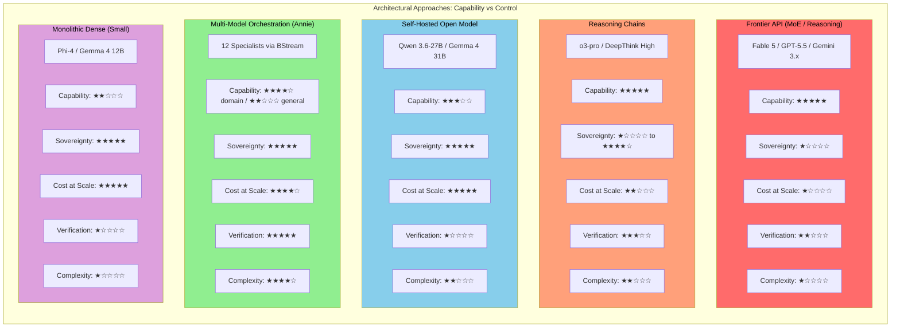
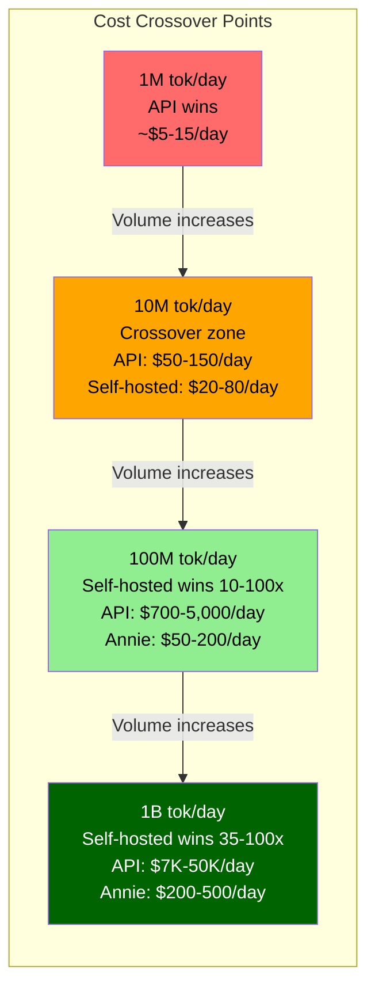
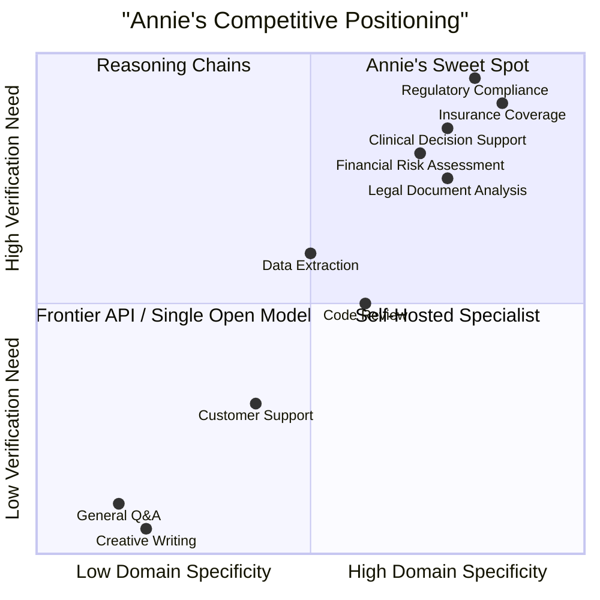

# Competitive Analysis: Annie vs The Field

**Status:** Working Draft
**Date:** 2026-06-22
**Depends on:** [SOTA Landscape](annie/sota-landscape.mdx), [Annie Architecture](annie/annie-architecture.mdx)

---

## Executive Summary

Annie's competitive position is narrow but defensible. She wins where three conditions converge: the task is domain-specific, the output requires verified correctness, and the deployment must be sovereign. Outside that intersection, she loses to frontier models on raw capability and to raw open-weight models on simplicity.

The honest picture: Annie will not match Opus 4.8 or GPT-5.5 on open-ended reasoning. She will not beat a single self-hosted Qwen 3.6-27B on deployment simplicity. She will not compete with ChatGPT on consumer chat. She should not try. What Annie offers is a verified, sovereign, domain-extensible pipeline that no single model -- frontier or open -- provides today. That pipeline costs 10-100x less than frontier APIs at scale and cannot be shut off by a foreign government.

The real competitive threat is not frontier labs. It is the "good enough" single open model: a team that deploys Qwen 3.6-27B on a single GPU and decides the orchestration overhead is not worth it. Annie must prove the verification pipeline catches enough errors to justify the added complexity. The research says it does -- ensembles improve accuracy by 4-18% on domain tasks -- but that margin must be visible and measurable to buyers, not just claimed.

---

## Architectural Comparison Matrix

Five distinct approaches to deploying language model capability exist in production today. Each makes a different tradeoff between capability, cost, control, and complexity.

### 1. Monolithic Dense (Historical, Still Used at Small Scale)

**How it works:** A single dense transformer where every parameter activates for every token. All of GPT-2, GPT-3, and early GPT-4 were dense. Today, dense models persist at the small end: Phi-4 (3.8-15B), Gemma 4 12B/31B, Qwen 3.6-27B.

**Strengths:** Simple to deploy. Predictable latency. Single file, single GPU (at small scale). Well-understood training dynamics. No routing failures possible.

**Weaknesses:** Capability scales linearly with compute -- every token pays the full parameter cost. A 27B dense model is fundamentally limited by 27B parameters worth of knowledge and reasoning. No path to frontier performance without frontier compute.

**Cost profile:** Training \$2K-\$500K depending on size. Inference is the lowest per-token cost at a given parameter count. A 27B model runs on a single consumer GPU (approximately 20GB VRAM at Q4).

**Sovereign suitability:** Excellent. A laptop to a single GPU is all that is required. This is the simplest sovereign deployment possible.

**Best use case:** Single-domain tasks where a fine-tuned specialist is sufficient and orchestration overhead is not justified.

### 2. Sparse MoE Single Model (Fable 5, GPT-5.x, Gemini, DeepSeek)

**How it works:** A transformer with many expert sub-networks, of which only a fraction activate per token. A learned router selects which experts process each token. Gemini 2.5 Pro: 200B total parameters, 64 experts per block, 8 active per token (12.5% active). GPT-5.5: estimated 10-50+ trillion total, 2-5 trillion active. DeepSeek V4-Pro: 1.6T total, 49B active.

**Strengths:** Near-dense quality at a fraction of compute. Frontier capability -- these are the models setting benchmarks. Fable 5 achieves 95% on SWE-Bench Verified (vendor-scaffold, contested). GPT-5.5 achieves 88.7%. The architecture scales to enormous total parameter counts while keeping inference cost manageable.

**Weaknesses:** Requires datacenter-scale hardware at frontier sizes. Expert collapse is a real training pathology: the router learns to send most tokens to a few favored experts while others atrophy. A 2026 paper found that expert "specialization" reflects hidden-state geometry, not domain expertise -- what looks like intelligent routing is an emergent geometric property. Load-balancing auxiliary losses help but directly trade off against model performance. Token dropping under load degrades quality.

**Cost profile:** Training: \$5M-\$500M+. Inference: \$2-\$50/MTok via API. Sovereign deployment of frontier-scale MoE models is impractical -- GPT-5.5's estimated parameter count requires hardware that only hyperscalers operate.

**Sovereign suitability:** Poor at frontier scale. Moderate for smaller MoE models (DeepSeek V4-Flash at 284B total / 13B active could run on a modest GPU cluster). The irony: sparse MoE was designed for efficiency, but frontier providers have used the efficiency gains to scale up rather than scale down.

**Best use case:** General-purpose capability where the broadest possible knowledge and reasoning are needed and API dependency is acceptable.

### 3. Reasoning Chains (o-series, DeepThink)

**How it works:** An LLM generates an explicit chain-of-thought at inference time, spending more compute on harder problems. OpenAI's o3 and o4-mini, Google's Gemini 3.x with DeepThink (three-tier: Low/Medium/High). This is inference-time compute scaling -- the model "thinks longer" on harder problems.

**Strengths:** State-of-the-art on hard problems. o3-pro achieves 98% on AIME 2025. Controllable compute: easy questions use less; hard questions use more. Can be applied on top of any base model architecture.

**Weaknesses:** Overthinking on simple tasks: shorter reasoning chains are up to 34.5% more accurate than longer ones on the same easy questions. Chain-of-thought actively harms performance on implicit statistical learning (GPT-4o drops 23.1%, o1-preview drops 36.3% vs zero-shot). Cost explosion: average token usage nearly doubled across DeepSeek R1 versions (12K to 23K tokens per question). Reasoning loops where the model fails to recognise it has reached a correct answer. Difficulty miscalibration: disproportionate compute on simple problems, insufficient on complex ones.

**Cost profile:** Highly variable. At OpenAI's o3 pricing (\$2/\$8 per MTok input/output), a complex reasoning chain generating 20K tokens costs approximately \$0.16 per query. o3-pro at \$20/\$80 per MTok makes extended reasoning chains expensive. The cost advantage over dense models on easy problems is offset by massive cost spikes on hard problems.

**Sovereign suitability:** Same as the base model. If the base model is open-weight (DeepSeek R1 at 671B/37B active), reasoning chains can run on sovereign infrastructure. If the base model is API-only (o3-pro), it remains API-dependent.

**Best use case:** Mathematical reasoning, formal logic, and complex multi-step problems where correctness matters more than latency or cost. Not suitable as a default mode for all queries.

### 4. Self-Hosted Open Models (Llama, Mistral, Qwen on Own Hardware)

**How it works:** Download open-weight models (Apache 2.0, MIT, or similar license), quantise to fit available hardware, serve via vLLM, Ollama, or similar inference server. No orchestration layer -- single model, single endpoint.

**Strengths:** Full sovereignty at Level 3-4 (see [SOTA Landscape](annie/sota-landscape.mdx)). No per-token API cost. The model quality of open weights in mid-2026 is genuinely impressive: Qwen 3.6-27B offers 1M native context and dense vision at approximately 20GB VRAM. Gemma 4 31B achieves 89.2% on AIME 2026. DeepSeek V4-Pro achieves 80.6% on SWE-Bench Verified. These are not toy models.

**Weaknesses:** Single-model limitations: no verification, no consensus, no structural hallucination reduction. The "last mile" problem: going from a running model to a production system requires prompt engineering, guardrails, monitoring, error handling, domain tuning, and UX -- all of which must be built in-house. Small model hallucination rates are dramatically higher: global average across 1.7-3B models is 80.9%. Even at 8-32B, hallucination rates average 54.75% vs 11.91% for larger models. No structural protection against confidently wrong output.

**Cost profile:** Hardware: \$5K-\$200K one-time. Electricity: \$105K-\$210K/year per rack at Australian rates. No per-token cost. Amortised daily cost at 100M tokens/day: \$50-\$200.

**Sovereign suitability:** Excellent. This is the baseline sovereign AI deployment. Hardware in your rack, weights on your disk, no external dependencies.

**Best use case:** Organisations that need sovereignty and have the engineering capability to build the "last mile" themselves, or where the task is simple enough that single-pass inference is acceptable.

### 5. Multi-Model Orchestration (Annie)

**How it works:** Multiple specialist models (250M-27B) orchestrated through a message-based pipeline. Gateway receives work, Classifier routes to 1-6 domain specialists running in parallel, Judgment Panel scores responses using rubrics and consensus, Verification Panel checks output quality, Outbound Processing delivers results. Specialist models can make tool calls during processing (querying databases, calling APIs, writing and executing code), with outputs verified through the consensus pipeline. Fast path bypasses consensus for simple queries. Entire pipeline runs on Bellerophon BStream for durability and observability.

**Strengths:** Verified output: multi-model consensus improves accuracy by 4-18% on domain tasks. Full pipeline observability -- every classification, expert response, judgment score, and verification decision is logged in the Cognition Stream. Sovereign at Level 3-4. Tool-capable experts: specialists invoke internal platform tools (Synapse, knowledge bases) during reasoning which execute immediately, and return external tool calls (querying databases, calling APIs, code execution) as requests for client execution at judgment time, with all inputs and outputs verified through the consensus pipeline. Each specialist can be independently trained, replaced, or upgraded. Domain extensibility: add a specialist for \$2K-\$500K, update the classifier, deploy. Cost at scale: \$50-\$200/day at 100M tokens vs \$700-\$5,000/day for frontier APIs.

**Weaknesses:** Correlated errors: model pairs agree on wrong answers approximately 60% of the time vs 33% expected by chance, and more capable models exhibit higher error correlation. Classifier misrouting: leading routers achieve only 68-70% accuracy, and on queries where fewer than 3 models can answer correctly, accuracy drops to 23-25%. Latency: sequential pipeline stages add 800-2,000ms vs sub-500ms for single models. Coordination overhead: production measurements show 38.6% overhead from consensus mechanisms. System complexity: a 2025 study of 7 multi-agent systems found 41-86.7% failure rates across 14 distinct failure modes. The "good enough" problem: many tasks do not need verification, and the overhead is wasted.

**Cost profile:** Hardware: \$5K-\$200K one-time (same as self-hosted single model -- Annie's specialists fit on the same hardware). Per-specialist training: \$2K-\$500K. Higher per-query compute than single model (2-5x for complex queries due to consensus pipeline). But dramatically lower than frontier APIs at any meaningful volume.

**Sovereign suitability:** Excellent. Same hardware profile as self-hosted open models, with the orchestration layer (Bellerophon BStream) also self-hosted.

**Best use case:** High-stakes domain tasks where verified correctness matters, sovereignty is required, and the organisation will invest in domain specialists. Insurance, regulatory compliance, financial analysis, medical review.

### Architectural Comparison Diagram

---

## Head-to-Head Comparisons

### Annie vs Anthropic (Opus 4.8 / Fable 5)

**The Contender:** Anthropic's model family spans Haiku 4.5 (\$1/\$5 per MTok) through Fable 5/Mythos 5 (\$10/\$50 per MTok). Fable 5 is widely believed to be sparse MoE, though Anthropic has not confirmed architecture details. Opus 4.8 achieves 88.6% on SWE-Bench Verified and 93.6% on GPQA Diamond. Fable 5 pushes to 95% SWE-Bench (vendor-scaffold, contested) and 128K max output tokens. Anthropic's projected 2026 losses are approximately \$29B against \$25-30B revenue, with committed compute partnerships exceeding \$330B.

**Where Annie wins:**

*Sovereignty.* Anthropic models are API-only. There are no self-hosted options. This is Level 1 sovereignty -- full dependency on a US provider. Service can be suspended, access revoked, or pricing changed unilaterally. For organisations in jurisdictions subject to export controls or geopolitical risk, this is not a technical limitation but an existential one. Annie's models are trained from scratch -- no dependency on external model weights that could become subject to export controls. This represents the strongest possible sovereignty position: full technical and legal independence from any external provider.

*Cost at scale.* At 100M tokens/day, Opus 4.8 costs \$1,500-\$5,000/day (\$550K-\$1.8M/year). Fable 5 at \$10/\$50 per MTok would cost \$3,000-\$10,000/day. Annie self-hosted costs \$50-\$200/day (\$18K-\$73K/year) plus one-time hardware investment. The gap widens with volume and never closes.

*Verification.* Anthropic offers no structural verification layer. Output is single-pass, with no consensus mechanism, no rubric-scored judgment, and no verification stage. Extended thinking provides reasoning traces but not independent verification. Annie's multi-stage pipeline catches errors that a single model -- even a frontier one -- will not catch by design.

*Extensibility.* Adding a domain to Annie means training a specialist (\$2K-\$500K), updating the classifier, and deploying. Adding a domain to Anthropic's models means requesting a feature, waiting, and hoping. Fine-tuning is available but at provider-controlled pricing and with provider-controlled constraints.

*Observability.* Every stage of Annie's pipeline is logged in the Cognition Stream on Bellerophon BStream. Classification decisions, expert responses, judgment scores, verification outcomes -- all auditable. Anthropic provides usage logs and, for some models, reasoning traces. There is no pipeline-level observability because there is no pipeline.

**Where Anthropic wins:**

*Raw capability.* Opus 4.8 at 88.6% SWE-Bench Verified and 93.6% GPQA Diamond represents hundreds of billions of active parameters trained on data that no specialist can match. Annie's largest specialist is 27B dense. For novel, cross-domain reasoning, open-ended creative work, or tasks that require broad world knowledge, Anthropic is categorically superior. Annie does not compete here and should not try.

*General reasoning.* A 27B specialist will not match Opus 4.8 on a question it has never been trained for. Annie's consensus pipeline improves accuracy on defined domain tasks; it does not create knowledge that does not exist in the underlying specialists.

*Ecosystem.* Claude Code, the Messages API, tool use, MCP integration, 1M context windows, batch processing -- Anthropic has a mature developer ecosystem. Annie is infrastructure, not an ecosystem.

*Simplicity.* One API call vs a multi-stage pipeline. For many use cases, the simpler path wins.

**The export control factor:** This is Annie's structural advantage that no amount of Anthropic engineering can address. Export controls are a political reality, not a technical one. If a jurisdiction faces US technology restrictions, Anthropic's models become unavailable regardless of their quality. Annie, built on open-weight models with Apache 2.0 and MIT licenses, deployed on customer hardware, is immune to this risk. This is not hypothetical -- service suspensions have been demonstrated.

### Annie vs OpenAI (GPT-5.5 / Codex)

**The Contender:** OpenAI's GPT-5.5 (codenamed "Spud") is the first fully retrained base model since GPT-4.5 -- a ground-up rebuild estimated at 10-50+ trillion total parameters with 2-5 trillion active. It achieves 88.7% on SWE-Bench Verified, 92.4% on MMLU, 93.6% on GPQA Diamond, and 85% on ARC-AGI-2. The o-series reasoning models push further: o3-pro at 98% on AIME 2025. OpenAI's weekly users exceed 900M with annualised revenue around \$25B and projected 2026 losses of approximately \$14B. Training runs cost \$500M+ each.

**Where Annie wins:**

*The hallucination story.* GPT-5.5 achieved only 57% accuracy on the AA-Omniscience factual recall benchmark -- meaning 43% of its answers on factual questions were incorrect or hallucinated. This is not a cherry-picked number -- it is from an independent evaluation benchmark. Annie's verification pipeline exists specifically to catch hallucinated output through cross-model consensus and rubric-scored judgment. The research supports the approach: multi-stage verification reduces hallucination by 4-67% depending on method. A system that is wrong on 43% of factual recall and has no structural verification layer is fundamentally unreliable for high-stakes domain work, regardless of how impressive its reasoning benchmarks look.

*Sovereignty.* Same analysis as Anthropic. GPT-5.5 is API-only. OpenAI has released open-weight models (gpt-oss-120b, gpt-oss-20b) but these are not GPT-5.5 -- they are smaller, less capable models. The frontier capability remains locked behind the API.

*Cost at scale.* GPT-5.5 at \$5/\$30 per MTok input/output. At 100M tokens/day: \$1,750-\$6,000/day. GPT-5.5 Pro at \$30/\$180 per MTok is orders of magnitude more expensive. Annie: \$50-\$200/day.

*The Azure sovereign cloud distinction.* Microsoft offers "Azure sovereign cloud" regions -- but this is Level 2 sovereignty (workloads in-jurisdiction, foreign entity operates). The customer does not hold the keys. The customer cannot disconnect without permission. Microsoft can revoke access. This is a marketing distinction, not a sovereignty one. Annie provides Level 3-4 sovereignty: the customer holds keys, makes decisions, and can disconnect without asking anyone.

**Where OpenAI wins:**

*Scale of capability.* GPT-5.5 with an estimated 2-5 trillion active parameters operates in a fundamentally different capability regime than Annie's 250M-27B specialists. The breadth of knowledge, the cross-domain transfer, the ability to handle novel queries that fall outside any specialist's training -- OpenAI wins decisively.

*The reasoning stack.* The o-series (o3, o3-pro, o4-mini) represents a different paradigm: inference-time compute scaling. o3-pro at 98% AIME 2025 is solving problems that no 27B model can approach. Annie's consensus pipeline improves reliability; it does not create this level of raw problem-solving capability.

*Ecosystem and reach.* 900M weekly users, ChatGPT, the Codex agent platform, Operator, deep Microsoft/Azure integration. OpenAI's ecosystem dwarfs anything Annie will build.

*Codex comparison.* OpenAI Codex is a cloud-based coding agent that assigns tasks, works autonomously, and submits pull requests -- similar in concept to Annie's asynchronous coworker model. Codex has the advantage of GPT-5.5/o3 underlying capability, massive training data, and deep GitHub integration. Annie's advantage is sovereignty and verified output, but for pure coding capability, Codex with frontier models will outperform Annie's coding specialist (Qwen 3.6-35B-A3B) on complex, novel tasks.

### Annie vs Google (Gemini 3.x)

**The Contender:** Google has the most credible sovereign deployment story of any frontier provider, and the only confirmed MoE architecture details in the field. Gemini 2.5 Pro: 200B total parameters, 80 layers, 16384 hidden dimension, 128 attention heads, 64 experts per block with 8 active per token (12.5% active, approximately 1.6x compute efficiency vs dense equivalent). Gemini 3.1 Pro achieves 80.6% SWE-Bench Verified, 94.3% GPQA Diamond, and 92.6% MMMLU. Google's 2026 capex guidance is \$175-185B, majority AI-directed.

**Where Annie wins:**

*True sovereignty vs GDC.* Google Distributed Cloud (GDC) is the best sovereign offering from a frontier provider. It puts Google hardware and software in customer-controlled or air-gapped facilities. But it is still Google's hardware running Google's software under Google's licensing. The customer cannot modify the models, cannot train their own specialists, and depends on Google for updates, patches, and continued operation. Annie at Level 3-4 sovereignty means the customer owns everything: hardware, model weights, training pipeline, orchestration layer. The distinction matters most when the relationship with the provider becomes adversarial -- whether through sanctions, contract disputes, or strategic divergence.

*Domain extensibility.* Google offers Gemini fine-tuning, but at Google-controlled pricing and with Google-controlled constraints. Annie's add-a-specialist architecture means the customer controls the capability roadmap entirely.

*Verification pipeline.* Same structural advantage as against all frontier providers: Google offers no multi-model consensus or verification layer. Gemini 3.x with DeepThink adds reasoning chains (three tiers: Low/Medium/High), which provides a form of self-verification but not independent cross-model verification.

**Where Google wins:**

*The TPU advantage.* Google operates custom silicon (TPU v5e, v6e Trillium, TPU 8t with 121 exaflops per superpod at 9,600 chips) that no one else can buy. This is a structural cost advantage in training and inference that translates to aggressive API pricing: Gemini 2.5 Flash at \$0.30/\$2.50 per MTok is cheaper than running Annie's specialists on commodity hardware at low volumes.

*Confirmed MoE architecture.* Google is the only frontier provider that has published detailed architecture specifications. The 64-experts-per-block, 8-active-per-token design at 200B parameters is a known, well-characterised architecture. This matters for research and trust: customers know what they are buying.

*GDC is genuinely the best provider sovereign story.* While it falls short of true sovereignty (Level 2-3 vs Annie's Level 3-4), for organisations that need frontier capability and some sovereign deployment, GDC is the least-bad option among frontier providers. It is meaningfully better than "API calls to us-east-1."

*Context and multimodality.* Gemini 3.1 Pro offers 1M token context. The Gemma 4 family provides on-device multimodal capability. Google's native multimodal training (not bolted-on vision) is a genuine technical advantage that Annie's pipeline of text-focused specialists cannot match without significant investment.

*Cost at lower volumes.* Gemini 3.1 Flash Lite at \$0.25/\$1.50 per MTok is extremely competitive. At 1M tokens/day, the API costs \$0.88/day. Annie's amortised hardware cost at the same volume is \$10-\$50/day. Google wins on cost until volume exceeds approximately 10M tokens/day.

### Annie vs Self-Hosted Open Models (Llama / Mistral / Qwen)

**This is Annie's real competitive threat.** Not frontier APIs -- those serve a different market. The threat is an engineering team that downloads Qwen 3.6-27B, puts it on a single GPU, wraps it in a basic API, and decides they are done.

**The case for "just deploy Qwen":**

The quality of open models in mid-2026 is remarkable. Qwen 3.6-27B: 27B dense parameters, 1M native context, vision capability, Apache 2.0 license, approximately 20GB VRAM at Q4 quantisation. It runs on a single consumer GPU. Gemma 4 31B: 89.2% AIME 2026, 80% LiveCodeBench. DeepSeek V4-Pro: 80.6% SWE-Bench Verified, 1.6T total / 49B active, MIT license. These models are available today, free, with no orchestration complexity.

Deployment is straightforward: download weights, quantise, serve via vLLM or Ollama, wrap in an API. One model, one endpoint, one thing to monitor. No classifier to train, no judgment panel to calibrate, no verification loops to debug. Full sovereignty. Low latency (no multi-stage pipeline). A competent team can have this running in production in a week.

**Annie's cost advantage in context.** While a single open model is simpler, Annie's total initial investment -- a modest capital outlay covering base model pre-training and fine-tuning -- is a one-time cost that pays dividends through the life of the system. Annie's architecture consists of a single sovereign base model fine-tuned into five unique domain specialist variants, plus Qwen 3.6:27B, with post-training on Evari's internal servers. This produced a system that cannot be built by downloading a single open model. For organisations that need both sovereignty and verified correctness, the investment is recovered within months through improved accuracy and reduced hallucination on domain tasks.

**Why Annie's orchestration layer matters:**

*The hallucination problem is real and structural.* Small model hallucination rates are dramatically higher than large models. At 8-32B parameters, hallucination averages 54.75%. A single Qwen 3.6-27B will confidently produce wrong output with no mechanism to detect or correct it. For low-stakes applications (internal search, draft generation, chat), this is acceptable. For insurance coverage determination, regulatory compliance, or financial analysis, it is not.

*Verification is the product.* Annie's value proposition is not "we have models" -- anyone can have models. The value is "we verify output through independent cross-model consensus with domain-specific rubrics." The research supports this: multi-model consensus improves accuracy by 4-18% on domain tasks. Fine-tuned Phi-3-mini beat GPT-4o on 6 of 7 financial NLP benchmarks. Ensembles of open-source LLMs scored 65.1% on AlpacaEval 2.0 vs GPT-4o's 57.5%. The verification layer is what transforms a collection of fallible small models into a system that catches its own mistakes.

*Domain specialisation compounds.* A single generalist model has one set of weights trying to serve every domain. Annie's architecture allows each specialist to be fine-tuned independently for its domain. A fine-tuned Phi-4 14B for insurance can achieve 96% accuracy on domain tasks where a generalist achieves 80%. The specialist does not need to be good at everything -- it needs to be excellent at one thing. Then the judgment panel, using a different model architecture, independently evaluates whether the specialist's output is correct.

*The "last mile" problem.* Going from a running model to a production system requires prompt engineering, guardrails, monitoring, error handling, domain tuning, output formatting, and UX. Most teams underestimate this. Annie provides the last mile as product: the classifier routes intelligently, the judgment panel scores with rubrics, the verification panel catches failures, and the Cognition Stream provides full observability. Building all of this around a single open model is possible but expensive in engineering time.

**Honest assessment:** For simple, low-stakes tasks, a single self-hosted open model is the right answer. Annie's orchestration overhead is not justified when the output does not need verification. The "good enough" single model is Annie's most dangerous competitor because it is real, available today, and simple. Annie must compete on verifiable quality improvement, not on theoretical architectural elegance.

### Annie vs Agentic AI Platforms (Devin, Copilot, etc.)

**Different category, but investors will ask.** Devin, GitHub Copilot, Cursor, and Google Antigravity are agent platforms -- they use LLMs to perform autonomous multi-step tasks with tool use. Annie is a verified inference pipeline. These solve different problems, but the market positioning overlaps.

**How agentic platforms work:**

*Devin (Cognition, valued at \$26B):* Multi-agent compound system with a Planner (high-reasoning model), Coder (code-specialised model), Critic (adversarial review), and Agent Router. Can spawn parallel sub-sessions. Devin Desktop (June 2026) opens orchestration to users. Excels at well-defined repetitive tasks (migrations, upgrades, tech debt). Struggles with novel, ambiguous problems.

*Cursor:* Auto-routes queries across model tiers (GPT-5.4-mini for trivial, GPT-5.5/Opus for significant). In-house Composer model for low-latency agentic coding. Supports 8 parallel agents. Key insight from their architecture: "The features that actually determine whether Cursor works are not the headline models -- they are the indexing pipeline, the rules system, and MCP tool integration."

*GitHub Copilot:* Multi-model (Claude Opus, GPT-5, Gemini 3 Pro). Copilot Coding Agent assigns GitHub issues directly to AI. Ecosystem play across GitHub, VS Code, Azure.

*Google Antigravity:* Built agent-first with multi-agent orchestration as the defining feature. Multiple specialised AI agents working in parallel.

**Where Annie differs:**

Annie and agentic platforms share the multi-model orchestration pattern. But the purpose is different. Agentic platforms use multiple models to orchestrate and execute multi-step actions in the world (write code, file PRs, navigate UIs). Annie uses multiple models to verify the correctness of output. Agentic platforms return external tool calls for the client to execute autonomously in sequence. Annie's specialists return tool calls (internal platform tools execute during processing; external tool requests return for client execution at judgment time) with all outputs verified through consensus before reaching the user. Agentic platforms optimise for autonomous task completion. Annie optimises for verified output reliability.

The philosophies diverge on trust and autonomy. Agentic platforms assume the model is probably right and focus on giving it more tools and multi-step autonomy. Annie assumes the model might be wrong and focuses on catching errors through verification before output reaches the user.

**Reality check on agentic AI:**

Gartner predicts 40%+ of agentic AI projects will be cancelled by end of 2027 due to escalating costs and unclear ROI. Scale AI's Remote Labor Index found the best AI agent (Manus) completed only 2.5% of real Upwork freelance tasks. Gartner coined "agent washing" in 2025, estimating only approximately 130 of thousands of self-proclaimed AI agent vendors are genuinely agentic.

**Where agentic platforms win over Annie:** Autonomous task execution, IDE integration, developer workflow. Annie and agentic platforms both use tool calls, but differently: agentic platforms use tools for autonomous multi-step task execution and workflow automation (writing code, filing PRs, navigating UIs), while Annie's specialist models make tool calls during expert processing (querying databases, calling APIs, retrieving documents) within a verified consensus pipeline. Annie optimises for verified correctness; agentic platforms optimise for autonomous task completion. These are complementary, not competitive, capabilities. Annie could serve as the verified inference backend for an agentic platform.

**The QuivaWorks Accelerator**
QuivaWorks was developed by Evari to provide and agentic AI platform. This provides agent interaction and building UX, and provides a platform for Annie to offload to LLM APIs for performing tasks that those models excel in.
---

## Scenario Analysis

How each approach performs across specific use cases, rated on a 5-point scale: Poor (1), Below Average (2), Average (3), Good (4), Excellent (5).

**Detailed scenario breakdown:**

| Scenario | Best Approach | Runner-Up | Annie Rating | Notes |
|---|---|---|---|---|
| Insurance coverage determination | **Annie** | Reasoning Chains | 5/5 | Domain specialist + verification + sovereignty. Annie's sweet spot. |
| Code review | Frontier API / Agentic Platform | Reasoning Chains | 3/5 | Annie's coding specialist (Qwen 3.6-35B-A3B) is competitive but does not match Opus 4.8 or GPT-5.5 on complex novel code. Agentic platforms have IDE integration Annie lacks. |
| General Q&A / Chat | Frontier API | Self-Hosted Open | 3/5 | Annie's fast path handles simple queries well, but the full pipeline adds unnecessary latency for casual conversation. Not Annie's market. |
| Regulatory compliance check | **Annie** | Reasoning Chains | 5/5 | Verification-critical, domain-specific, sovereignty-sensitive. Annie's architecture is purpose-built for this. |
| Creative content generation | Frontier API | Self-Hosted Open | 2/5 | Consensus-driven evaluation dampens creative voice. Multiple experts producing "average of opinions" output. Creative work benefits from a single strong voice, not committee review. |

Annie excels in exactly two of five scenarios -- but those two (insurance, regulatory compliance) represent the highest-value, highest-risk work where buyers will pay for verified correctness. Annie should not pursue the other three as primary markets.

---

## Cost Modeling

All figures in USD. Assumes 50/50 input/output token ratio unless noted. Annie costs assume hardware is amortised over 3 years.

### Low Volume: 1M tokens/day

| Solution | Daily Cost | Annual Cost | Notes |
|---|---|---|---|
| Annie self-hosted | \$10-\$50 | \$3.7K-\$18K | Dominated by amortised hardware. Overpaying for infrastructure at this volume. |
| Opus 4.8 API | \$15 | \$5.5K | Simple, no infrastructure. |
| GPT-5.5 API | \$17.50 | \$6.4K | Comparable to Opus. |
| Gemini 3.1 Pro API | \$7-\$11 | \$2.6K-\$4K | Cheapest frontier option. |
| Self-hosted Qwen 3.6-27B | \$10-\$50 | \$3.7K-\$18K | Same hardware cost as Annie, simpler system. |

**Verdict at 1M tokens/day: API wins.** Annie's infrastructure cost is not justified at this volume. Gemini 3.1 Pro or GPT-5.4 API is the right choice unless sovereignty is a hard requirement. If sovereignty is required, a single self-hosted Qwen is simpler and cheaper than Annie's full pipeline.

### Medium Volume: 100M tokens/day

| Solution | Daily Cost | Annual Cost | Notes |
|---|---|---|---|
| Annie self-hosted | \$50-\$200 | \$18K-\$73K | Hardware amortised. Electricity is the primary cost. |
| Opus 4.8 API | \$1,500-\$5,000 | \$550K-\$1.8M | 10-100x more expensive than Annie. |
| GPT-5.5 API | \$1,750-\$6,000 | \$640K-\$2.2M | Similar to Opus. |
| Gemini 3.1 Pro API | \$700-\$2,200 | \$255K-\$800K | Cheapest frontier, still 10x Annie. |
| Self-hosted Qwen 3.6-27B | \$50-\$200 | \$18K-\$73K | Same cost as Annie but no verification. |

**Verdict at 100M tokens/day: Self-hosted wins decisively.** The cost gap is 10-100x vs frontier APIs. The question is Annie vs raw Qwen -- same infrastructure cost, but Annie provides the verification pipeline. At this volume, the verification overhead (2-5x compute per complex query) is absorbed within the same hardware budget because the hardware is already paid for and has capacity.

### High Volume: 1B tokens/day

| Solution | Daily Cost | Annual Cost | Notes |
|---|---|---|---|
| Annie self-hosted | \$200-\$500 | \$73K-\$182K | Needs GPU scaling. Multiple inference servers. |
| Opus 4.8 API | \$15,000-\$50,000 | \$5.5M-\$18.3M | Prohibitive for sustained use. |
| GPT-5.5 API | \$17,500-\$60,000 | \$6.4M-\$21.9M | Batching reduces cost 50% but adds latency. |
| Gemini 3.1 Pro API | \$7,000-\$22,000 | \$2.6M-\$8M | Best frontier price but still 35-100x Annie. |
| Self-hosted Qwen 3.6-27B | \$200-\$500 | \$73K-\$182K | Needs same GPU scaling as Annie. |

**Verdict at 1B tokens/day: Self-hosted is the only rational choice.** API costs are \$2.6M-\$21.9M/year vs \$73K-\$182K for self-hosted. The cost gap is so large that the entire hardware investment (including Annie's specialist training) pays for itself in weeks. At this volume, the question is never "should we self-host?" -- it is "which self-hosted approach?"

### Enterprise Fleet: 10 Deployments

| Solution | Total Annual Cost | Notes |
|---|---|---|
| Annie self-hosted (10 instances at 100M tok/day each) | \$180K-\$730K | Hardware: \$50K-\$2M one-time. Specialist training shared across instances. |
| Opus 4.8 API (10 instances) | \$5.5M-\$18M | Volume discounts may apply but pricing is opaque. |
| GPT-5.5 API (10 instances) | \$6.4M-\$22M | Same. |
| Gemini 3.1 Pro API (10 instances) | \$2.6M-\$8M | GDC sovereign deployment adds significant cost. |
| Self-hosted Qwen (10 instances) | \$180K-\$730K | Same infrastructure, no verification pipeline. |

**Verdict for enterprise fleet:** Annie's per-deployment economics shine at fleet scale. Ten Annie deployments cost roughly the same as one year of a single enterprise frontier API contract. Specialist training cost (\$2K-\$500K per domain model) is paid once and deployed everywhere. The fleet economics are Annie's strongest cost story.

### Cost Trajectory Over Time

---

## Failure Modes and Honest Risks

This section is the most important in the document. A competitive analysis that hides weaknesses is worse than no analysis at all -- it creates false confidence that leads to bad decisions. Every architecture fails. The question is how it fails and whether you can recover.

### Failure Modes by Architecture

**Frontier API (MoE / Reasoning) Failure Modes:**
- **Hallucination at scale.** GPT-5.5 at 57% accuracy on factual recall (43% incorrect or hallucinated). Single-pass inference with no structural correction mechanism. The model is confident when wrong.
- **Service dependency.** Outages, rate limiting, policy changes, export controls, price increases -- all outside customer control. Not theoretical: demonstrated in production.
- **Expert collapse in training.** The router learns to favour a subset of experts. Dead experts waste parameters. Load-balancing auxiliary losses help but directly reduce model performance. This is a training pathology, not a deployment one, but it means the model you are paying for may not be using its full capacity.
- **Reasoning chain failures.** Overthinking simple problems (up to 34.5% less accurate). CoT actively harmful on implicit statistical learning tasks. Reasoning loops. Cost explosion from uncontrolled token generation. These are systemic, not edge cases.

**Self-Hosted Open Model Failure Modes:**
- **Undetected hallucination.** Small model hallucination rates: 54.75% at 8-32B parameters. No verification mechanism. The model is wrong more than half the time on factual recall and has no way to know it.
- **Quantisation degradation.** Running 27B models at Q4 quantisation to fit on consumer hardware loses precision. The impact varies by task and is difficult to characterise in advance.
- **Context window degradation.** Models claiming 1M context often degrade significantly at long context lengths. Gemini 3.1 Pro's MRCR-v2 at 128K is 84.9% -- but what about at 500K? GPT-5.4's long-context MRCR-v2 drops to 36.6%.
- **No guardrails by default.** Raw open models have no content filtering, no safety layer, no output validation. The "last mile" is entirely on the operator.

**Annie-Specific Failure Modes:**

These are Annie's known risks. They are real, some are structural, and they must be addressed in design and operation.

1. **Classifier misclassification cascade.** The classifier is the single point of failure at pipeline entry. If it routes an insurance query to the coding specialist, the entire downstream pipeline operates on the wrong expert output. The judgment panel may catch obviously wrong output, but subtle misclassification -- routing a regulatory question to general knowledge instead of the compliance specialist -- produces plausible but unverified output. Leading routers achieve only 68-70% accuracy in research benchmarks. On queries where fewer than 3 models can answer correctly, accuracy drops to 23-25%. This is precisely when routing matters most: ambiguous queries at domain boundaries. Annie's classifier will need to be significantly better than general-purpose routers, which means domain-specific training data and continuous evaluation.

2. **Correlated errors in consensus.** The fundamental assumption of Annie's judgment panel is that independent experts will make independent errors, and consensus catches mistakes. But LLM ensembles exhibit correlated errors at approximately 60% agreement on wrong answers vs 33% expected by chance. More capable models exhibit higher error correlation. If Annie's specialists are all trained on similar data distributions, they will converge on the same wrong answers, and the judgment panel will score the consensus as correct. This is the deepest architectural risk. Mitigation requires genuine diversity: different model architectures (Mistral, Qwen, Gemma, Phi), different training data, different fine-tuning approaches. Homogeneous panels provide minimal benefit -- the diversity is not optional, it is the mechanism.

3. **Verification loop.** If the verification panel repeatedly rejects output, the pipeline retries. Annie's design choice is discard-and-restart (not incremental refinement) to prevent contamination from the failed attempt. But what if the specialist consistently produces unverifiable output for a particular query type? The pipeline could loop indefinitely. This requires a circuit breaker: after N retries, escalate to a human or return a "low confidence" response rather than looping. The tradeoff: discard-and-restart is conservative and correct but wasteful. Redundant computation accumulates.

4. **Model loading latency.** Annie loads 1-6 specialists per query, not all 12 simultaneously. Cold start latency for loading a model from disk to GPU is significant (seconds to tens of seconds depending on model size and storage speed). Hot models (already in GPU memory) respond in milliseconds. Annie must maintain a warm pool of frequently-used specialists and predict which specialists will be needed. Misprediction means cold-start latency that breaks the user experience. At 250M-27B parameters, specialists range from 1.5GB to 20GB at Q4. A single 48GB GPU can hold 2-3 large specialists or 10+ small ones simultaneously.

5. **The "good enough" problem.** This is Annie's existential strategic risk, not a technical failure mode. For most use cases -- chat, general Q&A, draft generation, brainstorming -- a single self-hosted open model is good enough. The verification pipeline adds complexity, latency, and cost. The 4-18% accuracy improvement from ensemble consensus is real but may not be visible or valued by buyers whose primary use case does not require verified correctness. Annie must find and serve the buyers who need verification (insurance, regulatory, financial, medical) rather than trying to convince the broader market that verification matters. The market for "verified AI output" is smaller than the market for "AI output." Annie needs the former, not the latter.

6. **Consensus failure from conformity.** A February 2026 paper found heterogeneous multi-agent teams consistently failed to match their best individual member, with performance losses up to 37.6%. The failure mechanism: consensus-seeking over expertise. Agents reinforce each other's errors rather than providing independent evaluation. This is conformity bias / monoculture collapse. If Annie's judgment panel weights consensus too heavily, it may select the average answer over the correct minority answer. Rubric-based scoring mitigates this (rubrics evaluate quality, not popularity), but the risk is real.

7. **Single poisoned model.** A single deceptive or compromised model in the pipeline can nullify ensemble gains. If a specialist is fine-tuned with adversarial data, its consistently wrong output could influence the judgment panel. Security surface area grows linearly with the number of models. Annie's specialist count (up to 12) means 12 potential attack surfaces.

### Risk Severity Matrix

| Risk | Probability | Impact | Mitigation Difficulty | Priority |
|---|---|---|---|---|
| Classifier misclassification | High (68-70% router accuracy is the field baseline) | High (wrong expert, wrong output) | Medium (domain-specific training helps) | Critical |
| Correlated expert errors | Medium (depends on diversity) | High (consensus validates wrong answer) | High (requires genuine architectural diversity) | Critical |
| Verification loop | Low (requires consistent specialist failure) | Medium (wasted compute, delayed response) | Low (circuit breaker) | Medium |
| Model loading latency | Medium (depends on query patterns) | Medium (poor UX on cold start) | Medium (predictive warm pool) | Medium |
| "Good enough" single model | High (real market pressure) | High (strategic, not technical) | High (requires market education) | Critical |
| Consensus conformity bias | Medium | Medium (selects average over correct) | Medium (rubric design) | High |
| Single poisoned model | Low (requires supply chain compromise) | High (undermines entire pipeline) | Medium (model validation, weight checksums) | Medium |

---

## Strategic Positioning

### Where Annie Should Compete

Annie's defensible market is the intersection of three requirements:

1. **High domain specificity.** The task requires domain knowledge that can be encoded in a specialist model. Generic tasks do not benefit from Annie's architecture -- a frontier model or a single open model handles them better.

2. **High verification need.** The output will be used for decisions with real consequences: financial, legal, medical, regulatory. The 4-18% accuracy improvement from ensemble consensus must translate to measurable reduction in costly errors. If being wrong 54% of the time (single model) vs 40% of the time (verified pipeline) does not materially affect outcomes, the pipeline is not worth the complexity.

3. **Sovereignty required.** The deploying organisation needs control over its AI infrastructure for regulatory, geopolitical, or strategic reasons. API dependency on a foreign provider is unacceptable.

**Target sectors:** Insurance (coverage determination, claims assessment), financial services (regulatory compliance, risk assessment), government (sovereign AI requirement, classified environments), healthcare (clinical decision support in regulated markets), legal (document analysis in jurisdictions with data residency requirements).

**Target geographies:** Australia, New Zealand, Southeast Asia, Middle East, parts of Europe -- jurisdictions where US/China technology dependency is a strategic concern, where frontier API access may be restricted or unreliable, and where sovereign AI capability is a national priority.

### Where Annie Should NOT Compete

1. **General consumer chat.** ChatGPT has 900M weekly users. Gemini is integrated into every Google product. Annie's verification pipeline adds latency and complexity for tasks that do not need verification. Do not enter this market.

2. **State-of-the-art reasoning.** o3-pro at 98% AIME 2025, Fable 5 at 95% SWE-Bench Verified. Annie's largest specialist is 27B parameters. The raw capability gap is unbridgeable at Annie's parameter budget. Do not claim frontier-competitive general reasoning.

3. **Creative content generation.** Consensus-driven evaluation actively harms creative output by selecting the average. A single model with a distinctive voice produces better creative content than a committee. Do not position Annie for content creation.

4. **Developer tooling.** Cursor, Copilot, and Devin have deep IDE integration, massive training data on code, and models specifically optimised for coding. Annie's coding specialist (Qwen 3.6-35B-A3B) is competitive on benchmarks but has no IDE integration, no repository indexing, and no agent framework. Building these from scratch is a multi-year effort. Do not compete on developer tooling as a primary market. Annie's coding specialist is an internal capability (Annie improving Annie), not a product.

5. **Low-volume deployments.** At under 10M tokens/day, frontier APIs are cheaper and simpler than Annie's self-hosted pipeline. Do not sell Annie to organisations that process less than this unless sovereignty is a non-negotiable requirement.

### The Target Quadrant

The four targets in the upper-right quadrant (insurance coverage, regulatory compliance, clinical decision support, financial risk assessment) are where Annie wins. Everything else is better served by simpler, cheaper, or more capable alternatives.

### Strategic Implications

1. **Lead with verification, not sovereignty.** Sovereignty is a qualifying requirement (the buyer needs it), but verification is the differentiator (the buyer wants it). "Your AI output is verified through independent cross-model consensus with domain-specific rubrics" is a value proposition. "Your AI runs on your hardware" is a checkbox.

2. **Build depth before breadth.** Annie should be exceptional at insurance before she is mediocre at six domains. One domain with a fine-tuned specialist, calibrated rubrics, measured accuracy, and production track record is worth more than six domains with generic specialists and untested judgment criteria.

3. **Measure and publish error rates.** Annie's competitive advantage is verifiable correctness. That advantage only exists if it is measured and published. Run Annie and a single open model against the same domain-specific test set. Report the error rates. If Annie's verification pipeline catches 8% more errors on insurance coverage determination, publish that number. If it catches 2%, admit it and focus engineering on widening the gap.

4. **Do not fight the "good enough" market.** Accept that most AI use cases do not need Annie. Target the use cases that do. The addressable market is smaller but the willingness to pay is higher, the competitive moat is deeper, and the switching cost for buyers is substantial once domain specialists are trained.

5. **Position as infrastructure, not product.** Annie is not a chatbot. She is a verified inference pipeline that organisations embed into their decision-making systems. The buyer is the CTO or Head of AI, not the end user. The integration point is an API and a Cognition Stream, not a chat interface.

---

## Sources

### Academic Research

- Mixture-of-Agents (MoA), ICLR 2025. [arXiv:2406.04692](https://arxiv.org/abs/2406.04692)
- The Law of Multi-Model Collaboration, [arXiv:2512.23340](https://arxiv.org/abs/2512.23340)
- LLM Ensemble Forecasting, ForecastBench, Wharton, ICLR 2025
- RouteLLM, Berkeley, [arXiv:2406.18665](https://arxiv.org/abs/2406.18665)
- SWE-Protege, [arXiv:2602.22124](https://arxiv.org/abs/2602.22124)
- Correlated Errors in Large Language Models, [arXiv:2506.07962](https://arxiv.org/abs/2506.07962)
- Why Do Multi-Agent LLM Systems Fail?, [arXiv:2503.13657](https://arxiv.org/abs/2503.13657)
- Don't Always Pick the Highest-Performing Model, [arXiv:2602.08003](https://arxiv.org/abs/2602.08003)
- The Six Sigma Agent, [arXiv:2601.22290](https://arxiv.org/abs/2601.22290)
- Can AI Agents Agree?, [arXiv:2603.01213](https://arxiv.org/abs/2603.01213)
- The Myth of Expert Specialization in MoEs, [arXiv:2604.09780](https://arxiv.org/abs/2604.09780)
- SD-MoE: Spectral Decomposition for Expert Specialization, [arXiv:2602.12556](https://arxiv.org/abs/2602.12556)
- Understanding Agent Scaling via Diversity, [arXiv:2602.03794](https://arxiv.org/abs/2602.03794)
- Don't Overthink It: Shorter Thinking Chains, [arXiv:2505.17813](https://arxiv.org/abs/2505.17813)
- Mind Your Step: CoT Can Reduce Performance, [arXiv:2410.21333](https://arxiv.org/abs/2410.21333)
- Towards Mechanistic Understanding of Large Reasoning Models, [arXiv:2601.19928](https://arxiv.org/abs/2601.19928)
- A Geometric Analysis of Small-sized Language Model Hallucinations, [arXiv:2602.14778](https://arxiv.org/abs/2602.14778)
- LLMRouterBench, [arXiv:2601.07206](https://arxiv.org/abs/2601.07206)
- Risk Analysis for Multi-Agent LLM Systems, Gradient Institute
- Towards a Science of Scaling Agent Systems, Google Research

### Industry Sources

- CB Insights SLM Market Report, 2026
- Databricks Compound AI Systems Blog
- Scale AI Remote Labor Index
- Gartner Agentic AI Predictions (June 2025)
- ACM Transactions on Management Information Systems (Fine-tuned SLM vs GPT-4o)
- ZenML/Roots Insurance Case Study
- CodeAnt SWE-bench Analysis
- Microsoft Copilot Reorganisation (March 2026)

### Internal References

- [SOTA Landscape](annie/sota-landscape.mdx) -- State of the Art Landscape
- [Annie Architecture](annie/annie-architecture.mdx) -- Annie Architecture Decisions

### Benchmark Data Sources

- SWE-Bench Verified (deprecated Feb 2026, contamination concerns)
- GPQA Diamond
- MMLU / MMMLU
- ARC-AGI-2
- AIME 2025/2026
- FrontierMath
- Terminal-Bench 2.0/2.1
- Humanity's Last Exam
- AA Omniscience (GPT-5.5 hallucination rate)
