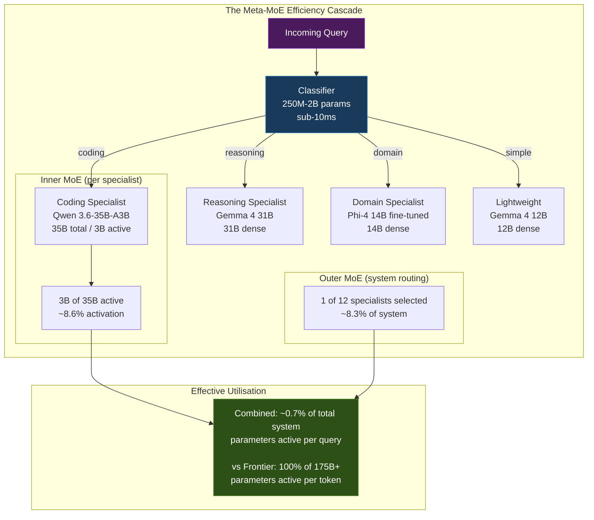
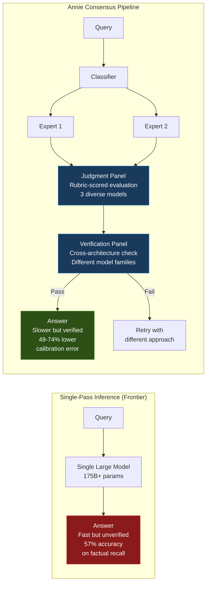
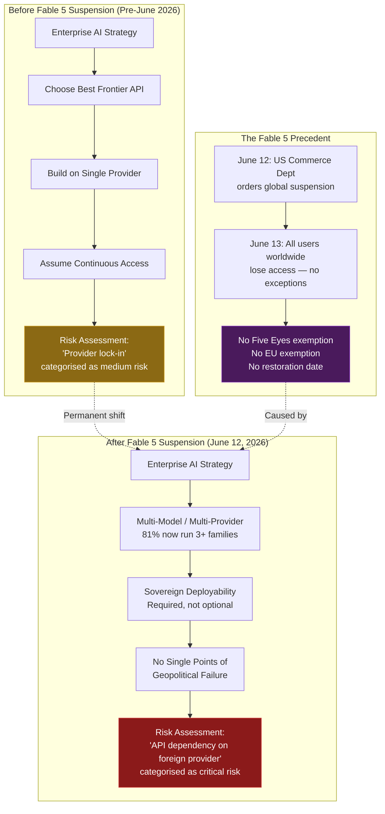
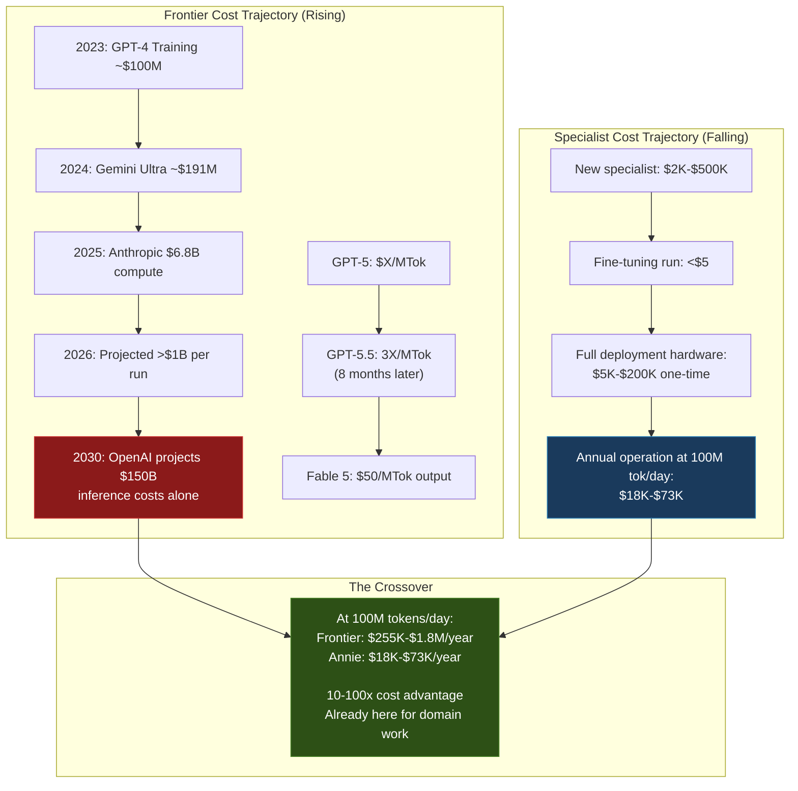
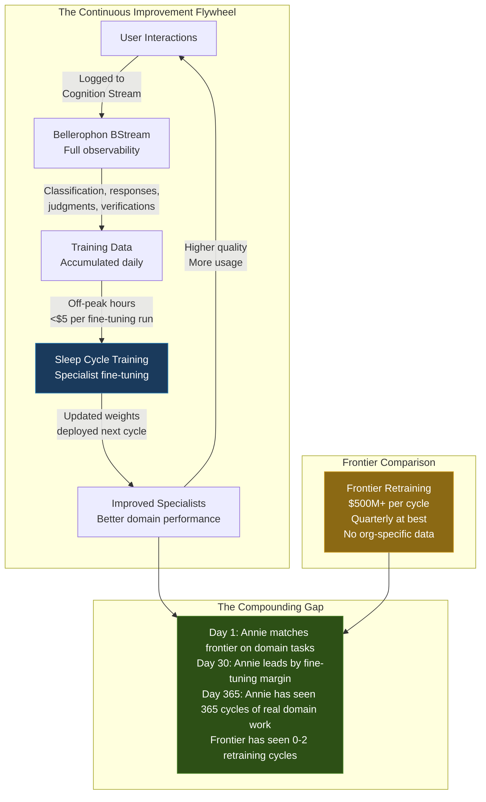

# The Annie Hypothesis: Why Small Expert Models Will Win

## Executive Summary

The AI industry is converging on a conclusion that the frontier labs do not want to hear: the era of the monolithic model is ending. Not because large models are bad -- they are extraordinary feats of engineering -- but because they are economically unsustainable, operationally fragile, and architecturally mismatched to the work enterprises actually need done. OpenAI does not expect profitability until 2030. Anthropic burned \$9.7 billion in 2025 alone, \$6.8 billion of it on compute. GPT-5.5 costs three times what GPT-5 cost eight months earlier. The direction of travel is clear: frontier models are getting more expensive, not less, and the organisations depending on them are one export control away from losing access entirely.

Annie -- the Agentic Neural Network Intelligence Engine -- is built on a different thesis. A system of small, domain-tuned specialist models (250M-27B parameters) with consensus verification, orchestrated through Evari's high-performance Bellerophon BStream messaging backbone, will outperform monolithic frontier models on domain-specific tasks at a fraction of the cost, while providing full sovereignty and continuous improvement. This is not a theoretical position. An 8B domain-specific model has been demonstrated to beat a 120B general-purpose model on financial question-answering by nearly five percentage points (Articul8, 2026). An ensemble of three models totalling 25B parameters outperformed ChatGPT at 175B+ in real-world user engagement over thirty days of A/B testing (Chai Research, 2024). Two small language models can outperform Qwen 2.5 72B on graduate-level reasoning benchmarks (Wang et al., 2024).

The hypothesis is contrarian only in the sense that it contradicts the marketing of frontier labs. It is not contrarian in the sense that matters: the research supports it, the economics demand it, and the leading minds in the field -- Sutskever, LeCun, Karpathy -- are all saying, in different ways, that the age of scaling is over and the age of architecture has begun.

---

## The Five Pillars of the Hypothesis

### 1. The Meta-MoE Advantage

**Hypothesis:** System-level Mixture of Experts with specialist models matches or exceeds frontier performance on domain tasks while activating a fraction of the total parameters.

Modern frontier models already use Mixture of Experts internally. Mistral Small 4 has 119 billion total parameters but activates only 6 billion per token -- roughly 5% of the network. GPT-OSS-120B activates 5.1 billion of its 117 billion parameters. The insight that drives Annie is that this same principle applies at the system level: route entire prompts to the right specialist model, and you get the benefit of a massive combined parameter space while paying the inference cost of a single small model.

This is the Meta-MoE architecture: inner MoE (within each specialist that uses it) composed with outer MoE (the system-level routing across specialists). The efficiency compounds multiplicatively.

**The efficiency math.** A query arrives. The classifier (250M-2B parameters, sub-10ms latency) routes it to a coding specialist. That specialist -- Qwen 3.6-35B-A3B -- has 35 billion total parameters but activates only 3 billion per token. The system has access to twelve specialists totalling hundreds of billions of parameters, but this query touches roughly 3 billion active parameters. Compare this to sending the same query to a 175B+ dense model where every parameter fires on every token.

**The training cost is real, not theoretical.** Annie's sovereign base model and five unique fine-tuned domain specialist variants were built at a modest initial capital investment -- orders of magnitude below frontier training costs -- covering cloud GPU compute for base model pre-training and internal server hardware for fine-tuning and continuous improvement. This is not a projection or estimate. This is actual expenditure that produced a working multi-specialist system. The key insight: one pre-training run plus five fine-tuning runs, not five separate pre-training runs. For comparison, training a single frontier model costs \$78-191 million minimum. Annie's cost advantage starts at the training phase, not just at inference.

**The research base is substantial.** Kondratyuk et al. (Google AI, 2020) demonstrated that an ensemble of two EfficientNet-B5 models matches EfficientNet-B7 accuracy using approximately 50% fewer FLOPs, with the efficiency gap widening as models get larger. The "Beyond Monoliths" paper (Quirke et al., submitted NeurIPS 2025) found that expert orchestration delivers superior performance to monolithic models, with the additional benefit of clearer evaluation metrics and narrower input spaces for testing. Chai et al. (ACL 2024) showed that representing expert LLMs as tokens in a meta-LLM's vocabulary outperforms existing multi-LLM collaboration paradigms across six expert domains.

Stanford's FrugalGPT achieved 85-98% cost reduction while maintaining quality through intelligent routing. RouteLLM (UC Berkeley/Anyscale/Canva, ICLR 2025) demonstrated that learning to route LLMs with preference data achieves comparable quality at a fraction of cost. These are not marginal findings. They indicate a structural advantage for architectures that route rather than brute-force.

**The domain specialisation evidence is decisive.** Articul8's benchmarks showed an 8B domain-specific model outperforming a 120B general-purpose model on financial QA (80.63% vs 75.85%), on energy sector tasks by 25.6 percentage points (96.9% vs 71.3%), and on Verilog compilation (89.2% vs 72.6%). Microsoft's Phi-3 at 3.8B parameters rivals Mixtral 8x7B and GPT-3.5 on standard benchmarks. Apple deploys a roughly 3B on-device model with runtime-swappable LoRA adapters for task specialisation at billion-device scale.

The pattern is consistent: for defined work within a known domain, a well-trained small model beats a general-purpose large model. Not sometimes. Repeatedly, across independent research groups, on different tasks, with different architectures.

### 2. Verification Beats Speed

**Hypothesis:** For consequential work, consensus-verified answers are more valuable than fast answers. The industry's optimisation for latency is the wrong target for knowledge work.

The AI industry has been optimising for the wrong metric. Time-to-first-token, tokens-per-second, sub-second responses -- these matter for chat. They do not matter for an insurance underwriting decision, a regulatory compliance assessment, or a legal document review. For work that has consequences, the question is not "how fast did you answer?" but "how confident should I be that the answer is correct?"

The hallucination problem is not a bug being fixed; it is a structural property of single-pass autoregressive generation. GPT-5.5 achieved only 57% accuracy on the AA-Omniscience factual recall benchmark -- meaning 43% of its answers on factual questions were incorrect or hallucinated. Thirty-nine percent of AI-powered customer service bots were pulled back or reworked in 2024 due to hallucination. These are not edge cases. These are the central tendency of how large language models behave when asked factual questions without retrieval augmentation.

**Consensus mechanisms provide a structural solution.** Wang et al. (ICLR 2023) demonstrated that sampling multiple reasoning paths and selecting the most consistent answer improves accuracy by 17.9% on GSM8K, 11.0% on SVAMP, and 12.2% on AQuA. The "Six Sigma Agent" paper (2026) mathematically proved that consensus voting with n independent agents reduces error to O(p^(ceil(n/2))), enabling exponential reliability gains. Multi-agent consistency verification (2026) reduces Expected Calibration Error by 49-74% across medical benchmarks. The VeriFY system (2026) demonstrated 9.7-53.3% hallucination reduction through consistency-based self-verification.

**The Panel of LLM Evaluators (PoLL) finding is particularly relevant to Annie's architecture.** A panel of three small, diverse models from different providers outperformed a single large judge across six datasets while reducing intra-model bias at significantly lower cost. This directly validates the multi-model judgment panel design.

**But naive consensus is insufficient.** The "Nine Judges, Two Effective Votes" paper (2025) showed that nine frontier LLMs from seven model families provide only about two independent votes' worth of information due to correlated errors. Simple majority voting is vulnerable to "agreeableness bias" where models follow the herd into a dominant but wrong consensus. The 2026 reasoning-tree auditing approach demonstrated that auditing branch evidence reliably selects correct minority answers over popular wrong ones. And "Beyond the Illusion of Consensus" (2026) found that dynamically generated rubrics with domain-knowledge grounding increase agreement by 22-27%.

Annie's architecture addresses these limitations structurally. Its specialists are genuinely different models -- different architectures, different training data, different parameter counts -- providing real independence for consensus. This is supported by Tan et al. (EMNLP 2025) finding that cross-model probes significantly enhance error detection where within-model consistency fails. The judgment panel uses rubric-based scoring rather than simple majority voting, and the verification panel provides a separate stage of validation. This is not marketing; it is a pipeline property, and every stage is logged in the Cognition Stream via Bellerophon BStream for full auditability.

**The async coworker paradigm.** The shift from "AI tool" to "AI coworker" is well underway. BCG reported that 76% of executives frame agentic AI as "AI coworker." Google launched Chrome Enterprise with agentic "AI coworker" features. But the metaphor matters: HBR research (May 2026) found that anthropomorphising AI agents as "employees" reduced accountability, while framing them as scoped-work participants with clear escalation paths improved outcomes.

Annie operates as an asynchronous coworker: you give it consequential work, it researches (invoking internal platform tools and returning external tool requests for the client to execute), and produces a verified answer through multi-model consensus. Internal platform tools (Synapse searches, knowledge base queries, internal APIs) execute immediately during expert processing. External tool calls (querying customer systems, calling customer APIs, code execution in external environments) are returned as requests for the client to execute at judgment time, with all inputs and outputs verified through the consensus pipeline before returning the result. The output includes full provenance of the reasoning and verification chain. The correct analogy is not a search engine that returns in milliseconds. It is a competent colleague who takes an hour to research something properly, consult relevant systems and data, and come back with a reliable, verified answer. For knowledge work -- insurance underwriting, regulatory compliance, contract analysis -- that is what organisations actually need.

### 3. Sovereignty Is Non-Negotiable

**Hypothesis:** The Fable 5 precedent permanently changed the risk calculus for AI-dependent organisations. Any architecture that depends on a foreign API is an architecture with a single point of geopolitical failure.

On June 12, 2026, the US Commerce Department ordered Anthropic to suspend its Fable 5 and Mythos 5 models globally. By June 13, both models were disabled for all users worldwide. No exemption for Five Eyes partners. No exemption for EU allies. No exemption for any country. The suspension remains in effect as of June 22 with no restoration date announced.

This was not a hypothetical risk scenario from a consulting firm's slide deck. This was a real event that affected real organisations with real dependencies on a single AI provider. Nationality-based filtering was technically infeasible, so the response was a total global kill switch. Every organisation that had built workflows, products, or services on Fable 5 lost access simultaneously and without warning.

**The international reaction was immediate and unambiguous.**

France's Bruno Retailleau called it a "wake-up call" and accelerated support for Mistral AI. The UK's Al Carns said: "This isn't an AI story. It's the story of every industry we used to lead." The Netherlands' Wilders called for accelerating domestic AI model development. The EU's Cloud and AI Development Act, proposed June 3 (before the suspension), saw its political support dramatically accelerate. At the G7 summit on June 17, France announced a coordinated AI cooperation platform to be established within one month. SoftBank committed 75 billion euros to French AI investment. Mistral received 2.1 billion euros in state investment and a French Ministry of Armed Forces framework agreement for 2026-2030.

In Australia, Kate Carruthers of UNSW stated that "sovereign AI just got real." SmartCompany reported that AI access now depends on "export controls, nationality, and geopolitical considerations." The pre-existing tension was already visible: Trump had directed all federal agencies to cease using Anthropic in February 2026, months before the Fable 5 suspension.

**The market data confirms the structural shift.** Eighty-one percent of enterprises now run three or more AI model families, up from 13% a year ago. Sixty-plus nations have published AI strategies, with thirty-plus committing funding. The sovereign AI infrastructure market is projected to reach \$301.6 billion by 2040. These are not reactions to Fable 5 alone; they are the culmination of years of growing awareness that API dependency is operational risk.

**Australia's position is particularly exposed.** The National AI Plan (March 2026) established no standalone AI Act, relying instead on sector regulators. The \$1.2 billion defence budget for sovereign AI and autonomous systems, the ASD-AWS "Top Secret Cloud" at approximately AUD \$2 billion over a decade, CDC's 200MW AI campus near Perth at AUD \$415 million, Macquarie's IC3 Super West 47MW AI data centre at AUD \$350 million, and NEXTDC's S7 site at 650MW partnered with OpenAI -- all of this infrastructure is building toward Level 2-3 sovereignty. But infrastructure without sovereign application-layer capability is a data centre with American software running in it. Five Eyes membership provides no exemption from US export controls. That was demonstrated, not theorised.

Annie provides Level 3-4 sovereignty: full deployment on customer-controlled infrastructure, no external API dependency, ability to disconnect from the internet and continue functioning. Every specialist model uses an Apache 2.0 or MIT licence. Every component runs on consumer-grade hardware. The total hardware investment for a full deployment is \$5,000-\$200,000, compared to the data-centre-scale infrastructure required for frontier models. This is not sovereignty for governments with billion-dollar budgets. This is sovereignty for any organisation that needs it.

### 4. The Cost Inversion

**Hypothesis:** Frontier model costs are increasing while small model capabilities are increasing, creating a crossover point that has already arrived for domain-specific work.

The conventional wisdom is that AI models will get cheaper over time. The data says the opposite for frontier models. GPT-5.5 costs three times what GPT-5 cost eight months earlier. Gemini 3.5 Flash tripled versus its predecessor. Fable 5 output pricing sits at \$50 per million tokens; Opus 4.8 at \$25; GPT-5.5 Pro at \$180. The direction is up, not down.

Gartner analyst Will Sommer explained the mechanism: "Yes, token costs are coming down, that is going to unlock relatively low-value capabilities," but higher-value applications "are going to be more expensive, not less." Agentic AI requires 5-30 times more tokens per query than generative AI, which means the effective cost per unit of work is increasing even as the per-token price decreases for basic inference.

**The training cost divergence is even more stark.** A single frontier training run now costs \$78-100 million (GPT-4) to \$191 million (Gemini Ultra), with projections exceeding \$1 billion by 2027. Anthropic spent \$6.8 billion on compute alone in 2025. Google has guided \$175-185 billion in capital expenditure. OpenAI does not expect profitability until at least 2030 and projects \$150 billion on inference costs alone through 2030.

Annie's entire initial investment was a modest capital outlay -- orders of magnitude below frontier training costs -- covering cloud GPU compute for specialist training and internal server hardware for post-training, continuous improvement, and ongoing operations. This is not a theoretical cost projection -- it is actual expenditure. Adding an additional specialist costs \$2K-\$500K per model. Fine-tuning a 7B model costs under \$5 per run. The entire Annie hardware investment for a full deployment is \$5K-\$200K, one time. These are not comparable numbers to frontier training. They are different categories of expenditure.

**At scale, the economics are decisive.** At 100 million tokens per day:

| Metric | Frontier API (Opus 4.8) | Frontier API (Gemini 3.1 Pro) | Annie Self-Hosted |
|---|---|---|---|
| Daily cost | \$1,500-5,000 | \$700-2,200 | \$50-200 |
| Annual cost | \$550K-1.8M | \$255K-800K | \$18K-73K |
| Hardware investment | None | None | \$5K-200K (one-time) |

Annie is 10-100 times cheaper at scale. Even multiplying Annie's per-query compute by 2-5 times for the consensus pipeline, 5 times self-hosted is still dramatically cheaper than 1 times frontier API.

**The sustainability problem is structural, not cyclical.** Anthropic projects approximately \$29 billion in losses against \$25-30 billion in revenue for 2026. OpenAI projects \$14 billion in losses. The frontier labs sustain themselves through what Jacobin described as "circular financing rather than genuine profitability." ChatGPT costs approximately \$17 billion per year to run with 800-900 million weekly users, but only 35 million are paying subscribers. As Professor Andy Wu of Harvard Business School observed: "The pool of people willing to pay \$20 a month for generative AI is smaller than that willing to pay \$20 a month for Netflix."

This is not a business model with a path to equilibrium. It is a capital-burning exercise sustained by the assumption that scale will eventually produce returns. Meanwhile, the "Small is Sufficient" paper ([arXiv:2510.01889](https://arxiv.org/abs/2510.01889)) demonstrated that switching to appropriately-sized models is 65.8% more energy efficient at the cost of only 3.9% utility loss, with task-specific energy reductions reaching 92.8% for time series forecasting and 80.6% for speech recognition. Globally, model selection could save 31.9 TWh in 2025 alone -- equivalent to the annual output of five nuclear reactors.

The crossover has already happened. For defined domain work, small specialist models are cheaper, more accurate, more energy-efficient, and more operationally resilient than frontier APIs. The remaining question is not whether organisations will adopt this architecture, but how quickly.

### 5. Continuous Domain Improvement

**Hypothesis:** Small models trained on actual user interactions will outperform large models trained on internet data for specific domain work. The flywheel effect creates compounding advantage over time.

Frontier models are trained on internet-scale data. This gives them broad knowledge but shallow domain expertise. A model that has seen billions of web pages knows something about insurance underwriting, but it does not know how a specific company underwrites specific products for specific markets. The data it would need to be genuinely expert in that domain does not exist on the internet. It exists in the company's systems, in the interactions between underwriters and the tools they use, in the decisions made and the reasoning behind them.

Annie's sleep cycle training captures exactly this data. Every interaction flows through the Cognition Stream via Bellerophon BStream. Classification decisions, expert responses, judgment scores, verification outcomes -- all logged, all structured, all available as training signal. During off-peak hours, specialists fine-tune on accumulated interaction data at a cost of under \$5 per run. The specialist that handles insurance pricing today is better than the one that handled it yesterday, because it has seen one more day of real insurance pricing work.

**The research supports this mechanism.** "Fine-Tune an SLM or Prompt an LLM?" ([arXiv:2505.24189](https://arxiv.org/abs/2505.24189), 2025) found that fine-tuning a small language model can outperform prompting a frontier LLM on domain-specific tasks. Industry analyses suggest domain-focused models lower hallucination rates by 70-85% compared to general-purpose systems. The "Small is Sufficient" paper demonstrated that appropriately-sized, well-trained models sacrifice only 3.9% utility while achieving 65.8% energy savings -- and that utility gap narrows further with domain-specific fine-tuning.

**The flywheel compounds.** Each interaction generates training data. Each training cycle improves specialist performance. Improved performance leads to more usage, which generates more training data. The specialist becomes more expert in the specific domain of the specific organisation over time. A frontier model cannot do this. It is too expensive to retrain (DeepSeek V3's \$5.6 million training cost shocked the industry as 10-20 times lower than assumed, and it is still orders of magnitude more than Annie's per-specialist cost). It is too general to benefit from narrow domain data without extensive prompt engineering. And its training data is static between major releases.

Apple understood this at device scale: a roughly 3B on-device model with runtime-swappable LoRA adapters for task specialisation, deployed across billions of devices, each adapting to its user's patterns. Annie applies the same principle at the enterprise scale: small models, domain-adapted, continuously improving on the work they actually do.

**The economic asymmetry is important.** Retraining a frontier model costs \$500 million or more. Adding or improving an Annie specialist costs \$2,000-\$500,000. Fine-tuning an existing specialist on new interaction data costs under \$5. This means Annie can iterate daily where frontier labs iterate quarterly or annually. Over the course of a year, that is not a marginal advantage. It is a structural one.

---

## The Contrarian Position

The Annie hypothesis runs counter to the dominant narrative in Silicon Valley, which holds that scaling will continue to produce breakthroughs, that a single model will eventually do everything well enough, and that users want instant answers above all else. We disagree. But intellectual honesty requires engaging with the strongest version of the opposing arguments, not the weakest.

### "Scaling will continue to work"

**The argument:** Every time someone has predicted the end of scaling, they have been wrong. GPT-4 was better than GPT-3. GPT-5 was better than GPT-4. The curve has not flattened yet, and there is no theoretical reason it must.

**Why we think it is wrong, but not obviously wrong.** Scaling may continue to produce marginal improvements. The question is not whether larger models are better in absolute terms, but whether the improvement per dollar is sustainable. Ilya Sutskever, who co-led the scaling revolution at OpenAI, said at NeurIPS 2024: "Pretraining as we know it will end. The 2010s were the age of scaling, now we're back in the age of wonder and discovery." Yann LeCun left Meta and raised \$1.03 billion for AMI Labs to build world models, arguing that LLMs "cannot, on their own, reach human-level intelligence." MIT research warns that "in the next five to ten years, things are very likely to start narrowing" on returns from the biggest models.

The data wall is real: Chinchilla-optimal training for a 1T parameter model requires roughly 20T tokens, while high-quality internet text is estimated at 10-50T tokens total. We are approaching the limits of what internet data can teach. And the economic wall is real too: when training runs cost \$1 billion and the organisations funding them are losing \$14-29 billion per year, the question is not "can we build a bigger model?" but "should we?"

Our position is not that scaling is dead. It is that scaling alone is insufficient, and that for domain-specific work, the marginal return on scale is already below the marginal return on specialisation.

### "One model to rule them all"

**The argument:** Convenience wins. Developers do not want to manage twelve models. They want one API call. The history of technology is the history of consolidation: one operating system, one cloud provider, one search engine.

**Why we think it is wrong for consequential work.** The history of technology is also the history of specialisation at the application layer. Enterprises do not use one database. They do not use one programming language. They do not use one security tool. They use the right tool for each job, integrated through middleware and orchestration. Annie's innovation is not requiring organisations to manage twelve models; it is managing them so the organisation does not have to. The classifier routes, the pipeline orchestrates, and the user interacts with a single interface.

More fundamentally, "one model to rule them all" is the wrong framing for regulated industries. An insurer does not want one model that is pretty good at everything. They want provably correct answers on the specific tasks that matter to their business, with an audit trail that satisfies their regulator. A general-purpose model that is 80% accurate on insurance pricing is worthless if a specialist can be 96% accurate. The stakes are too high for "good enough."

### "Users want instant answers"

**The argument:** ChatGPT won because it was fast. Users have been trained to expect sub-second responses. Anything that takes minutes will feel broken.

**Why we think it is wrong for work, but right for chat.** The distinction between chat and work is the key insight. For a question like "what is the capital of France?" -- yes, speed is the correct optimisation target. For a question like "should we underwrite this policy at \$4.2 million?" -- no reasonable professional would prefer a fast wrong answer to a slow correct one.

The analogy is email versus instant messaging. Both are communication tools. Both are valuable. But nobody argues that email should be replaced by instant messaging because instant messaging is faster. They serve different purposes. Annie serves the "email" purpose: consequential work that benefits from deliberation, verification, and auditability. Chatbots serve the "instant messaging" purpose. We are not competing with chatbots. We are competing with the alternative to chatbots that most organisations have not yet built.

The error-propagation problem makes this distinction critical. A 10% error rate is acceptable for chatbots -- users can re-ask. It is catastrophic for autonomous agents executing business logic, where one failed step corrupts downstream state. For agentic work, reliability is worth latency.

### "Frontier models will get cheaper"

**The argument:** Token prices have fallen dramatically. GPT-3.5 cost far more per token than GPT-4-mini. Moore's Law applies to inference. Give it time.

**Why the data says otherwise.** Per-token prices for low-capability inference are falling. Per-token prices for high-capability inference are rising. GPT-5.5 costs three times what GPT-5 cost eight months earlier. Gemini 3.5 Flash tripled versus its predecessor. Fable 5 sits at \$50 per million output tokens. The cheap tokens are the ones that do simple work; the expensive tokens are the ones that do hard work.

And the total cost of ownership is what matters, not the per-token price. Agentic AI requires 5-30 times more tokens per query than single-pass chat. An agentic workflow that makes ten API calls, each requiring reasoning-mode inference, consumes orders of magnitude more tokens than a chat response. The effective cost per unit of business value is increasing even as the base per-token price decreases.

Uber spent \$3.4 billion on AI in 2025 and exhausted its entire 2026 AI budget by April. Per-developer consumption increased 5-20 times with no matching documented output value increase. The "it will get cheaper" argument assumes that consumption will remain constant while prices fall. In practice, consumption is exploding while prices for capable inference are rising.

---

## White Paper Roadmap

The following white papers are designed to convert Annie's architectural thesis into credible, published evidence. Each paper targets a specific audience, fills a documented gap in the existing literature, and builds the evidence base needed for investor and enterprise conversations.

### 1. "The Meta-MoE: Hierarchical Mixture of Experts for Sovereign AI"

**Target audience:** Technical leaders, AI architects, academic researchers, investors with technical due diligence requirements.

**Key thesis:** System-level Mixture of Experts -- routing entire queries to domain specialists rather than tokens to expert sub-networks -- achieves frontier-class performance on domain tasks at a fraction of the compute cost, while enabling sovereign deployment on commodity hardware. Inner MoE (within specialists) and outer MoE (across the system) compound multiplicatively to produce extreme parameter efficiency.

**Evidence base:** Kondratyuk et al. (2020) on ensemble efficiency; Quirke et al. (NeurIPS 2025 submission) on expert orchestration outperforming monoliths; Chai et al. (ACL 2024) on expert-as-token representation; FrugalGPT and RouteLLM on cost-quality routing; Microsoft Phi-3 and Apple Foundation Models on small model capability; Articul8 domain benchmarks on specialisation advantages.

**Publication gap:** No existing paper bridges multi-model orchestration with sovereign AI goals. The routing and ensemble literature is purely about cost-quality optimisation. Nobody has published on how multi-model architectures serve sovereignty (vendor independence, jurisdictional data control, resilience against provider lock-in). The dynamic model routing survey (arXiv 2026) identifies generalisation to new models and domains, and underexplored multi-stage cascades, as specific open research gaps.

**Estimated scope:** Full white paper (15-20 pages). This is the core architecture document and must be comprehensive.

**Priority:** HIGH. This is the foundational document for all technical conversations with investors, data centre partners, and enterprise customers.

---

### 2. "Verified AI: Why Consensus Pipelines Beat Single-Pass Inference for Enterprise Decisions"

**Target audience:** Enterprise buyers in regulated industries (insurance, finance, healthcare, government), compliance officers, risk managers.

**Key thesis:** For decisions with material consequences -- underwriting, compliance assessment, legal review -- a multi-model consensus pipeline with rubric-based evaluation and cross-architecture verification produces structurally more reliable outputs than any single model, regardless of that model's size. The latency cost of verification is a worthwhile trade for the reliability gain.

**Evidence base:** Wang et al. (ICLR 2023) on self-consistency; "Six Sigma Agent" (2026) on mathematical proof of consensus error reduction; PoLL on small diverse panels outperforming single large judges; "Nine Judges, Two Effective Votes" on the importance of genuine model diversity; Chain-of-Verification (Meta, 2023); VeriFY (2026); multi-agent consistency verification on medical benchmarks; "Beyond the Illusion of Consensus" on rubric-grounded evaluation.

**Publication gap:** No publication addresses lightweight, practical consensus mechanisms for enterprise multi-model systems that do not rely on blockchain. The literature is split between simple majority voting (shown to be flawed) and complex cryptographic approaches (impractical for real-time enterprise use). Consensus mechanisms that deliberately use different model architectures to increase verification robustness are absent from the literature.

**Estimated scope:** Full white paper (12-15 pages), with potential for a shorter arXiv preprint if empirical results from insurance domain are included.

**Priority:** HIGH. Verification is Annie's most defensible differentiator against both frontier APIs and other multi-model approaches. This paper makes the case that matters most to enterprise buyers.

---

### 3. "Sovereign AI Without Sovereign Budgets: Application-Layer Architecture as a Sovereignty Strategy"

**Target audience:** Government decision-makers, defence procurement, enterprise CISOs, Australian data centre operators (CDC, Macquarie, NEXTDC), sovereign AI investors.

**Key thesis:** Sovereign AI does not require building a national frontier lab. Application-layer architecture choices -- multi-model, vendor-diverse, locally-deployable, open-weight -- achieve functional sovereignty at a cost accessible to mid-market enterprises and smaller nations, not just superpowers. The Fable 5 suspension demonstrated that API dependency is geopolitical risk, and Five Eyes membership provides no exemption.

**Evidence base:** Fable 5 suspension timeline and international reaction; sovereign AI market projections (\$301.6B by 2040); 81% multi-model enterprise adoption; Australian National AI Plan and defence budget; CDC, Macquarie, NEXTDC investment data; Mistral state investment and French military framework; EU Cloud and AI Development Act; NVIDIA sovereign AI white paper (as infrastructure-only framing to contrast against).

**Publication gap:** This is a Tier 1 gap. Every major publication treats sovereign AI as an infrastructure problem -- buy GPUs, build data centres, deploy cloud. Almost nothing exists on sovereign AI at the application and orchestration layer. The insurance and regulated-industry-specific sovereign AI literature is essentially nonexistent as rigorous technical publication.

**Estimated scope:** Full white paper (15-20 pages). This is the primary document for the Australian data centre and government audience.

**Priority:** HIGH. Directly supports the Evari fundraising narrative and data centre partnership conversations. Should be published before investor meetings.

---

### 4. "The Asynchronous AI Coworker: From Chatbot Paradigm to Knowledge Work Architecture"

**Target audience:** Enterprise product leaders, CIOs, agentic AI buyers, industry analysts.

**Key thesis:** The chatbot paradigm -- synchronous, single-turn, optimised for speed -- is architecturally mismatched to knowledge work. An event-driven, asynchronous architecture where AI operates as a scoped-work participant (not an instant-answer machine) produces better outcomes for consequential tasks, with clearer governance, full auditability, and natural integration into existing business workflows.

**Evidence base:** Gartner 40% agent penetration prediction; \$201.9B agentic AI spending (2026); HBR research on AI agent framing (scoped-work vs employee metaphor); 39% chatbot pullback rate; error propagation in multi-step agent workflows; Temporal for durable agent execution; AutoGen v0.4 async-first architecture; CIO article on three non-negotiable agentic infrastructure pillars (event-driven messaging, observability, governance).

**Publication gap:** The architectural paradigm shift from synchronous to asynchronous AI is discussed in industry blogs and Gartner reports but lacks rigorous academic treatment. No paper formally analyses the reliability, latency, cost, and user-experience tradeoffs of async agentic architectures versus synchronous chatbots in production. The error-propagation problem in multi-step agent workflows is mentioned everywhere but formally modelled nowhere.

**Estimated scope:** Short paper or long-form blog series (8-12 pages). More accessible than the architecture papers, designed for broad enterprise readership.

**Priority:** MEDIUM-HIGH. Positions Annie's product thesis against the dominant chatbot paradigm. Strong for enterprise sales conversations.

---

### 5. "Continuous Learning Through Sleep Cycles: Domain Adaptation Economics for Enterprise AI"

**Target audience:** AI/ML engineers, enterprise AI platform teams, data science leaders, investors evaluating defensibility.

**Key thesis:** Continuous fine-tuning of specialist models on accumulated interaction data -- at under \$5 per training run -- creates a compounding performance advantage that no frontier model can replicate. The flywheel of use-train-improve-use turns an operational cost into an appreciating asset, and the economics favour the small-model approach by orders of magnitude.

**Evidence base:** "Fine-Tune an SLM or Prompt an LLM?" ([arXiv:2505.24189](https://arxiv.org/abs/2505.24189)); Apple Foundation Models LoRA adapter approach; Phi-3 data-curation results; DeepSeek V3 training cost shock (\$5.6M); frontier retraining costs (\$500M+); domain-specific hallucination reduction (70-85%); "Small is Sufficient" energy efficiency findings.

**Publication gap:** Rigorous, peer-reviewed empirical studies on small model economics in production are scarce. The 75% cost reduction claims come from blog posts and vendor marketing. A controlled study showing, for a real enterprise workload, the actual cost-quality-latency tradeoffs of a continuously-improving SLM-first architecture versus an LLM-only approach with real production data would be genuinely novel and highly citable.

**Estimated scope:** Technical paper (10-12 pages). Best published with real production data from an Annie deployment, making it dependent on pilot timing.

**Priority:** MEDIUM. High long-term value as a defensibility argument, but requires production data to be credible. Sequence after initial pilots are running.

---

### 6. "The Cognition Stream: Event-Driven AI Orchestration Through Bellerophon BStream"

**Target audience:** AI infrastructure engineers, platform architects, DevOps and MLOps teams, technical investors.

**Key thesis:** AI orchestration requires a purpose-built event-driven backbone that provides durable message delivery, full observability, and replay capability -- not the request-response patterns inherited from web APIs. Bellerophon BStream provides the Cognition Stream that makes Annie's multi-stage pipeline auditable, debuggable, and resilient, treating AI reasoning as a first-class event stream rather than a black-box function call.

**Evidence base:** CIO article on three non-negotiable agentic infrastructure pillars; AutoGen v0.4's adoption of event-driven architecture; Temporal's emergence as standard for durable agent execution; ACM CAIS 2026 conference framing compound AI systems as "the norm"; the observability gap in current AI systems; event sourcing patterns from financial systems applied to AI reasoning.

**Publication gap:** The "how to build reliable AI infrastructure" space is dominated by cloud provider marketing (Azure AI, Google Vertex, AWS Bedrock). Independent technical publications on event-driven AI orchestration architectures that are not vendor-specific are rare. The connection between event sourcing (well-understood in financial systems) and AI reasoning auditability is essentially unexplored in the published literature.

**Estimated scope:** Technical report (10-15 pages) with architecture diagrams and implementation patterns. Could be accompanied by a blog series introducing the concepts incrementally.

**Priority:** MEDIUM. Important for technical credibility but less urgent for investor or enterprise buyer conversations than the sovereignty and verification papers.

---

### 7. "The Rapport Model: Adaptive AI Communication for Long-Term Enterprise Relationships"

**Target audience:** UX researchers, enterprise product teams, HR and change management leaders, CHI (human-computer interaction) community.

**Key thesis:** Enterprise AI effectiveness depends not just on answer quality but on the quality of the human-AI working relationship over time. A lightweight rapport model that learns communication preferences, adapts to expertise level, remembers context across sessions, and calibrates tone along a continuous spectrum produces measurably better adoption, trust, and outcomes than stateless API interactions.

**Evidence base:** PersonaMem-v2 (arXiv 2025) on implicit user personas; CloneMem and "Beyond Dialogue Time" on temporal semantic memory; State of AI Agent Memory 2026 on open problems (temporal abstraction, cross-session evolution, privacy architecture); HBR research on AI agent framing; Deloitte finding that only 6% achieve significant enterprise-wide AI impact (suggesting adoption, not capability, is the bottleneck).

**Publication gap:** This is a Tier 1 gap. AI rapport -- the quality of the human-AI working relationship over time -- is almost entirely absent from the literature. Personalisation research focuses on recommendation systems and content delivery. Nobody is publishing on how an enterprise AI assistant builds and maintains a productive working relationship with a specific user over weeks and months. This is a genuinely underserved area with real commercial value.

**Estimated scope:** Position paper (8-10 pages) initially, expanding to a full research paper with longitudinal data from Annie deployments.

**Priority:** MEDIUM-LOW for investor readiness (the concept is harder to quantify), but HIGH for product differentiation and long-term category creation. Consider submitting to CHI 2027.

---

### 8. "Small Models, Big Decisions: Empirical Cost-Quality Analysis for Insurance AI"

**Target audience:** Insurance industry executives, actuaries, insurtech investors, regulatory bodies.

**Key thesis:** For insurance-specific tasks -- pricing, underwriting, claims assessment, regulatory compliance -- a system of fine-tuned small models demonstrably outperforms frontier APIs on accuracy, cost, latency, and auditability, with empirical data from production deployments. The insurance industry's unique requirements (explainability, audit trails, regulatory compliance, data sovereignty) make it the ideal proving ground for specialist AI architecture.

**Evidence base:** Articul8 domain benchmarks (8B vs 120B on financial QA); 39% chatbot pullback rate; GPT-5.5 57% accuracy / 43% error rate on factual recall; Annie cost comparisons at scale; consensus pipeline verification rates; production data from Annie insurance pilots (when available).

**Publication gap:** Insurance and fintech-specific sovereign AI literature is essentially nonexistent as rigorous technical publication. Current coverage is infrastructure vendors selling cloud services. A controlled study of SLM-first architecture performance on real insurance workloads would be the first of its kind.

**Estimated scope:** Full white paper (12-15 pages), potentially co-authored with an insurance industry body or university research group for credibility.

**Priority:** HIGH for enterprise sales in the insurance vertical. Dependent on pilot data availability. Should be the first paper published with production evidence.

---

### 9. "Model Diversity as a Verification Feature: Why Architectural Heterogeneity Matters for AI Reliability"

**Target audience:** AI safety researchers, ML engineers building evaluation systems, enterprise AI governance teams.

**Key thesis:** The reliability of multi-model verification depends critically on the genuine independence of the models involved. Architecturally homogeneous panels (same family, similar training data) provide far fewer effective independent votes than their headcount suggests. Deliberate architectural heterogeneity -- different model families, different parameter counts, different training approaches -- is a design requirement for reliable consensus, not an implementation detail.

**Evidence base:** "Nine Judges, Two Effective Votes" (2025) on correlated errors in homogeneous panels; Tan et al. (EMNLP 2025) on cross-model probes enhancing error detection; PoLL on diverse panels outperforming homogeneous ones; "Beyond the Illusion of Consensus" on fragile sample-level agreement; "Six Sigma Agent" on independence requirements for consensus error reduction.

**Publication gap:** Using architecturally different models deliberately to increase consensus robustness is an emerging finding with no dedicated paper. The "Nine Judges" paper identifies the problem; no paper proposes the solution as an architectural principle. This is a gap Annie is well-positioned to fill given its deliberate use of diverse specialist architectures.

**Estimated scope:** Short paper (6-8 pages). Suitable for arXiv preprint or workshop paper at a safety/evaluation venue.

**Priority:** MEDIUM. Strengthens the verification narrative and addresses the strongest technical counterargument to consensus approaches.

---

## Publication Strategy and Sequencing

### Phase 1: Investor Readiness (Months 1-2)

Publish papers 1, 2, and 3 as company white papers (ungated). These form the core narrative for data centre partner and investor conversations: here is the architecture, here is why it is more reliable, here is why sovereignty matters and how we deliver it affordably. No production data required; these are architecture and evidence-synthesis papers.

### Phase 2: Market Positioning (Months 3-4)

Publish papers 4 and 6 as blog series leading to formal publications. Paper 4 (async coworker) positions Annie against the chatbot paradigm for enterprise buyers. Paper 6 (Cognition Stream) establishes technical credibility with platform engineers who will evaluate Annie for integration.

### Phase 3: Production Evidence (Months 5-8)

Publish papers 5, 8, and 9 once pilot data is available. Paper 8 (insurance empirical) is the highest-impact publication in this phase -- the first rigorous, production-data-backed comparison of specialist versus frontier performance on real insurance workloads. Paper 5 (sleep cycles) demonstrates the flywheel in action. Paper 9 (model diversity) provides the academic anchor for the verification thesis.

### Phase 4: Category Creation (Months 6-12)

Publish paper 7 (rapport model) with longitudinal data from Annie deployments. Target CHI 2027 or a human-computer interaction venue. This is a longer-term investment in defining a new category.

### Publishing Venues

| Venue | Best For | Timeline |
|---|---|---|
| Company blog / technical report (ungated) | Broad reach, GenAI discovery, authentic operator voice | 2-4 weeks per piece |
| arXiv preprint | Academic credibility, citation, technical audience | Submit with empirical data |
| NeurIPS 2027 Industry Track | Mixed academic/industry, high prestige | Check submission deadlines |
| AAAI-27 Emerging Trends | Architecture and systems focus | Submission likely H1 2027 |
| Insurance / fintech conferences (ACORD, Insurtech Connect) | Buyer audience, underserved by serious AI content | 2026-2027 calendar |
| CHI 2027 | Human-computer interaction, rapport model | Submission likely H2 2026 |
| Partnership publications | Co-author with university or industry body for credibility | Ongoing |

---

## Evidence Index

### Pillar 1: The Meta-MoE Advantage

**Ensemble efficiency:**
- Kondratyuk et al. (Google AI, 2020). "When Ensembling Smaller Models is More Efficient than Single Large Models." [arXiv:2005.00570](https://arxiv.org/abs/2005.00570). Two EfficientNet-B5 models match B7 at 50% fewer FLOPs.
- Chai Research (2024). "Blending Is All You Need." [arXiv:2401.02994](https://arxiv.org/abs/2401.02994). Three models at 25B total outperform ChatGPT 175B+ in user retention.
- Wang et al. (2024). "SLM-MUX: Orchestrating Small Language Models for Reasoning." [arXiv:2510.05077](https://arxiv.org/abs/2510.05077). Two SLMs outperform Qwen 2.5 72B on GPQA and GSM8K.
- Li et al. (2024). "More Agents Is All You Need." [arXiv:2402.05120](https://arxiv.org/abs/2402.05120). Scaling agent count improves outcomes.
- Jiang et al. (ACL 2023). "LLM-Blender." [arXiv:2306.02561](https://arxiv.org/abs/2306.02561). Pairwise ranking and generative fusion for ensemble LLMs.
- Quirke et al. (submitted NeurIPS 2025). "Beyond Monoliths." [arXiv:2506.00051](https://arxiv.org/abs/2506.00051). Expert orchestration outperforms monolithic models.
- Chai et al. (ACL 2024). "An Expert is Worth One Token." [arXiv:2403.16854](https://arxiv.org/abs/2403.16854). Expert LLMs as tokens in meta-LLM vocabulary.

**Small model capability:**
- Microsoft Phi-3 Technical Report (2024). 3.8B model rivals Mixtral 8x7B and GPT-3.5.
- [arXiv:2505.24189](https://arxiv.org/abs/2505.24189) (2025). "Fine-Tune an SLM or Prompt an LLM?" Fine-tuned SLM outperforms prompted frontier LLM on domain tasks.
- Apple Foundation Models (2024-2025). ~3B on-device model with LoRA adapters at billion-device scale.
- Articul8 benchmarks (2026). 8B domain model beats 120B general model on financial QA (80.63% vs 75.85%), energy sector (96.9% vs 71.3%).

**Cost-optimised routing:**
- Chen et al. (Stanford, TMLR 2024). "FrugalGPT." [arXiv:2305.05176](https://arxiv.org/abs/2305.05176). 85-98% cost reduction while maintaining quality.
- UC Berkeley/Anyscale/Canva (ICLR 2025). "RouteLLM." [arXiv:2406.18665](https://arxiv.org/abs/2406.18665). Comparable quality at fraction of cost via learned routing.
- [arXiv:2605.06116](https://arxiv.org/abs/2605.06116) (2026). "Policy-Guided Stepwise Model Routing for Cost-Effective Reasoning."

**Scaling limitations:**
- Ilya Sutskever, NeurIPS 2024. "Pretraining as we know it will end."
- Yann LeCun / AMI Labs (2026). \$1.03B raised to build world models; LLMs "cannot reach human-level intelligence."
- Falcon 180B (2023) outperformed by Llama 3 8B (2024).

### Pillar 2: Verification Beats Speed

**Consensus mechanisms:**
- Wang et al. (ICLR 2023). "Self-Consistency Improves Chain of Thought Reasoning." [arXiv:2203.11171](https://arxiv.org/abs/2203.11171). +17.9% accuracy on GSM8K.
- Verga et al. (2024). "Panel of LLM Evaluators (PoLL)." Three small diverse models outperform single large judge.
- Zhao et al. (2024). "Language Model Council." [arXiv:2406.08598](https://arxiv.org/abs/2406.08598). Council rankings more robust than individual judge.
- "The Six Sigma Agent" (2026). [arXiv:2601.22290](https://arxiv.org/abs/2601.22290). Consensus error reduces to O(p^(ceil(n/2))).
- "Nine Judges, Two Effective Votes" (2025). [arXiv:2605.29800](https://arxiv.org/abs/2605.29800). Correlated errors limit effective votes in homogeneous panels.
- Tan et al. (EMNLP 2025). [arXiv:2505.17656](https://arxiv.org/abs/2505.17656). Cross-model probes enhance error detection.

**Verification and hallucination reduction:**
- Meta AI (2023). "Chain-of-Verification (CoVe)." [arXiv:2309.11495](https://arxiv.org/abs/2309.11495). 4-8% factual accuracy improvement.
- VeriFY (2026). [arXiv:2602.02018](https://arxiv.org/abs/2602.02018). 9.7-53.3% hallucination reduction.
- Multi-Modal Fact-Verification Framework (2025). [arXiv:2510.22751](https://arxiv.org/abs/2510.22751). 67% hallucination reduction.
- "Sample, Scrutinize and Scale" (2025). [arXiv:2502.01839](https://arxiv.org/abs/2502.01839). Gemini v1.5 surpassed o1-Preview via inference-time verification scaling.
- Multi-agent consistency verification (2026). 49-74% reduction in Expected Calibration Error on medical benchmarks.

**Rubric-based evaluation:**
- "Beyond the Illusion of Consensus" (2026). [arXiv:2603.11027](https://arxiv.org/abs/2603.11027). Domain-grounded rubrics increase agreement by 22-27%.
- "Rubric Is All You Need" (ACM ICER 2025). [arXiv:2503.23989](https://arxiv.org/abs/2503.23989). Question-specific rubrics outperform generic criteria.

**Hallucination prevalence:**
- GPT-5.5 accuracy: 57% on factual recall benchmarks (AA-Omniscience) -- 43% of answers incorrect or hallucinated.
- 39% of AI chatbots pulled back or reworked in 2024 due to hallucination (ComputerTechReviews, 2025).

### Pillar 3: Sovereignty Is Non-Negotiable

**The Fable 5 precedent:**
- US Commerce Department order, June 12, 2026. Global suspension of Fable 5 and Mythos 5.
- Triggered by NSA red-team exercise; Mythos broke into nearly all NSA classified systems.
- No Five Eyes, EU, or allied exemptions. UK exemption collapsed.
- Trump directed federal agencies to cease using Anthropic, February 2026.

**International reaction:**
- France: Bruno Retailleau "wake-up call"; accelerated Mistral support.
- UK: Al Carns: "This isn't an AI story. It's the story of every industry we used to lead."
- Netherlands: Wilders called for domestic AI model development.
- EU: Cloud and AI Development Act political support accelerated post-suspension.
- G7 summit, June 17: France announced coordinated AI cooperation platform.
- Australia: Kate Carruthers (UNSW): "sovereign AI just got real."

**Market data:**
- 81% of enterprises run 3+ AI model families (up from 13% a year ago).
- Sovereign AI infrastructure market: \$301.6B by 2040 (Roots Analysis).
- 60+ nations published AI strategies; 30+ committed funding.
- SoftBank EUR 75B French AI investment; Mistral EUR 2.1B state investment.

**Australian context:**
- National AI Plan (March 2026); \$1.2B defence sovereign AI budget.
- ASD-AWS "Top Secret Cloud" ~AUD \$2B/decade.
- CDC 200MW AI campus near Perth (AUD \$415M).
- Macquarie IC3 Super West 47MW (AUD \$350M).
- NEXTDC S7 650MW (AUD \$7B+, OpenAI partnership, H2 2027).

### Pillar 4: The Cost Inversion

**Frontier pricing (output per million tokens):**
- Fable 5: \$50. Opus 4.8: \$25. GPT-5.5: \$30. GPT-5.5 Pro: \$180. Gemini 3.1 Pro: \$12-18.

**Frontier training and operating costs:**
- GPT-4 training: \$78-100M (2023). Gemini Ultra: ~\$191M (2023).
- Anthropic 2025 spending: \$9.7B (\$6.8B compute). Committed \$50B infrastructure.
- OpenAI: \$25B+ training spend projected 2026. \$150B inference costs projected through 2030.
- Google: \$175-185B capex guided.
- ChatGPT: ~\$17B/year to run; 800-900M weekly users, 35M paying subscribers.
- Anthropic projected 2026: ~\$29B loss against \$25-30B revenue.
- OpenAI projected 2026: ~\$14B loss.

**Annie economics:**
- New specialist: \$2K-\$500K. Fine-tuning run: \<\$5. Full deployment hardware: \$5K-\$200K one-time.
- At 100M tokens/day: \$18K-73K/year vs \$255K-\$1.8M/year frontier.
- 10-100x cost advantage at scale.

**Industry analysis:**
- Gartner (Will Sommer): Higher-value applications "are going to be more expensive, not less."
- Jacobin: "No evidence exists that current spending models achieve cost-benefit equilibrium."
- Professor Andy Wu (HBS): Paying subscriber pool smaller than Netflix.
- Uber: \$3.4B AI spend in 2025; exhausted 2026 budget by April.

**Energy efficiency:**
- "Small is Sufficient" ([arXiv:2510.01889](https://arxiv.org/abs/2510.01889)). 65.8% energy savings at 3.9% utility loss.
- Task-specific: time series forecasting 92.8% reduction, speech recognition 80.6%.
- Global model selection could save 31.9 TWh (2025), 106 TWh (2028).
- AI data centre electricity: 460-490 TWh (2025); projected 945 TWh (2030), 1,200 TWh (2035).
- Inference now 63% of lifecycle energy (passed training Q3 2025).

### Pillar 5: Continuous Domain Improvement

**Domain adaptation:**
- [arXiv:2505.24189](https://arxiv.org/abs/2505.24189) (2025). Fine-tuned SLM outperforms prompted frontier LLM on domain tasks.
- Articul8 domain benchmarks. 70-85% hallucination reduction from domain-focused models.
- Microsoft Phi-3. 3.8B model trained on curated data rivals much larger models.
- Apple Foundation Models. LoRA adapters for runtime task specialisation.

**Training economics:**
- DeepSeek V3: ~\$5.6M training cost (10-20x lower than industry assumed).
- Annie fine-tuning: \<\$5 per run.
- Frontier retraining: \$500M+.

**The flywheel:**
- Every interaction generates training signal via Cognition Stream.
- Off-peak fine-tuning at negligible cost.
- Daily improvement cycles vs quarterly (at best) frontier retraining.
- Specialists improve on actual user work, not abstract benchmarks.

### Cross-Cutting: Market Direction

**Agentic AI market:**
- Gartner: 40% of enterprise apps to include AI agents by end of 2026 (up from \<5% in 2025).
- Agentic AI spending: \$201.9B (2026), overtaking chatbot spending by 2027.
- IDC: Agentic AI to handle 40% of Global 2000 jobs by end of 2026.
- 76% of executives frame agentic AI as "AI coworker" (BCG, Nov 2025).
- Gartner: 1,445% surge in multi-agent system inquiries Q1 2024 to Q2 2025.

**Compound systems:**
- AlphaCode 2: Outperformed 85% of human competitors via generation and filtering.
- AlphaGeometry 2: Gold-medal level geometry via neuro-symbolic hybrid.
- FactSet: 55% to 85% accuracy via modularised compound architecture.
- ACM CAIS 2026: "Compound AI systems have become the norm."

**Analyst consensus:**
- TechCrunch: "2026 will be the year the tech gets practical."
- AT&T Andy Markus: "Fine-tuned SLMs will be the big trend."
- Andrej Karpathy: Useful autonomous agents are "a decade out."
- Deloitte: Only 6% of enterprises achieve significant enterprise-wide AI impact.
- Gartner: >40% of agentic AI projects could be cancelled by 2027 due to escalating costs.
