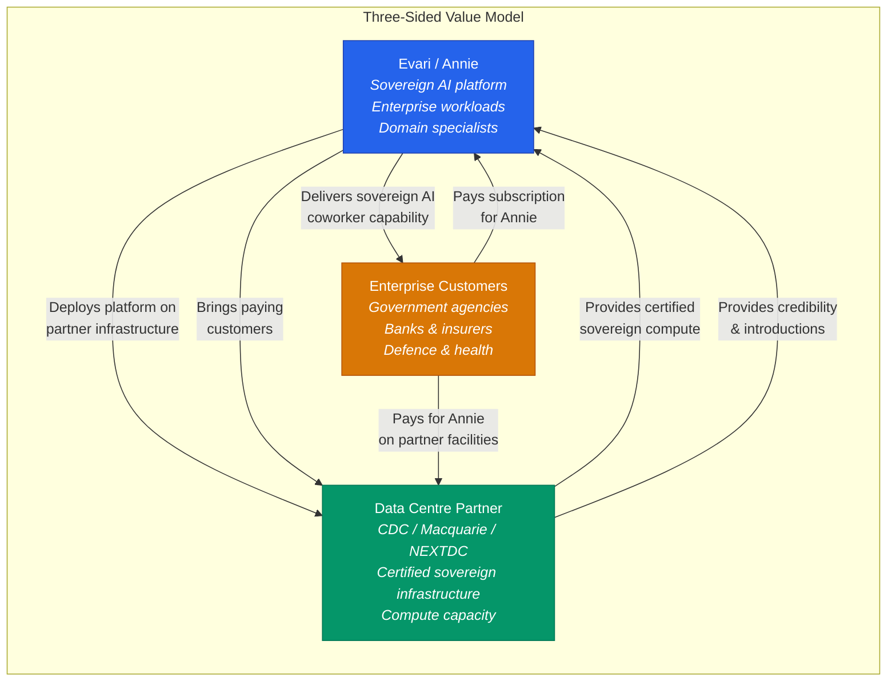
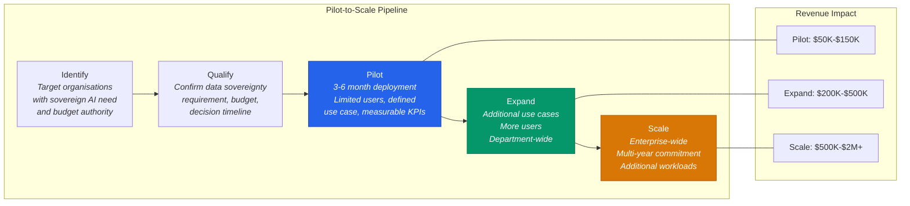
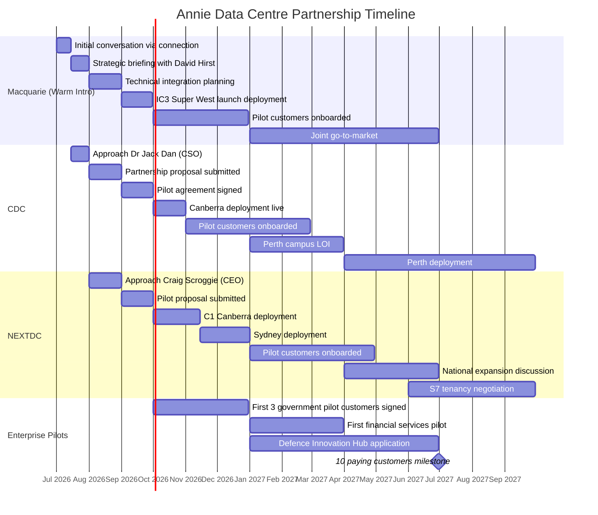
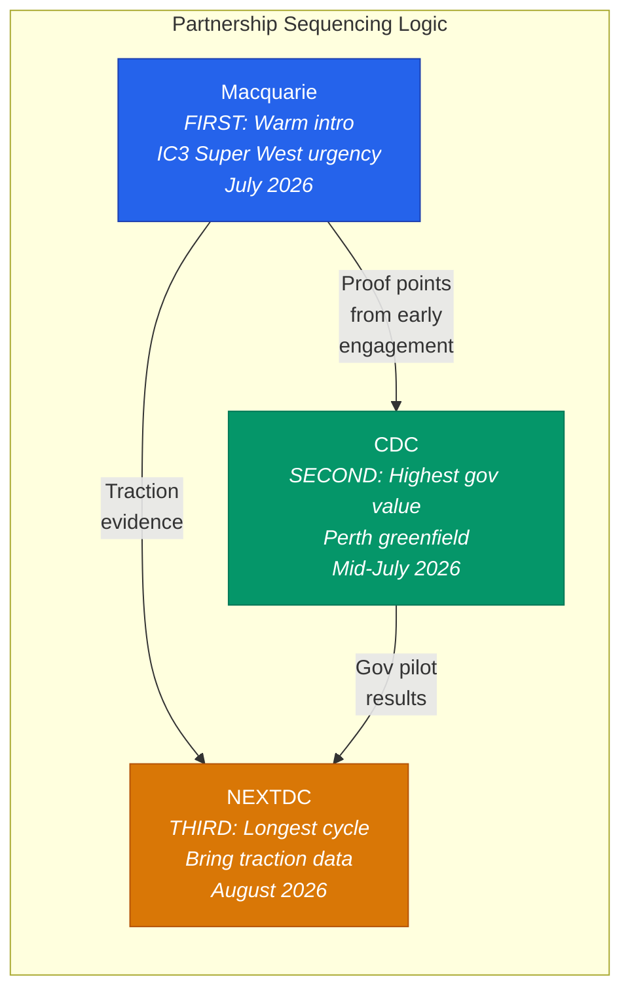

# Partner Propositions: CDC, Macquarie Data Centres, NEXTDC

## Executive Summary

Evari is approaching three of Australia's leading data centre operators with a proposition that goes beyond a traditional tenancy arrangement. The model is three-sided: Evari brings Annie, a sovereign AI platform that creates a new category of workload. Data centre partners provide certified sovereign infrastructure and compute capacity. Enterprise customers -- government agencies, banks, insurers, defence organisations -- pay to run Annie on that infrastructure. Every Annie deployment is a tenant on the partner's facility. Every new customer Evari signs is revenue the partner did not have to sell.

This is a workload-generation partnership, not a capital raise. Data centre operators are in an unprecedented build-out phase. CDC is constructing 800MW of new capacity. Macquarie is opening a 47MW AI-optimised facility in September 2026. NEXTDC has 550MW to fill at its S7 campus. Their shared challenge is the same: filling that capacity with creditworthy, long-term tenants running real production workloads. Annie addresses that challenge directly.

The three partners are complementary, not competing. CDC provides the deepest government certification and the greenfield Perth opportunity. Macquarie provides the Dell/NVIDIA sovereign AI factory hardware stack and the warmest introduction path. NEXTDC provides national scale, public company credibility, and a diversification story against OpenAI concentration risk.

**What Evari brings to every partner:**
- A new category of sovereign AI workload that does not exist today in Australian data centres
- Enterprise customers in government, defence, financial services, healthcare, and insurance who will pay for Annie and consume infrastructure capacity
- Modest hardware requirements (standard inference GPUs with 32GB+ VRAM, not training-grade clusters) that deliver high revenue per rack at low power density
- Differentiation narrative: "the only data centre in Australia running an Australian-built sovereign AI coworker platform"
- The Fable 5 precedent as a compelling demand driver -- every organisation that lost AI access on June 13 is now evaluating sovereign alternatives

**Why this scales beyond Evari:** Annie is a platform, not a model. She ships with Evari's own sovereign specialists, but her pipeline roles are open slots. Every customer who deploys Annie can bring their own domain models into the architecture. A bank adds their risk model. A defence contractor plugs in a classified specialist. Each new customer model is additional compute running on the partner's infrastructure. This means Annie is not a single tenant -- she is a workload multiplier. The more customers on the platform, the more models in the pipeline, the more racks consumed.

**What Evari asks from every partner:**
- Compute capacity without massive upfront capital investment
- Access to the partner's customer relationships and sales channels
- Credibility by association with certified sovereign infrastructure
- Potential co-investment to fund Annie's go-to-market

---

## The Market Opportunity

### The Sovereign AI Imperative

On June 12, 2026, the US Commerce Department ordered Anthropic to suspend global access to Fable 5 and Mythos 5. Because nationality-based filtering proved technically infeasible, Anthropic disabled both models for all users worldwide -- including paying enterprise customers. As of June 22, they remain suspended with no restoration date. No exemption exists for Five Eyes partners, EU allies, or any other country.

This is not a theoretical risk. It has been demonstrated. Every Australian government agency, bank, insurer, and healthcare provider running critical workloads on US-hosted frontier models now faces the same question: what happens when access is severed without warning?

Annie addresses this by providing sovereign AI that was built with sovereign infrastructure. Annie's architecture consists of one sovereign base model (sparse MoE, pre-trained from scratch) fine-tuned into five unique domain specialist variants, plus Qwen 3.6:27B. These six physical models fill twelve logical pipeline roles -- classifier, domain experts, judgment models, verification models, rapport model, etc. -- with some models serving multiple roles. The sovereign base model was trained from scratch on 1.5 trillion tokens of Evari domain data plus 15 trillion tokens of open-source permissible datasets. The five unique fine-tuned variants specialize in domains like coding, insurance, general knowledge, regulatory compliance, etc. The total initial training investment was a modest capital outlay -- orders of magnitude below frontier training costs. This is not an adaptation or fine-tune of an external model. This is capability built entirely within Australia's control. Qwen 3.6:27B has extensive additional training and serves as the largest specialist for complex reasoning. All post-training occurs on Evari's internal servers. The result: a sovereign AI system that cannot be suspended by an external government and has no dependency on external model weights that could become subject to export controls.

The European Commission proposed the Cloud and AI Development Act on June 3, aiming to triple European data centre capacity over five to seven years. France, the Netherlands, and the UK have all announced accelerated sovereign AI programmes. Australia has no equivalent response yet, but the political and institutional demand is building.

### The Australian Opportunity

The Australian sovereign AI market sits at the intersection of four forces:

1. **Government mandate.** The DTA's AI procurement guidance (December 2025) requires AI Impact Assessments for all new AI use cases, with mandatory compliance by December 2026. GovAI Chat trials began in April 2026. The government is building the procurement framework; it now needs the platforms.

2. **Defence investment.** The 2025-26 budget allocated $1.2 billion for sovereign AI and autonomous systems. The Advanced Strategic Capabilities Accelerator (ASCA) committed $3.4 billion over its first decade, with roughly 40% directed at AI. Project Redspice is a $9.9 billion cyber and intelligence programme with significant AI components.

3. **Regulatory pressure.** Financial services (APRA), healthcare (TGA), and insurance (ASIC) all face regulatory requirements around data sovereignty, model transparency, and audit trails that US-hosted AI services cannot currently satisfy.

4. **Critical infrastructure designation.** Data centres are now classified as critical infrastructure under the Security of Critical Infrastructure Act 2018. AI platforms processing government and financial data will face increasing scrutiny around where computation happens and who controls it.

### Why Now

The Fable 5 suspension created a window. Before June 12, sovereign AI was a policy aspiration. After June 12, it is an operational requirement with executive-level urgency. Organisations that were evaluating sovereign alternatives over an 18-month horizon are now compressing that timeline to months.

Annie is ready for pilot deployment. The data centre partners are in a build-out phase with capacity to fill. The enterprise customers have budget and urgency. The three-sided model works because all three sides are motivated simultaneously.

### Target Sectors

| Sector | Why They Care | Estimated Market Size |
|--------|--------------|----------------------|
| **Federal Government** | Fable 5 demonstrated the risk. Hosting Certification Framework mandates sovereign infrastructure. DTA procurement guidance requires AI Impact Assessments. | 98 federal agencies, $1.8B annual IT spend on external providers |
| **Defence** | $1.2B allocated for sovereign AI in 2025-26. Five Eyes interoperability requires Australian-controlled AI for classified work. | $3.4B ASCA commitment over decade |
| **Financial Services** | APRA prudential requirements on data sovereignty. Board-level concern about operational resilience after June 12. | Four major banks, ~20 significant insurers |
| **Healthcare** | Patient data sovereignty requirements. Medicare and PBS claims processing at massive scale. | $8B+ annual health IT spend |
| **Insurance** | Domain-specific AI requirements that generalist models handle poorly. Regulatory audit trail obligations. | $70B+ annual premium market |

---

## Partner Proposition: CDC Data Centres

### About CDC

CDC is Australia's largest sovereign, privately owned data centre operator. Founded in 2007 by Greg Boorer in Canberra, it now operates 18 data centres with five more under construction, delivering over 800MW across Canberra, Sydney, Melbourne, Auckland, and Perth.

The ownership structure tells the story: Infratil (49.75%), Australian Future Fund (34.55%), Commonwealth Superannuation Corporation (12.04%), and management (3.66%). Two of the three institutional shareholders are Australian government-affiliated entities. No foreign hyperscaler or Chinese capital involvement. The February 2025 share transaction implied an AUD $17 billion enterprise valuation.

CDC holds Certified Strategic status -- the highest level under the Australian Government Hosting Certification Framework -- across all of its facilities. It was one of the first three providers to achieve this certification. Government contracts have surpassed $1 billion, anchored by a $226 million Services Australia extension and $91.5 million in Defence contracts.

CDC's AI strategy centres on the Firmus/NVIDIA partnership (Project Southgate), targeting 1.6GW of AI factories through 2028 using 18,500 NVIDIA GB300 GPUs. It also hosts the Monash MAVERIC supercomputer ($60M, NVIDIA GB200 NVL72) and CSIRO's Virga HPC cluster (NVIDIA H100s).

**Key decision-makers:** Greg Boorer (CEO, ultimate signoff), Dr Jack Dan (CSO, strategic partnerships), Andrew Kirker (MD Hyperscale), Simon Black (CCO, commercial).

### What Annie Brings to CDC

**A new sovereign AI workload category that fills capacity.** CDC is building hundreds of megawatts of new capacity across Marsden Park (504MW, $3.1B), Melbourne (800MW+ target), and Perth (200MW, $415M Stage 1). Their biggest risk is filling it. Every Annie customer is a tenant on CDC infrastructure -- government agencies, banks, insurers -- exactly the customer profile CDC already serves. Annie does not compete with CDC's existing tenants; it brings new ones.

**Differentiation from the Firmus relationship.** Firmus is focused on massive-scale AI training factories (GB300 GPUs, 1.6GW). Annie occupies a different tier entirely: enterprise-grade, inference-focused, domain-specific AI coworker services. A 7B specialist model running insurance coverage determinations is not competing with a GB300 training cluster. Annie complements Firmus by adding a sovereign AI application layer on top of CDC's infrastructure story.

**Modest hardware, high margins.** Annie's twelve specialist models range from 250M to 27B parameters and run on standard inference GPUs with 32GB+ VRAM (e.g., RTX 5090, L40S, A6000). A full Annie deployment requires a fraction of the power and cooling that a training-grade cluster demands. For CDC, this means high revenue per rack at standard power density -- no need for the 100kW+ liquid-cooled racks that Firmus workloads require. Annie workloads can fill standard-density capacity that might otherwise sit empty while high-density AI racks are under construction.

**An anchor workload for the Perth campus.** The Maddington campus (200MW, operational 2026) is greenfield with no legacy tenants. It is explicitly positioned for "AI and advanced technology deployments in Western Australia." Annie as an early-stage platform partner -- committed before the facility opens -- is strategically valuable to CDC as a signal to the WA market. Perth's proximity to the mining/resources sector (growing AI/ML needs), the defence sector (naval base, Five Eyes), and renewable energy from the WA grid aligns with Annie's target customer base.

**The sovereign narrative amplified.** CDC's entire brand is sovereign. Annie amplifies that story: not just sovereign infrastructure, but a sovereign AI platform running on sovereign infrastructure. Australian-built AI, Australian-owned data centres, Australian government-affiliated shareholders. No foreign AI provider involved. No US CLOUD Act exposure. This is the pitch CDC's sales team makes to government customers, made stronger.

### What CDC Brings to Annie

**Government certification at the highest level.** CDC's Certified Strategic status across all facilities means Annie can immediately serve PROTECTED-level government workloads without building or certifying infrastructure. This is years of accreditation work that Annie inherits by deploying on CDC.

**Government customer relationships.** CDC serves Services Australia, the Department of Defence, and dozens of federal and state agencies. These are exactly the organisations most likely to pilot sovereign AI. CDC's sales team already has the relationships; Annie provides them with a new product to sell.

**Compute capacity without upfront capital.** Annie does not need to build data centres or buy servers. CDC provides the physical environment, power, and cooling. Evari deploys software and lightweight GPU hardware. The capital requirement drops from hundreds of millions to hundreds of thousands.

**Credibility by association.** "Annie runs on CDC's Certified Strategic infrastructure, the same facilities that host Services Australia and the Department of Defence." This is a sentence that opens doors with government procurement teams.

**The Perth greenfield timing.** Getting into Perth early -- before the facility opens and tenancy commitments are locked -- gives Annie favourable terms and a strategic position as the anchor AI platform in Western Australia.

### Proposed Engagement Model

**Phase 1: Pilot (Months 1-6).** Deploy Annie on CDC infrastructure at one Canberra facility (Hume or Fyshwick). Three to five pilot customers drawn from CDC's existing government relationships. Minimal hardware: four to eight inference GPUs with 32GB+ VRAM for the specialist model pool. CDC provides rack space and power at reduced pilot rates. Evari provides the platform, specialist models, and customer onboarding. Pilot scope includes domain-specific tuning: Annie is currently optimised for insurance and fintech domains. Government use cases will require training or fine-tuning of specialists for government-specific workflows, policy interpretation, and regulatory domains. This is factored into pilot timelines and deliverables.

**Phase 2: Expansion (Months 6-18).** Scale based on pilot outcomes. Add Sydney (Marsden Park) and Perth (Maddington) deployments. Expand to financial services and insurance customers. Graduate to commercial colocation rates with committed power draw. Discuss co-investment if pilot metrics justify it. Specialist model expansion continues as new use cases are discovered.

**Phase 3: Strategic Partnership (Months 18-36).** Formal partnership agreement positioning Annie as CDC's sovereign AI platform offering. Joint go-to-market for government and enterprise customers. CDC sales team trained to sell Annie alongside their core colocation services. Potential equity investment from CDC or its shareholders. Continuous specialist development for new domains identified through customer engagement.

**The commercial structure:** Colocation lease for Annie's infrastructure at CDC facilities, with a revenue-sharing component on Annie subscription fees generated from customers introduced through CDC's sales channels. This aligns incentives: CDC earns more when Annie succeeds, and Annie succeeds when CDC's customers adopt it. Specialist training and domain customisation are handled through Evari's professional services, separate from colocation licensing.

### Alignment and Risks

**Where interests align perfectly:**
- Both need government and enterprise tenants
- Both benefit from the sovereign narrative
- Annie fills standard-density capacity while Firmus fills high-density
- Annie's growth directly increases CDC's recurring revenue
- Perth timing works for both parties

**Where friction could arise:**
- CDC may view Annie as too small or too early for a partnership at CDC's current scale ($17B valuation)
- The Firmus/NVIDIA relationship could create exclusivity concerns -- does Firmus see Annie as a competitor?
- CDC's 555MW US hyperscaler deal suggests a strategic direction toward hyperscale, not boutique AI platforms
- If Annie's pilot customers are too few or too small, CDC may not allocate sales attention

**Mitigation:** Position Annie explicitly as complementary to Firmus (application layer vs. training infrastructure). Start small with a pilot that requires minimal CDC commitment. Demonstrate demand through signed pilot customers before asking for a broader partnership. Target the Perth campus specifically, where CDC has capacity to fill and fewer competing priorities.

---

## Partner Proposition: Macquarie Data Centres

### About Macquarie

Macquarie Data Centres is a division of Macquarie Technology Group (ASX: MAQ, market cap ~$1.82B), a 100% Australian-owned company founded in 1992 by David and Aidan Tudehope. It operates five data centres across Sydney and Canberra, all holding Certified Strategic status.

The flagship asset is IC3 Super West: a 47MW AI-optimised facility at the Macquarie Park campus, opening September 2026 with Phase 1 delivering 6MW. It supports direct-to-chip liquid cooling for high-density GPU workloads and is being positioned as "the only data centre to add new AI capacity to Sydney's north zone in 2026."

Macquarie's AI strategy centres on the Dell Sovereign AI Factory partnership (announced August 2025), combining Dell PowerEdge XE9680 servers, NVIDIA GPUs, and NVIDIA Spectrum-X networking inside IC3 Super West. The target sectors are healthcare, financial services, education, research, government, and critical infrastructure -- sectors requiring strict data residency and regulatory compliance.

In March 2026, the Australian Government's National Reconstruction Fund committed $200 million to Macquarie for sovereign cloud expansion, AI-enabled cybersecurity capability, and a new sovereign data facility. This is the federal government putting taxpayer capital directly behind Macquarie's sovereign infrastructure vision.

Macquarie serves 42% of Australian Federal Government agencies, employs 200+ NV1+ cleared engineers, and operates a 24/7 Security Operations Centre with cleared staff. IC5 "The Bunker" in Canberra is Zone 5 Top Secret capable.

**Key decision-makers:** David Hirst (Group Executive, Macquarie Data Centres -- primary for AI infrastructure partnerships), Aidan Tudehope (MD Hosting Group -- government/sovereign cloud angle), David Tudehope (Group CEO).

**Evari's existing connection:** A warm introduction path exists, which materially changes the engagement approach.

### What Annie Brings to Macquarie

**The software layer for the Dell/NVIDIA hardware stack.** Macquarie has the physical infrastructure (IC3 Super West) and the hardware (Dell AI Factory with NVIDIA). What they likely need are the software platforms, AI applications, and managed services that run on top. Annie is that missing layer. The Dell partnership gives Macquarie a sovereign AI factory; Annie gives the factory a product to manufacture. Without a platform layer, Macquarie has infrastructure looking for applications. Annie provides the applications looking for infrastructure.

**Tenants for IC3 Super West.** IC3 Super West opens in September 2026 with 6MW in Phase 1, expanding to 19MW and then 47MW. Macquarie needs anchor tenants and compelling use cases to fill that capacity. Annie's deployment plus the enterprise customers Annie brings directly addresses Macquarie's most pressing business need in Q3 2026.

**A competitive answer to NEXTDC's OpenAI partnership.** NEXTDC's OpenAI deal (announced December 2025) put pressure on Macquarie to demonstrate a comparable sovereign AI ecosystem. The Dell partnership is infrastructure; Annie provides the application layer that makes the ecosystem tangible. "Macquarie hosts Australia's sovereign AI coworker platform" is a headline that competes with "NEXTDC hosts OpenAI." Annie arrives in 2026, a full year before NEXTDC's S7 campus delivers its first phase in H2 2027.

**Enterprise customers in Macquarie's target sectors.** Macquarie's customer base is 42% of Federal Government agencies, Fortune 500 enterprises, and critical infrastructure providers. Annie's target customers are government, defence, financial services, healthcare, and insurance. The overlap is nearly total. Annie brings workloads from customers Macquarie already knows or wants to know.

**Alignment with the NRF investment mandate.** The $200M NRF investment is earmarked partly for "AI-enabled cybersecurity capability" and sovereign cloud expansion. A sovereign AI platform that runs on Macquarie infrastructure, serving government customers, directly addresses the outcomes the NRF investment was designed to achieve.

### What Macquarie Brings to Annie

**AI-optimised infrastructure purpose-built for GPU workloads.** IC3 Super West was specifically designed for high-density AI compute with liquid cooling support. While Annie's specialist models run on standard inference GPUs (32GB+ VRAM) rather than training-grade clusters, having access to purpose-built AI infrastructure provides headroom for scaling and for customers who want to run larger fine-tuning workloads alongside Annie's inference pipeline.

**The Dell/NVIDIA partnership ecosystem.** Access to the Dell AI Factory hardware stack, NVIDIA DGX-Ready certification, and the engineering expertise that comes with a 15-year Dell relationship. If Annie's hardware requirements evolve (larger specialists, more concurrent models, customer-specific fine-tuning), the Dell/NVIDIA ecosystem provides a scaling path.

**Deep government relationships and cleared personnel.** 200+ NV1+ cleared engineers is a capability that takes years and significant investment to build. For Annie deployments serving classified government workloads, Macquarie provides the cleared operational staff that Evari does not yet have. IC5 The Bunker offers Zone 5 Top Secret capability for the most sensitive deployments.

**The warm introduction.** Evari's existing connection to Macquarie reduces the cold-start problem that plagues data centre partnerships. The conversation can start at a strategic level rather than fighting through procurement gatekeepers.

**The Macquarie University partnership.** Macquarie's April 2026 strategic partnership with Macquarie University for joint research in cloud computing, cybersecurity, and data centre engineering provides a potential research collaboration channel for Annie's specialist model development.

### Proposed Engagement Model

**Phase 0: Introduction (Weeks 1-4).** Leverage the existing connection for a strategic conversation with David Hirst (data centre partnerships) and Aidan Tudehope (sovereign cloud). Frame Annie as the software platform that completes their Dell AI Factory stack. Provide a technical brief demonstrating Annie's architecture and how it maps onto IC3 Super West's capabilities.

**Phase 1: IC3 Super West Launch Partner (Months 2-8).** Position Annie as one of the anchor tenants for IC3 Super West's September 2026 opening. Deploy the Annie platform on a modest initial allocation (two to four racks, standard inference GPUs with 32GB+ VRAM). Run three to five pilot customers from Macquarie's government and enterprise base. This gives Macquarie a tangible "sovereign AI platform" story for the IC3 Super West launch -- a headline beyond "we have racks and cooling." Pilot scope includes domain-specific tuning: Annie is currently optimised for insurance and fintech. Government and enterprise customers will require specialist training for their target use cases. Specialist development is factored into pilot timelines.

**Phase 2: Joint Go-to-Market (Months 8-18).** Develop a joint value proposition: "Macquarie Sovereign AI, powered by Annie." Macquarie's sales team offers Annie as a managed service running on their certified infrastructure. Annie handles the AI platform; Macquarie handles the infrastructure, security, and government compliance. Revenue share on jointly acquired customers. Specialist model expansion for government and enterprise domains continues through partnership.

**Phase 3: Integrated Offering (Months 18+).** Annie becomes part of Macquarie's sovereign cloud services portfolio. Potential co-investment or equity arrangement. Expansion to the planned 150MW+ campus. Integration with Macquarie Government's cyber security services for an AI-enabled security offering (aligned with NRF investment outcomes). Specialist development roadmap covers new domains as customer base grows.

### Alignment and Risks

**Where interests align perfectly:**
- IC3 Super West needs tenants for its September 2026 opening -- Annie arrives at exactly the right time
- The Dell AI Factory needs a software platform -- Annie fills the gap
- Macquarie needs a competitive response to NEXTDC's OpenAI deal -- Annie provides one
- Both target the same customer segments (government, defence, finance, healthcare)
- The NRF investment creates government expectations that Macquarie will deliver sovereign AI outcomes
- The warm introduction reduces partnership friction

**Where friction could arise:**
- Macquarie is a smaller operator ($1.82B market cap vs. CDC at $17B and NEXTDC at $9.2B) -- does this limit their reach?
- IC3 Super West's Phase 1 is only 6MW -- initial capacity is constrained
- Macquarie may prefer a larger, more established AI platform partner (a recognisable global brand)
- If Annie is perceived as too early-stage, Macquarie's risk-averse government customers may hesitate
- Dell and NVIDIA have their own AI platform preferences that may not include Annie

**Mitigation:** The warm introduction is the single biggest advantage. Use it to get an honest assessment of Macquarie's appetite before investing significant effort. Position Annie not as a replacement for Dell/NVIDIA software but as a complementary Australian sovereign layer. Start with a small footprint that demonstrates value without requiring Macquarie to make a significant commitment.

---

## Partner Proposition: NEXTDC

### About NEXTDC

NEXTDC (ASX: NXT, market cap ~$9.17B) is Australia's largest listed data centre operator. It runs 17 data centres across Australia and one in Malaysia, with a development pipeline exceeding 1.5GW. The company was founded in 2010 and has grown to become the second-largest data centre operator in Oceania behind Equinix.

The defining recent event is the OpenAI partnership. In December 2025, NEXTDC signed a Memorandum of Understanding under OpenAI's "OpenAI for Countries" programme -- the first in Asia-Pacific. The deal covers a next-generation 550MW AI campus at S7 Eastern Creek in western Sydney, valued at $7 billion. First phase delivery is expected H2 2027.

NEXTDC is DTA Certified Strategic across its entire national network. It holds NVIDIA DGX-Ready certification, supports rack densities up to 150kW (scalable to 600kW), and offers direct-to-chip and immersion cooling. It is carrier-neutral and cloud-neutral, hosting AWS, Azure, GCP, Oracle, and IBM across its facilities.

The company is not yet profitable (H1 FY2026 net loss of $39.4M) but is growing aggressively, with contracted utilisation up 60% to 667MW and a forward order book up 83% to 544MW. FY26 capex guidance is $2.7B-$3.0B. Pro forma liquidity stands at $8.4 billion.

The board includes Steve Smith, former CEO of Equinix, who grew that company from $2B to $34B market value. His appointment signals NEXTDC's global ambitions.

**Key decision-makers:** Craig Scroggie (CEO), David Dzienciol (Chief Customer and Commercial Officer), Simon Cooper (Group Chief Development Officer).

### What Annie Brings to NEXTDC

**Diversification from OpenAI dependency.** The OpenAI MoU is non-binding and covers a single US company whose models are now subject to demonstrated export control risk. If US export controls tighten further -- or if the Fable 5 precedent is applied to GPT models -- NEXTDC's flagship AI story is exposed. Annie provides a hedge: an Australian-built, Australian-controlled sovereign AI platform that cannot be suspended by a US Commerce Department directive. Having multiple AI tenants, including a sovereign one, is a stronger story than dependence on a single US provider.

This is not speculative. The Fable 5 suspension proved that access to US-built AI can be revoked without warning, without geographic exemption, and without recourse. NEXTDC's board and shareholders understand this risk. Annie is the insurance policy.

**Access to sectors OpenAI may not reach.** Classified government workloads, defence applications, and highly regulated sectors (banking, insurance) may require AI platforms that operate entirely under Australian jurisdiction with no foreign dependencies. OpenAI, as a US company subject to US law, faces structural barriers in these sectors. Annie, as an Australian platform on Australian infrastructure, does not. NEXTDC can offer Annie for the sovereign-sensitive workloads and OpenAI for everything else.

**Enterprise pilot customers in NEXTDC's target sectors.** NEXTDC is DTA Certified Strategic and explicitly targets government, financial services, defence, education, healthcare, and research for S7. Annie's target customer base is identical. Every Annie pilot customer consumes NEXTDC infrastructure.

**Complementary positioning, not competitive.** OpenAI provides frontier general-purpose AI. Annie provides sovereign domain-specific AI. These serve different use cases and different procurement requirements. A government agency might use OpenAI (via NEXTDC) for general productivity and Annie (also via NEXTDC) for classified domain work. NEXTDC becomes the venue where both coexist, offering customers sovereign choice rather than a single provider.

**Modest hardware requirements that fill capacity immediately.** S7's first phase is H2 2027. But NEXTDC has existing facilities (S1-S6, C1, P1-P2, M1-M3) with available capacity today. Annie's standard GPU requirements (32GB+ VRAM) can deploy into existing NEXTDC facilities immediately, generating revenue while S7 is under construction. Annie does not need to wait for the 550MW campus; it can start in a single rack at any Certified Strategic NEXTDC site.

### What NEXTDC Brings to Annie

**National scale.** 17 data centres across Sydney, Melbourne, Brisbane, Perth, Canberra, Adelaide, Darwin, and more. Annie can deploy nationally on a single partner's infrastructure, serving customers in every major Australian market without managing multiple data centre relationships.

**Public company credibility.** NEXTDC is an ASX-listed company with a $9.17B market cap, institutional backing from La Caisse de depot et placement du Quebec, and Steve Smith (ex-Equinix CEO) on the board. "Annie runs on NEXTDC infrastructure" carries weight with enterprise procurement teams that "Annie runs on a startup's servers" does not.

**AI infrastructure expertise from the OpenAI partnership.** NEXTDC's engagement with OpenAI has forced them to build deep expertise in AI infrastructure: liquid cooling, high-density power distribution, GPU cluster networking. This expertise benefits all AI tenants, including Annie. Even though Annie's requirements are modest by comparison, the operational maturity that comes from hosting frontier AI workloads provides a better platform for every AI customer.

**Enterprise customer relationships.** NEXTDC's 770+ ecosystem partners, carrier-neutral interconnection fabric, and existing enterprise customer base provide a sales channel that Annie could not build independently. NEXTDC's CCO (David Dzienciol) and VP Customer (Adam Scully) manage relationships with exactly the organisations Annie needs to reach.

**The JV co-investment structure.** NEXTDC is actively seeking third-party capital partners for its S4/S7 joint venture platform, targeting $15B over 10+ years for 850MW of new Sydney capacity. While Evari is not a capital partner at that scale, the JV structure signals that NEXTDC is open to partnership models beyond simple tenancy.

### Proposed Engagement Model

**Phase 1: Existing Facility Pilot (Months 1-6).** Deploy Annie at one or two existing NEXTDC facilities (C1 Canberra for government, S-series Sydney for enterprise). Consumer-GPU hardware in two to four racks. Three to five pilot customers. Position Annie as a sovereign AI option alongside NEXTDC's cloud-neutral ecosystem. No dependency on S7 timeline. Pilot scope includes domain-specific tuning for government and enterprise sectors identified with customers. Annie is currently optimised for insurance and fintech; expanding to new domains requires specialist training or customer model injection.

**Phase 2: National Expansion (Months 6-18).** Scale Annie across NEXTDC's national footprint: Melbourne (M-series), Perth (P-series), Brisbane (B-series). Target state government customers in each geography. Develop the "sovereign AI choice" narrative: government and enterprise customers can access OpenAI for general AI and Annie for sovereign domain-specific AI, both on NEXTDC infrastructure. Specialist model development continues for new sectors identified through customer engagement.

**Phase 3: S7 Integration (Months 18-36).** As S7's first phase comes online (H2 2027), Annie is positioned as a confirmed additional tenant alongside OpenAI. Annie's track record from Phase 1 and Phase 2 demonstrates demand and creditworthiness. Negotiate a long-term capacity commitment at S7 for Annie's growing customer base. Explore co-investment or revenue-sharing arrangements. Specialist roadmap for new domains identified through expanded customer base is in place.

**The commercial structure:** Standard colocation lease initially, with a strategic partnership overlay that includes co-marketing, joint sales enablement, and customer referral arrangements. NEXTDC's carrier-neutral, cloud-neutral DNA means they are comfortable hosting multiple AI providers -- Annie does not need to be the only or the biggest, just creditworthy and growing. Specialist training is handled through Evari's professional services, separate from colocation licensing.

### Alignment and Risks

**Where interests align perfectly:**
- NEXTDC needs tenant diversification beyond OpenAI -- Annie provides it
- Both target the same government and enterprise sectors
- Annie can deploy immediately in existing facilities, generating revenue before S7 opens
- NEXTDC's carrier-neutral model naturally accommodates multiple AI platforms
- The sovereign narrative is stronger with both frontier (OpenAI) and sovereign (Annie) AI on the same infrastructure
- NEXTDC's not-yet-profitable status means they are motivated by near-term revenue from real tenants

**Where friction could arise:**
- NEXTDC may view Annie as too small to be strategically significant at their scale (667MW contracted, 544MW forward order book vs. Annie's initial requirement of perhaps 0.5MW)
- OpenAI could object to NEXTDC actively promoting a competing AI platform, even if the MoU is non-exclusive
- NEXTDC's board may question Evari's credit profile and funding runway -- the "bad AI tenant" concern
- NEXTDC might prefer to wait for larger, more established sovereign AI platforms (Mistral, DeepSeek) to approach them
- The S7 timeline (H2 2027) may not align with Annie's urgency to deploy now

**Mitigation:** Start in existing facilities, not S7. This removes the timeline mismatch and allows Annie to demonstrate demand before asking for a strategic commitment. Position Annie explicitly as complementary to OpenAI -- "we serve the sectors OpenAI structurally cannot." Address the credit concern head-on by presenting signed pilot customer commitments and a funded runway. Accept that Annie will be a small tenant initially and build the relationship through demonstrated growth rather than day-one scale.

---

## Pilot Customer Strategy

The three-sided model only works if all three sides are present. Data centre partners provide infrastructure. Annie provides the platform. But enterprise customers provide the revenue that makes the model financially real. Without signed pilot customers, the data centre partnership is a pitch. With them, it is a business.

*Current status: No pilot customers are signed or named yet. Identifying and securing at least one named pilot customer is the highest-priority pre-requisite before data centre partner conversations advance beyond the initial introduction stage.*

### Government Agencies

**Why they care:** The Fable 5 suspension was a concrete demonstration of dependency risk. DTA's AI procurement guidance (December 2025) creates the framework. GovAI Chat (trials from April 2026) establishes the baseline. Agencies need specialised AI capabilities beyond what GovAI provides -- domain-specific reasoning, policy interpretation, compliance checking -- that a sovereign platform can deliver without US dependency.

**Priority targets:**
- **Services Australia** -- Already the most advanced agency in operational AI deployment (chatbot "Sam," myGov virtual assistant). Existing CDC customer ($226M contract). The logical first pilot because they have proven AI appetite and a relationship with CDC.
- **Australian Taxation Office (ATO)** -- Massive-scale data processing, fraud detection, compliance automation. Existing Macquarie customer. Budget and procurement sophistication to run a pilot.
- **Department of Home Affairs** -- Immigration, border security, national security use cases. Recently consolidated a $55M 10-year CDC contract.
- **Digital Transformation Agency (DTA)** -- Owns the policy framework and GovAI. Positioning Annie as a complementary specialised platform to GovAI could secure the gatekeeper's endorsement.

**Estimated pilot scope:** 20-50 users within a single business unit. Defined use case (e.g., policy interpretation, claims processing assistance, compliance checking). Three to six months. $50K-$150K pilot fee.

**How they procure:** Digital Sourcing Framework. AI Impact Assessment required (mandatory from June 2026, full compliance by December 2026). Can use existing panel arrangements (Data Centre Facilities 2 Whole of Government Panel) or direct approach for innovative technology. Multidisciplinary procurement teams required. Contract clauses must address data sovereignty, model transparency, and audit rights.

### Defence

**Why they care:** $1.2B allocated for sovereign AI in 2025-26. ASCA's $3.4B over a decade with ~40% directed at AI. Four defined sovereign AI focus areas: signals intelligence, autonomous maritime surveillance, electronic warfare, logistics optimisation. Australia currently lacks a dedicated defence AI testing range. The clearance and sovereignty requirements mean US-hosted AI is structurally unsuitable for classified work.

**Priority targets:**
- **Defence Innovation Hub** -- 80+ AI-related projects funded since 2024 expansion. Grant range from $500K (early feasibility) to $45M (advanced prototype). This is the entry point for defence work.
- **Advanced Strategic Capabilities Accelerator (ASCA)** -- Headquartered at Lot Fourteen, Adelaide. Emerging and Disruptive Technologies Decision Advantage Program: $40M, 14 new contracts.
- **Defence Science and Technology Group (DSTG)** -- Currently employs ~400 AI/data science specialists, targeting 600 by 2028. Potential research collaboration.

**Estimated pilot scope:** Classified domain-specific AI assistant for a defined intelligence or logistics function. Requires DISP membership, IRAP assessment, and deployment on Certified Strategic infrastructure. Six to twelve months. $200K-$500K through Defence Innovation Hub funding.

**How they procure:** Defence Innovation Hub for early-stage; ASCA for larger programmes. DISP membership required. IRAP assessment for IT systems handling classified information. Longer procurement cycles (12-18 months typical) but larger contract values.

### Financial Services

**Why they care:** APRA prudential requirements on operational resilience and data sovereignty. Board-level urgency after Fable 5 -- major banks were using Claude for code review, document analysis, and customer service automation. Compliance requirements around model transparency and audit trails that US-hosted AI cannot fully satisfy.

**Priority targets:**
- **Major banks (CBA, NAB, ANZ, Westpac)** -- All four have AI programmes. CBA is a named OpenAI Australia customer. The pitch to the others: "CBA is locked into a US provider. You can choose sovereign AI with full data control and audit trail."
- **Major insurers** -- Domain-specific AI for claims processing, underwriting, compliance. Annie's insurance specialist models are a natural fit.

**Estimated pilot scope:** AI assistant for a specific business function (compliance checking, document analysis, claims triage). 50-100 users. Three to six months. $100K-$300K pilot fee.

**How they procure:** Enterprise procurement with APRA compliance review. Vendor risk assessment, data sovereignty certification, model governance documentation. Three to six month procurement cycle for pilots.

### Healthcare

**Why they care:** Patient data sovereignty under the Privacy Act and My Health Records Act. Medicare and PBS claims processing at massive scale (Services Australia handles this). Clinical decision support requires auditability and explainability.

**Priority targets:**
- **Department of Health and Aged Care** -- Policy interpretation, Medicare claims processing support.
- **State health departments** -- Clinical coding, administrative AI assistance.
- **Private health insurers** -- Claims processing, provider management.

**Estimated pilot scope:** AI assistant for clinical coding or claims processing. 20-50 users. Three to six months. $50K-$150K pilot fee.

**How they procure:** Similar to government procurement frameworks. My Health Records Act compliance requirements. Ethics committee review for clinical applications.

---

## Compliance and Certification Roadmap

Annie does not currently hold formal security or compliance certifications. This is expected for an early-stage platform and is not unusual for pilot-phase engagements. However, any path from pilot to production in government, defence, financial services, or healthcare will require certifications. The following are anticipated requirements:

- **IRAP assessment** for government deployments (required for Protected-level workloads)
- **ISO 27001** as baseline information security certification
- **SOC 2 Type II** for enterprise and financial services customers
- **DISP membership** if defence deployments are pursued
- **APRA CPS 230/234 alignment** for financial services and insurance customers

Certification scoping and timeline will be determined during the pilot phase, informed by which customer sectors are engaged first. The partner's existing certification framework provides the infrastructure baseline; Annie's certification covers the application and data handling layer.

---

## The Ask

This section specifies what Evari wants from each partner. Vague asks get vague responses. Concrete asks get concrete answers.

### From CDC

| Item | Specifics |
|------|-----------|
| **Compute allocation** | Two racks at a Canberra facility (Hume or Fyshwick) for pilot. Eight inference GPUs with 32GB+ VRAM (e.g., RTX 5090, L40S, A6000). Standard power density (~10kW per rack). |
| **Commercial terms** | Reduced colocation rate for a 6-month pilot period. Transition to standard commercial rates upon expansion. |
| **Partnership duration** | 6-month pilot with option to extend to 3-year strategic partnership. |
| **Customer introductions** | Introduction to Services Australia, ATO, and Department of Home Affairs procurement teams. Joint presentation at one government customer event. |
| **Perth campus** | Letter of intent for early tenancy at Maddington when operational. Preferred terms as an anchor AI platform partner. |
| **Investment** | Not requested in Phase 1. Discussed in Phase 2 if pilot metrics justify it. Potential $2M-$5M strategic investment. |
| **What Evari commits** | Three signed pilot customers within 6 months. Technical integration with CDC's operational monitoring. Joint case study upon pilot completion. Sovereign deployment with no external dependencies. Annie is currently domain-specialised for insurance and fintech. Pilot scope includes training new specialists (or fine-tuning existing ones) for government-specific use cases identified with customers. Timeline and investment for specialist development are scoped as part of pilot agreements. |

### From Macquarie

| Item | Specifics |
|------|-----------|
| **Compute allocation** | Two racks at the Macquarie Park campus (IC3 or IC3 Super West upon opening). Eight inference GPUs with 32GB+ VRAM. Liquid cooling not required for Phase 1. |
| **Commercial terms** | Launch partner pricing for IC3 Super West. Revenue sharing on customers jointly acquired. |
| **Partnership duration** | 12-month strategic pilot with path to a 3-year partnership. |
| **Customer introductions** | Introduction to three to five Federal Government agencies from Macquarie's 42% base. Joint briefing to Macquarie Government's cyber security customers. |
| **Dell/NVIDIA ecosystem** | Technical engagement with Dell AI Factory engineering team for integration planning. |
| **NRF alignment** | Joint proposal positioning Annie as an outcome of the NRF investment in AI-enabled capability. |
| **Investment** | Strategic investment of $1M-$3M as part of IC3 Super West launch partnership. |
| **What Evari commits** | Platform ready for IC3 Super West opening (September 2026). Three signed pilot customers. Integration with Macquarie's sovereign cloud services. Joint marketing for IC3 Super West launch. Annie is currently domain-specialised for insurance and fintech. Pilot scope includes training new specialists for government and enterprise customer target sectors. Specialist development and domain tuning are included as part of the launch partnership. |

### From NEXTDC

| Item | Specifics |
|------|-----------|
| **Compute allocation** | Two racks at C1 (Canberra) and two racks at one S-series facility (Sydney). Eight inference GPUs with 32GB+ VRAM per site. |
| **Commercial terms** | Standard colocation rates with a 6-month pilot discount. No long-term commitment required initially. |
| **Partnership duration** | 6-month pilot, expanding to national deployment over 18 months. |
| **Customer introductions** | Introduction to NEXTDC's ecosystem partners in government and financial services. Joint presentation at one NEXTDC customer event. |
| **Sovereign AI positioning** | Inclusion in NEXTDC's sovereign AI narrative as the Australian-built complement to OpenAI. Joint marketing that positions NEXTDC as offering both frontier and sovereign AI options. |
| **S7 consideration** | Early discussion on Annie as a confirmed tenant for S7 Phase 1 (H2 2027), conditional on pilot success. |
| **Investment** | Not requested. NEXTDC's capital is committed to infrastructure build-out. Relationship is commercial, not equity. |
| **What Evari commits** | Five signed pilot customers within 6 months across two NEXTDC sites. Growth to ten or more customers within 12 months. Committed power draw increase as customer base scales. Joint case study and marketing upon pilot completion. Annie is currently domain-specialised for insurance and fintech. Pilot scope includes training new specialists for government and enterprise customer sectors. Specialist development timelines and investment are scoped with each customer. Annie does not automatically apply to all domains; new domains require specialist training or customer model contribution. |

---

## Timeline

### Sequencing Rationale

**Macquarie first (July 2026).** The warm introduction makes this the lowest-friction starting point. IC3 Super West opens in September, creating natural urgency. Success here provides proof points for CDC and NEXTDC conversations.

**CDC second (mid-July 2026).** CDC's Canberra presence and government customer base make it the highest-value partnership for government pilots. Approaching two to three weeks after Macquarie allows the initial conversation to reference the Macquarie engagement (without oversharing) as evidence of market interest.

**NEXTDC third (August 2026).** NEXTDC is the longest sales cycle (larger company, more stakeholders, public company governance). Starting later allows Annie to bring early traction data from Macquarie and CDC conversations. NEXTDC's S7 timeline (H2 2027) means there is less urgency but more strategic value in establishing the relationship now.

**Enterprise pilots in parallel (October 2026 onward).** Pilot customer conversations start in July but deployments begin once data centre infrastructure is in place. The goal is three signed pilot customers by end of 2026, ten by mid-2027.

### Key Milestones

| Date | Milestone | Success Criteria |
|------|-----------|-----------------|
| **July 2026** | Macquarie strategic conversation | Meeting with David Hirst secured. Interest confirmed. |
| **August 2026** | CDC proposal submitted | Dr Jack Dan engaged. Proposal under review. |
| **September 2026** | Macquarie IC3 Super West deployment | Annie live on IC3 Super West at launch. |
| **October 2026** | CDC Canberra deployment | Annie live on CDC Canberra facility. |
| **December 2026** | Three pilot customers signed | Three paying enterprise customers across partner sites. |
| **March 2027** | NEXTDC pilot live | Annie live on two NEXTDC sites. |
| **June 2027** | Ten pilot customers | Ten paying customers, $500K+ ARR. |
| **September 2027** | Strategic partnerships formalised | At least one partnership graduated from pilot to multi-year agreement. |

---

## Sources

### Strategy Documents
- [01 - SOTA AI Model Landscape](/home/paul/.pi/agent/docs/strategy/01-sota-landscape.md) -- Fable 5 precedent, sovereign AI imperative, open-weight ecosystem viability
- [02 - Annie Architecture](/home/paul/.pi/agent/docs/strategy/02-annie-architecture.md) -- Hierarchical MoE design, Bellerophon BStream backbone, hardware requirements, consensus verification pipeline

### CDC Data Centres
- [CDC secures AUD $17B valuation](https://telconews.com.au/story/cdc-secures-aud-17-billion-valuation-in-ownership-deal)
- [Infratil CDC valuation March 2026](https://infratil.com/news/cdc-independent-valuation-31-march-2026/)
- [CDC Government sector](https://cdc.com/sectors/government/)
- [First three Certified Strategic providers](https://www.itnews.com.au/news/govt-certifies-first-three-strategic-data-centre-providers-565631)
- [Services Australia $226M extension](https://www.datacenterdynamics.com/en/news/services-australia-signs-au226m-extension-with-canberra-data-centres/)
- [CDC AI sector](https://cdc.com/sectors/artificial-intelligence/)
- [Firmus/CDC/NVIDIA partnership](https://cdc.com/resources/news/driving-australia-s-ai-future-with-cdc-firmus-and-nvidia/)
- [Perth AI campus](https://cdc.com/resources/news/cdc-announces-landmark-plan-to-drive-ai-and-advanced-technology-deployments-in-western-australia/)
- [CDC Marsden Park NSW approval](https://www.nsw.gov.au/ministerial-releases/southern-hemispheres-biggest-data-centre-gets-green-light)
- [CDC 555MW contract](https://cdc.com/resources/news/cdc-signs-555mw-data-centre-contract-with-us-customer/)

### Macquarie Data Centres
- [Macquarie Data Centres portfolio](https://www.macquariedatacentres.com/data-centres/)
- [IC3 Super West](https://www.macquariedatacentres.com/data-centres/sydney/macquarie-park-campus/ic3-super-west/)
- [IC3 Super West topping-out](https://www.macquariedatacentres.com/blog/treasurer-tops-out-macquarie-data-centres-newest-47mw-ai-and-cloud-data-centre/)
- [Dell Sovereign AI Factory partnership](https://www.macquariedatacentres.com/blog/mdc-and-dell-technologies-bring-sovereign-ai-factories-to-australia/)
- [Macquarie certifications](https://macquariedatacentres.com/why-us/compliance-certifications/)
- [NRFC $200M investment](https://www.nrf.gov.au/news-and-media-releases/national-reconstruction-fund-invests-macquarie-technology-group-strengthen-australias-sovereign-cloud-and-cybersecurity-capabilities)
- [Macquarie Technology Group Wikipedia](https://en.wikipedia.org/wiki/Macquarie_Technology_Group)
- [Macquarie University partnership](https://itbrief.com.au/story/macquarie-university-tech-group-deepen-digital-ties)

### NEXTDC
- [NEXTDC-OpenAI sovereign AI infrastructure](https://www.nextdc.com/news/building-the-next-generation-of-sovereign-ai-infrastructure-in-australia)
- [OpenAI for Australia](https://openai.com/global-affairs/openai-for-australia/)
- [NEXTDC S7 Sydney](https://www.nextdc.com/data-centres/sydney-data-centres/s7-sydney)
- [NEXTDC 1H26 results](https://www.nextdc.com/news/asx-release-1h26-record-results)
- [NEXTDC $8.4B liquidity](https://www.nextdc.com/news/nextdc-bolsters-liquidity-to-a8.4-billion-to-accelerate-ai-infrastructure-rollout)
- [NEXTDC leadership](https://www.nextdc.com/about-us/our-leadership)
- [NEXTDC NVIDIA DGX-Ready certification](https://www.nextdc.com/news/nextdc-secures-certification-in-the-nvidia-dgx-ready-data-center-program)
- [NEXTDC seeks JV partner for 850MW](https://www.datacenterdynamics.com/en/news/nextdc-seeks-partner-for-850mw-data-center-jv-in-sydney-australia/)

### Government Procurement and AI Policy
- [DTA AI procurement guidance](https://www.dta.gov.au/media-releases/ai-policy-overhauled-new-impact-assessment-tool-and-procurement-guidance)
- [GovAI](https://www.govai.gov.au/about)
- [APS AI Plan](https://www.finance.gov.au/about-us/news/2025/introducing-aps-ai-plan)
- [ASCA](https://www.asca.gov.au/)
- [Defence sovereign AI capability](https://fbi.org.au/blog/2026-03-11-australia-defence-tech-sovereign-ai-capability/)
- [AI Accelerator funding](https://www.industry.gov.au/news/ai-accelerator-initiative-kicks-funding-industry-led-research)
- [Hosting Certification Framework](https://www.hostingcertification.gov.au/framework)

### Industry and Market Analysis
- [Data Centre Cost Guide](https://encoradvisors.com/data-center-cost/)
- [Colocation pricing 2026](https://datacenterhawk.com/resources/fundamentals/colocation-data-center-pricing-a-2026-beginner-s-guide)
- [AI data centre market report](https://www.marketsandmarkets.com/Market-Reports/ai-data-center-market-267395404.html)
- [Data centre JV structures](https://www.bclplaw.com/en-US/events-insights-news/the-rise-of-strategic-joint-ventures-and-alternative-structures-in-data-centre-investment.html)
- [Data Centres Australia peak body](https://datacentres.org.au/introducing-data-centres-australia/)
- [Australia colocation portfolio analysis 2025](https://www.businesswire.com/news/home/20251205007956/en/)
