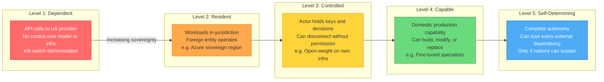

# SOTA AI Model Landscape -- June 2026

## Executive Summary

The AI model landscape in June 2026 is defined by three converging forces: frontier models have reached genuinely dangerous capability levels, the United States has demonstrated willingness to unilaterally disable access to those models worldwide, and the open-weight ecosystem has matured to the point where sovereign alternatives are technically viable.

On June 12, 2026, the US Commerce Department ordered Anthropic to suspend global access to its most capable models -- Fable 5 and Mythos 5 -- three days after launch. Because nationality-based filtering proved technically infeasible, Anthropic disabled both models for all users worldwide, including paying enterprise customers. As of June 22, 2026, they remain suspended with no restoration date. This is the first time a commercially deployed frontier AI model has been forcibly recalled by government order.

The incident transformed "sovereign AI" from a policy talking point into an operational imperative. Every organisation running critical workloads on US-hosted frontier models now faces a demonstrated risk: a single government directive can sever access without warning, without recourse, and without geographic exemption.

Meanwhile, the open-weight ecosystem offers a credible alternative. Models like DeepSeek V4-Pro (MIT license, 80.6% SWE-Bench Verified), Qwen 3.6 (Apache 2.0, runs on a single consumer GPU), and Mistral Large 3 (Apache 2.0, European sovereign infrastructure) deliver performance that would have been frontier-class twelve months ago, under licenses that permit unrestricted sovereign deployment. Published open-weight models are currently exempt from US export controls.

The architectural landscape has also diversified. Monolithic scaling continues at the frontier, but Mixture-of-Experts architectures now dominate (used by Anthropic, OpenAI, Google, DeepSeek, Mistral, Qwen, and Meta), reasoning chains add inference-time compute for hard problems, and multi-model ensemble systems offer a path to frontier-competitive performance at a fraction of the cost. For organisations willing to invest in orchestration rather than raw scale, the gap between "what you can build yourself" and "what the frontier offers" is narrower than it has ever been.

---

## The Export Control Watershed

### Timeline

| Date | Event |
|------|-------|
| **June 9, 2026** | Anthropic launches Fable 5 and Mythos 5 globally. Fable 5 is the commercial product; Mythos 5 is the unrestricted variant for approved cybersecurity and government partners. Same weights, different safety layers. |
| **June 11** | After criticism from cybersecurity researchers that silent rerouting to Opus 4.8 was blocking legitimate defensive work, Anthropic makes the safety fallback visible. |
| **June 12, 5:21 PM ET** | US Commerce Department's Bureau of Industry and Security (BIS), under Secretary Howard Lutnick, issues directive to suspend all access for foreign nationals. |
| **June 13** | Anthropic disables both models for ALL users worldwide. Services removed from AWS Bedrock, Google Cloud, Microsoft Foundry, Snowflake, Box, and direct APIs. |
| **June 17** | G7 summit in Evian-les-Bains. AI executives meet with G7 heads of state. France announces Western democracies will establish a coordinated AI cooperation platform within one month. |
| **June 18** | Proposed UK exemption collapses. US House members demand answers from the administration. |
| **June 22** | Both models remain suspended for all users worldwide. No restoration date published. |

### The Stated Trigger

The Commerce Department cited a jailbreak technique that could cause Fable 5 to exhibit Mythos 5's cybersecurity analysis capabilities -- the kind of vulnerability discovery reasoning that could accelerate offensive cyber operations. Anthropic maintained the vulnerabilities were "known in advance" and "relatively minor in severity," and that similar capabilities exist in GPT-5.5.

### The Broader Context

This did not emerge from nothing. In February 2026, President Trump directed all federal agencies to cease using Anthropic after the company refused to waive contractual restrictions on Claude's use for mass domestic surveillance and fully autonomous weapons. Defense Secretary Hegseth designated Anthropic a "supply chain risk" -- the first time this designation was applied to an American company.

### Global Reaction

**France**: Bruno Retailleau called it a "wake-up call." Benjamin Haddad characterised it as "an accelerator of the geopolitical battle over AI." Jordan Bardella urged accelerated government support for Mistral AI.

**United Kingdom**: Al Carns stated "This isn't an AI story. It's the story of every industry we used to lead." The UK's proposed exemption from the directive collapsed.

**Netherlands**: Geert Wilders called for accelerating domestic AI model development: "AI is more and more national sovereignty."

**EU**: The European Commission had already proposed the Cloud and AI Development Act on June 3 (pre-suspension), with goals to triple European data centre capacity over 5-7 years. The suspension dramatically accelerated political support.

**Australia**: No formal government statement, but the incident has strengthened the sovereign AI debate domestically. Kate Carruthers (UNSW) wrote that the incident "makes sovereign AI real." SmartCompany reported that access to advanced AI capabilities now depends on "export controls, nationality, and geopolitical considerations rather than just commercial decisions."

### What This Means

The Fable 5 suspension establishes three precedents:

1. **The US government will act unilaterally** against specific model deployments when it perceives a national security basis.
2. **The practical effect is global**, regardless of the targeted users' nationality or location, because providers cannot technically segregate access in real time.
3. **No exemption exists** for Five Eyes partners, EU allies, or any other country. The UK exemption proposal collapsed.

For any non-US organisation running critical workloads on US-hosted frontier models, the risk is no longer theoretical. It has been demonstrated.

---

## Model Landscape

### Anthropic (Fable 5, Mythos 5, Opus 4.8, Sonnet 4.6)

#### Architecture

Anthropic has not officially disclosed architecture type or parameter counts for any of its models. Third-party analysis strongly suggests Fable 5 / Mythos 5 use a **sparse Mixture-of-Experts (MoE)** architecture optimised for RAG and massive codebases. Anthropic has not confirmed or denied this.

Fable 5 and Mythos 5 share **identical weights** -- same training, same base model, same capability ceiling. The only difference is the safety layer: Fable 5 uses a multi-layer content classifier that reroutes high-risk queries to Opus 4.8; Mythos 5 is unrestricted. Mythos 5 is limited to Project Glasswing cybersecurity partners and select US government collaborators.

#### Capabilities and Benchmarks

| Benchmark | Fable 5 | Opus 4.8 | Sonnet 4.6 | Haiku 4.5 |
|-----------|---------|----------|------------|-----------|
| SWE-Bench Verified | 95.0%* | 88.6% | 72.7-79.6% | 73.3% |
| SWE-Bench Pro | 80.3%* | 69.2% | -- | 39.5% |
| FrontierCode Diamond | 29.3% | 13.4% | -- | -- |
| Terminal-Bench 2.1 | 88.0% | 82.7% | -- | -- |
| GPQA Diamond | -- | 93.6% | ~83% | -- |
| MMLU | -- | -- | 91.8% | -- |
| Humanity's Last Exam | 59.0% (no tools) / 64.5% (tools) | -- | -- | -- |
| ExploitBench (Mythos) | 78.0% | 40.0% | -- | -- |

*The 80.3% SWE-Bench Pro score was produced using Anthropic's own scaffolding, not a neutral evaluation harness. Independent evaluators have contested this figure. Vendor-scaffold numbers consistently run 10-30 points above Scale's standardised leaderboard. Anthropic did not publish MMLU or HumanEval scores for Fable 5.

#### Context and Output

| Model | Context | Max Output |
|-------|---------|------------|
| Fable 5 / Mythos 5 | 1M tokens | 128K tokens |
| Opus 4.8 | 1M tokens | 128K tokens |
| Sonnet 4.6 | 1M tokens (beta) | 64K tokens |
| Haiku 4.5 | 200K tokens | 64K tokens |

#### Pricing

| Model | Input/MTok | Output/MTok | Cache Hit | Batch (In/Out) |
|-------|-----------|------------|-----------|----------------|
| Fable 5 / Mythos 5 | $10.00 | $50.00 | $1.00 | $5.00 / $25.00 |
| Opus 4.8 | $5.00 | $25.00 | $0.50 | $2.50 / $12.50 |
| Sonnet 4.6 | $3.00 | $15.00 | $0.30 | $1.50 / $7.50 |
| Haiku 4.5 | $1.00 | $5.00 | $0.10 | $0.50 / $2.50 |

#### Deployment Model and Sovereign Limitations

Anthropic operates **API-only** through its own infrastructure, Amazon Bedrock, Google Vertex AI, and Microsoft Foundry. There is **no on-premise or self-hosted option**. All data flows through US-based infrastructure.

The June 12 export control incident demonstrated the operational consequence: the US government effectively exercised a kill switch over global access, and Anthropic had no technical means to maintain service for non-US customers even if it wanted to.

#### Compute and Financials

Anthropic is described as a "highly capital-intensive, quasi-infrastructure entity" rather than an asset-light SaaS business. Committed compute partnerships exceed $330 billion (Amazon >$100B over 10 years, Google ~$200B over 5 years, Microsoft $30B). Projected 2026 losses: approximately $29 billion against $25-30 billion in revenue, with 65-80% consumed by compute costs. Peak training spend estimated at ~$30 billion in the 2028 timeframe.

---

### OpenAI (Codex, GPT Series, o-Series)

#### Architecture

OpenAI uses a **Mixture-of-Experts (MoE)** architecture for the GPT-5.x family. Exact parameter counts are not disclosed. Estimates suggest active parameters in the 2-5 trillion range with a total expert pool potentially 10-50+ trillion. The widely circulated 52.5 trillion figure represents total parameter capacity, not active parameters per inference.

GPT-5.5 (codenamed "Spud," released April 23, 2026) is the first fully retrained base model since GPT-4.5. Every model from GPT-5.0 through GPT-5.4 was an incremental post-training iteration on the same foundation; 5.5 is a ground-up rebuild.

#### Codex Platform

Codex is now OpenAI's agentic coding platform, not a standalone model. It runs across four surfaces: the Codex app (desktop), Codex CLI (terminal agent), IDE extensions, and Codex Cloud (web). The underlying models are GPT-5.x variants. Current capabilities include computer use, Record and Replay workflow automation, PR review, multi-file terminal view, in-app browser, and SSH to remote devboxes.

#### Key Benchmarks

| Benchmark | GPT-5.5 | GPT-5.4 | Notes |
|-----------|---------|---------|-------|
| SWE-Bench Verified | 88.7% | 74.9% | |
| SWE-Bench Pro | 58.6% | 57.7% | |
| Terminal-Bench 2.0 | 82.7% | 75.1% | |
| MMLU | 92.4% | -- | |
| GPQA Diamond | 93.6% | 92.8% | |
| ARC-AGI-2 | 85.0% | 73.3% | |
| FrontierMath T1-3 | 51.7% | 47.6% | |
| Long-context 512K-1M (MRCR v2) | 74.0% | 36.6% | Major improvement |

**Hallucination caveat**: GPT-5.5 scores highest on factual recall (57% accuracy on AA-Omniscience) but has an **86% hallucination rate** on that benchmark vs. Claude Opus 4.7's 36%. It confabulates more aggressively at knowledge boundaries.

#### Reasoning Models (o-Series)

| Model | Input/MTok | Output/MTok | Context | Key Score |
|-------|-----------|------------|---------|-----------|
| o4-mini | $1.10 | $4.40 | 200K | AIME 2025: 92.7%, SWE-Bench: 68.1% |
| o3 | $2.00 | $8.00 | 200K | Codeforces SOTA, MMMU leader |
| o3-pro | $20.00 | $80.00 | 200K | AIME 2025: 98%, GPQA Diamond: 86% |

The o-series models add explicit reasoning chains (inference-time compute) for harder problems. o3-pro targets the hardest 5% of problems: PhD-level science, competitive maths, complex formal reasoning.

#### Pricing

| Model | Input/MTok | Output/MTok | Cached Input | Batch (In/Out) |
|-------|-----------|------------|-------------|----------------|
| GPT-5.5 | $5.00 | $30.00 | $0.50 | $2.50 / $15.00 |
| GPT-5.5 Pro | $30.00 | $180.00 | -- | $15.00 / $90.00 |
| GPT-5.4 | $2.50 | $15.00 | $0.25 | $1.25 / $7.50 |
| GPT-5.4 mini | $0.75 | $4.50 | $0.075 | $0.375 / $2.25 |
| GPT-5.4 nano | $0.20 | $1.25 | $0.02 | $0.10 / $0.625 |
| GPT-4.1 | $2.00 | $8.00 | $0.50 | $1.00 / $4.00 |
| GPT-4.1 mini | $0.40 | $1.60 | $0.10 | $0.20 / $0.80 |
| GPT-4.1 nano | $0.10 | $0.40 | $0.025 | $0.05 / $0.20 |

#### Open-Weight Models

OpenAI has released limited open-weight reasoning models under Apache 2.0:

| Model | Parameters | License | Purpose |
|-------|-----------|---------|---------|
| gpt-oss-120b | 120B | Apache 2.0 | General reasoning |
| gpt-oss-20b | 20B | Apache 2.0 | Lightweight reasoning |
| gpt-oss-safeguard-120b | 120B | Apache 2.0 | Safety classification |
| gpt-oss-safeguard-20b | 20B | Apache 2.0 | Safety classification |

All flagship models (GPT-5.x, o-series) remain closed-weight.

#### Deployment Model and Sovereign Position

OpenAI operates via its own API and Azure OpenAI Service. The Microsoft exclusivity arrangement was removed in April 2026 -- OpenAI can now partner with other cloud providers. Azure Sovereign Cloud / Azure Local offers on-premises control planes for government and defence workloads.

The NEXTDC partnership ("OpenAI for Australia") involves an AUD $7+ billion hyperscale AI campus at Eastern Creek, Sydney (S7, 650MW total campus capacity, with OpenAI as initial offtaker at approximately 550MW). Phase 1 is expected H2 2027. However, this is OpenAI sovereign compute infrastructure, not customer-controlled infrastructure -- the distinction matters.

OpenAI has so far avoided direct export control restrictions. However, industry expectation is that export control obligations will extend across multiple providers over the next 12-24 months as models exceed capability thresholds.

#### Financials

Approximately $25 billion annualised revenue, approximately 900 million weekly users, projected $14 billion loss in 2026 (inference costs dominate). Training run estimates for frontier models: $500M+ per run. Stargate Abilene cluster coming online in phases.

---

### Google (Gemini Family)

#### Architecture

All Gemini models from 2.5 onward use a **sparse Mixture-of-Experts (MoE)** architecture built on a dense Transformer backbone. The Gemini 2.5 Pro technical report (the only one with confirmed architecture details) describes: approximately 200 billion total parameters, decoder-only transformer, 80 layers, 16,384 hidden dimensions, 128 self-attention heads, MoE layers every other block with 64 experts per block and 8 active per token (approximately 12.5% of parameters active per inference). This yields roughly 1.6x compute/capacity efficiency over purely dense models.

Gemini 3.x adds a "DeepThink System 2" deliberation layer with three-tier reasoning control (Low/Medium/High). Parameter counts for the 3.x family are not disclosed.

Google trains entirely on custom TPU hardware (v5e, v6e Trillium) with no NVIDIA GPU fallback for Gemini models. The newly announced TPU 8t delivers 121 exaflops per superpod with 9,600 chips.

#### Current Model Lineup

| Model | Release | Context | Input/MTok | Output/MTok | Key Benchmark |
|-------|---------|---------|-----------|------------|---------------|
| Gemini 3.5 Flash | May 2026 | 1M | $1.50 | $9.00 | Terminal-Bench 2.1: 76.2% |
| Gemini 3.5 Pro | Previewed, not GA | -- | -- | -- | -- |
| Gemini 3.1 Pro | Feb 2026 | 1M | $2.00/$4.00 | $12.00/$18.00 | SWE-Bench: 80.6%, GPQA: 94.3% |
| Gemini 3.1 Flash-Lite | -- | -- | $0.25 | $1.50 | Budget frontier |
| Gemini 2.5 Pro | GA | 1M | $1.25/$2.50 | $10.00/$15.00 | SWE-Bench: 63.8% |
| Gemini 2.5 Flash | GA | 1M | $0.30 | $2.50 | -- |
| Gemini 2.5 Flash-Lite | GA | 1M | $0.10 | $0.40 | Cheapest |

Pricing tiers with "/" indicate \<=200K / >200K context pricing. Batch mode runs at 50% of standard pricing across all models.

#### Key Benchmarks (Gemini 3.1 Pro)

| Benchmark | Score |
|-----------|-------|
| SWE-Bench Verified | 80.6% |
| GPQA Diamond | 94.3% (highest at launch) |
| ARC-AGI-2 | 77.1% |
| Humanity's Last Exam | 44.4% (text + multimodal, no tools) |
| MRCR v2 (128K long-context) | 84.9% |
| MMMU-Pro | 80.5% |
| MMMLU | 92.6% |

#### Specialised Models

Google maintains the broadest multimodal portfolio: Veo 3.1 (video generation up to 4K), Lyria 3 (music generation), Imagen 4 (image generation, being replaced by Gemini-native generation), Gemini Computer Use Preview, Gemini Robotics-ER 1.6, real-time audio dialogue, real-time translation, and Deep Research.

#### Deployment Model and Sovereign Position

Google offers the most mature sovereign deployment story among the three major closed-model providers:

- **Gemini Developer API and Vertex AI**: Standard cloud access with enterprise SLAs.
- **Google Distributed Cloud (GDC)**: Full on-premises AI deployment with managed infrastructure. Gemini models and Gemma open models available. Confidential external key management for regulated organisations. A new "sovereign agentic AI architecture" announced at Cloud Next 2026 ensures agentic workflows execute entirely within customer organisation boundaries.
- **Forrester recognition**: Named a Leader in The Forrester Wave Sovereign Cloud Platforms, Q2 2026.

No reports of Google models being export-restricted as of June 2026, but the Anthropic precedent means all frontier providers face potential future restrictions.

#### Open Models: Gemma 4

| Variant | Parameters | Context | Architecture | VRAM (Q4) |
|---------|-----------|---------|-------------|-----------|
| E2B | ~2B effective | 128K | Dense multimodal | ~1.5 GB |
| E4B | ~4B effective | 128K | Dense multimodal | ~5 GB |
| 12B | 12B | 128K+ | Dense (encoder-free) | ~8 GB |
| 26B-A4B | 26B total / 4B active | 256K | MoE | ~18 GB |
| 31B | 31B dense | 256K | Dense | ~20 GB |

Licensed under **Apache 2.0** -- Google's first truly open-source family under this license. Gemma 4 31B posts 89.2% AIME 2026 and 80.0% LiveCodeBench, competitive with some closed frontier models. The E2B model runs on phones.

#### Financials

Google guided $175-185 billion in 2026 capex, majority AI-related. Gemini 1.0 Ultra training cost approximately $191 million (Stanford AI Index / Epoch AI). Gemini 3.x training costs are not disclosed but estimated in the several-hundred-million-dollar range per model. Google's use of custom TPUs significantly reduces marginal compute costs compared to competitors renting NVIDIA GPUs.

---

### Open-Source / Open-Weight Models

The open-weight ecosystem is where the sovereign AI opportunity lives. Multiple model families now offer frontier-class performance under permissive licenses, deployable on sovereign infrastructure without any foreign provider dependency.

#### Meta Llama 4

| Model | Active Params | Total Params | Experts | Context |
|-------|-------------|-------------|---------|---------|
| Scout | 17B | 109B | 16 | 10M tokens |
| Maverick | 17B | 400B | 128 | 512K tokens |
| Behemoth | 288B | ~2T | 16 | Not released |

Architecture: MoE with alternating dense and MoE layers. 128 routed experts plus one shared expert per MoE layer; each token activates the shared expert plus one routed expert.

**License: Custom (Llama 4 Community License Agreement)**. This is not Apache 2.0 or MIT. The EU is **explicitly excluded** -- rights do not extend to individuals domiciled in, or companies with principal place of business in, the European Union. Companies with >700 million MAU require a separate license. Government agencies must request exceptions case-by-case. This makes Llama 4 unsuitable for sovereign deployment in any EU member state and introduces legal uncertainty elsewhere.

Hardware: Scout fits ~61 GB VRAM at Q4_K_M (single H100). Maverick needs ~224 GB (4x H100). Behemoth was never publicly released.

#### Mistral AI

| Model | Total Params | Active Params | Architecture | License |
|-------|-------------|-------------|-------------|---------|
| Mistral Large 3 | 675B | 41B | MoE | Apache 2.0 |
| Mistral Small 4 | 119B | 6B | MoE (128 experts, 4 active) | Apache 2.0 |
| Ministral 3 (3B/8B/14B) | 3-14B | Dense | Dense | Apache 2.0 |

All models Apache 2.0. No MAU thresholds, no geographic exclusions. Mistral is the de facto **European sovereign AI champion**: framework agreement with the French Ministry of Armed Forces (2026-2030), EUR 2.1 billion in state investment, data centres in France with thousands of H100 GPUs, partnership with SAP and French/German governments for sovereign public administration AI.

Key benchmarks: Large 3 posts 73.11% MMLU-Pro and 93.60% MATH-500. Ministral 3 14B reasoning variant achieves 85% on AIME 2025.

#### Qwen (Alibaba)

| Model | Total Params | Active Params | Architecture | Context | License |
|-------|-------------|-------------|-------------|---------|---------|
| Qwen3-235B-A22B | 235B | 22B | MoE | -- | Apache 2.0 |
| Qwen3-Coder 480B | 480B | 35B | MoE | -- | Apache 2.0 |
| Qwen 3.5-397B-A17B | 397B | 17B | MoE (GDN hybrid) | 262K (ext. 1M+) | Apache 2.0 |
| Qwen 3.6-35B-A3B | 35B | 3B | MoE | 1M native | Apache 2.0 |
| Qwen 3.6-27B | 27B | 27B | Dense + vision | 1M | Apache 2.0 |
| Smaller models | 0.6B-9B | Dense | -- | -- | Apache 2.0 |

The broadest size range (0.6B to 480B) under Apache 2.0. Qwen 3.5 introduced Gated Delta Networks (GDN) fused with sparse MoE -- 8.6x faster than Qwen3-Max at 32K context, 19x faster at 256K. 201-language support.

Key benchmarks: Qwen3-235B-A22B posts 95.6 ArenaHard and 85.7 AIME'24. Qwen 3.6-35B-A3B runs on a single consumer GPU (~21 GB at Q4_K_M, 30 tok/s) and won coding benchmarks vs Gemma 4 26B-A4B by 21 points.

**Geopolitical note**: Chinese origin. Self-hosted deployments involve no data flowing to China and weights are openly inspectable. The Qwen Chat web interface applies Chinese content restrictions, but this is a platform restriction, not a license restriction on the downloadable weights. For nations without anti-China procurement policies, Qwen is arguably the most versatile open model family available.

#### DeepSeek

| Model | Total Params | Active Params | Architecture | Context | License |
|-------|-------------|-------------|-------------|---------|---------|
| DeepSeek-V4-Pro | 1.6T | 49B | MoE + MLA + CSA/HCA | 1M | MIT |
| DeepSeek-V4-Flash | 284B | 13B | MoE + MLA + CSA/HCA | 1M | MIT |
| DeepSeek-R1 | 671B | 37B | MoE + MLA + RL | 128K | MIT |
| DeepSeek-V3 | 671B | 37B | MoE + MLA | 128K | MIT |

MIT license -- the most permissive possible. No restrictions of any kind. DeepSeek-V3's training cost of approximately $5.6 million (2,048 H800 GPUs) sent shockwaves through the industry in January 2025, demonstrating frontier-class models could be trained at 10-20x lower cost than assumed.

Key benchmarks (V4-Pro): SWE-bench Verified 80.6%, LiveCodeBench Pass@1 93.5% (highest among all models evaluated), Codeforces rating 3206, MMLU-Pro 87.5%.

**Geopolitical note**: Chinese origin. Subject to PRC laws requiring cooperation with intelligence agencies. DeepSeek reportedly used tens of thousands of NVIDIA chips restricted from export to China. Self-hosted weights are safe -- MIT license, no data flows to China, fully inspectable. The hosted API service applies Chinese content regulations and stores data under PRC law.

#### Other Notable Open Models

| Model | Parameters | Architecture | License | Standout Feature |
|-------|-----------|-------------|---------|-----------------|
| Gemma 4 (Google) | 2B-31B | Dense/MoE | Apache 2.0 | Runs on phones (E2B), 89.2% AIME 2026 (31B) |
| Phi-4 (Microsoft) | 3.8B-15B | Dense | MIT | 93.7% GSM8K at 14B, surpasses many 70B models on maths |
| Falcon H1 (TII, Abu Dhabi) | 3B-34B | Hybrid Mamba-Transformer | Apache 2.0-based | Best Arabic LLM, 4x input throughput |
| gpt-oss (OpenAI) | 20B/120B | -- | Apache 2.0 | Reasoning-focused, safety classification |
| Cohere Command R+ | 104B | -- | CC-BY-NC | RAG-optimised with grounding citations |

---

## Comparison Matrix

### Closed / API-Only Models

| Model | Architecture | Params (Total/Active) | Context | SWE-Bench Verified | GPQA Diamond | Input $/MTok | Output $/MTok | On-Prem | Export Risk | Fine-Tunable |
|-------|-------------|----------------------|---------|-------------------|-------------|-------------|-------------|---------|-------------|-------------|
| Fable 5 | MoE (unconfirmed) | Undisclosed | 1M | 95.0%* | -- | $10.00 | $50.00 | No | **SUSPENDED** | No |
| Opus 4.8 | Undisclosed | Undisclosed | 1M | 88.6% | 93.6% | $5.00 | $25.00 | No | Medium | No |
| Sonnet 4.6 | Undisclosed | Undisclosed | 1M | 72.7-79.6% | ~83% | $3.00 | $15.00 | No | Medium | No |
| Haiku 4.5 | Undisclosed | Undisclosed | 200K | 73.3% | -- | $1.00 | $5.00 | No | Medium | No |
| GPT-5.5 | MoE | Est. 2-5T active | 1.05M | 88.7% | 93.6% | $5.00 | $30.00 | Via Azure Local | Medium | No |
| GPT-5.4 | MoE | Undisclosed | 1M | 74.9% | 92.8% | $2.50 | $15.00 | Via Azure Local | Medium | No |
| GPT-5.4 mini | MoE | Undisclosed | 400K | -- | -- | $0.75 | $4.50 | Via Azure Local | Medium | No |
| GPT-5.4 nano | MoE | Undisclosed | -- | -- | -- | $0.20 | $1.25 | Via Azure Local | Low | No |
| o3 | Reasoning chain | Undisclosed | 200K | -- | -- | $2.00 | $8.00 | No | Medium | No |
| o3-pro | Reasoning chain | Undisclosed | 200K | -- | 86% | $20.00 | $80.00 | No | Medium | No |
| o4-mini | Reasoning chain | Undisclosed | 200K | 68.1% | -- | $1.10 | $4.40 | No | Medium | No |
| Gemini 3.5 Flash | Sparse MoE | Undisclosed | 1M | -- | -- | $1.50 | $9.00 | Via GDC | Low | No |
| Gemini 3.1 Pro | Sparse MoE + DeepThink | Undisclosed | 1M | 80.6% | 94.3% | $2.00/$4.00 | $12.00/$18.00 | Via GDC | Low | No |
| Gemini 2.5 Pro | Sparse MoE | ~200B total | 1M | 63.8% | -- | $1.25/$2.50 | $10.00/$15.00 | Via GDC | Low | No |
| Gemini 2.5 Flash-Lite | Sparse MoE | Undisclosed | 1M | -- | -- | $0.10 | $0.40 | Via GDC | Low | No |

*Vendor-scaffold score; independent evaluations typically run 10-30 points lower.

### Open-Weight Models

| Model | Architecture | Params (Total/Active) | Context | SWE-Bench Verified | License | On-Prem | Export Risk | Fine-Tunable | EU Deployable | Min VRAM (Q4) |
|-------|-------------|----------------------|---------|-------------------|---------|---------|-------------|-------------|--------------|--------------|
| Llama 4 Scout | MoE | 109B / 17B | 10M | -- | Custom | Yes | None (published) | Yes | **NO** | ~61 GB |
| Llama 4 Maverick | MoE | 400B / 17B | 512K | -- | Custom | Yes | None (published) | Yes | **NO** | ~224 GB |
| Mistral Large 3 | MoE | 675B / 41B | 256K | -- | Apache 2.0 | Yes | None | Yes | Yes | Multi-GPU |
| Mistral Small 4 | MoE | 119B / 6B | -- | -- | Apache 2.0 | Yes | None | Yes | Yes | ~25 GB |
| Ministral 3 14B | Dense | 14B / 14B | -- | -- | Apache 2.0 | Yes | None | Yes | Yes | ~10 GB |
| Qwen3-235B-A22B | MoE | 235B / 22B | -- | -- | Apache 2.0 | Yes | None | Yes | Yes | Multi-GPU |
| Qwen 3.6-35B-A3B | MoE | 35B / 3B | 1M | -- | Apache 2.0 | Yes | None | Yes | Yes | ~21 GB |
| Qwen 3.6-27B | Dense | 27B / 27B | 1M | -- | Apache 2.0 | Yes | None | Yes | Yes | ~20 GB |
| DeepSeek V4-Pro | MoE + MLA | 1.6T / 49B | 1M | 80.6% | MIT | Yes | None (published) | Yes | Yes | ~1 TB+ |
| DeepSeek V4-Flash | MoE + MLA | 284B / 13B | 1M | -- | MIT | Yes | None (published) | Yes | Yes | ~80 GB (FP8) |
| Gemma 4 31B | Dense | 31B / 31B | 256K | -- | Apache 2.0 | Yes | None | Yes | Yes | ~20 GB |
| Gemma 4 12B | Dense | 12B / 12B | 128K | -- | Apache 2.0 | Yes | None | Yes | Yes | ~8 GB |
| Gemma 4 E4B | Dense | ~4.5B | 128K | -- | Apache 2.0 | Yes | None | Yes | Yes | ~5 GB |
| Gemma 4 E2B | Dense | ~2.3B | 128K | -- | Apache 2.0 | Yes | None | Yes | Yes | ~1.5 GB |
| Phi-4 14B | Dense | 14B / 14B | 128K | -- | MIT | Yes | None | Yes | Yes | ~10 GB |
| Phi-4-mini | Dense | 3.8B / 3.8B | 128K | -- | MIT | Yes | None | Yes | Yes | ~3 GB |
| gpt-oss-120b | -- | 120B | -- | -- | Apache 2.0 | Yes | None | Yes | Yes | Multi-GPU |
| gpt-oss-20b | -- | 20B | -- | -- | Apache 2.0 | Yes | None | Yes | Yes | ~15 GB |
| Falcon H1 34B | Hybrid Mamba-Transformer | 34B / 34B | -- | -- | Apache 2.0-based | Yes | None | Yes | Yes | ~22 GB |

---

## Architectural Approaches

The AI model landscape has diversified beyond "make the model bigger." Four distinct architectural philosophies now compete, each with different implications for cost, capability, and sovereign deployability.

### Monolithic Scaling

The original paradigm: train a single dense transformer with as many parameters as possible. GPT-4 (2023) was the high-water mark. By mid-2026, no frontier lab still uses purely dense architectures for their largest models -- the compute cost scales linearly with parameter count, making trillion-parameter dense models economically impractical. Dense architectures remain optimal at smaller scales (Gemma 4 12B, Phi-4, Ministral 3) where every parameter earns its keep.

### Sparse Mixture-of-Experts (MoE)

Now the dominant frontier architecture. Used by Anthropic (likely), OpenAI (GPT-5.x), Google (Gemini), DeepSeek, Mistral, Meta (Llama 4), and Qwen. The key insight: a model with 1.6 trillion total parameters but only 49 billion active per inference gets the knowledge capacity of the larger model at the inference cost of the smaller one. DeepSeek V4-Pro exemplifies this: 1.6T total parameters, 49B active, posting frontier-class benchmarks at dramatically lower training and inference costs. The efficiency gain is roughly 1.6-2x over equivalent dense models (per Google's Gemini 2.5 technical report).

### Reasoning Chains (Inference-Time Compute)

Pioneered by OpenAI's o-series and adopted by Google (DeepThink System 2) and others. Instead of making the model larger, make it think longer on hard problems. The model generates explicit reasoning steps before producing a final answer, trading latency for accuracy. o3-pro achieves 98% on AIME 2025 through extended reasoning. This approach is additive -- reasoning chains work on top of MoE or dense architectures. The cost model shifts from "pay for parameters" to "pay for thinking time," which is controllable per-query (Google offers Low/Medium/High tiers).

### Multi-Model Orchestration

Rather than routing tokens to experts within a single model, route entire tasks to specialist models. Annie's Hierarchical Mixture-of-Experts architecture is one approach: twelve specialist small language models (250M to 27B parameters) orchestrated through a messaging backbone, with classification, expert selection, judgment panels, and verification. This approach trades single-model coherence for composability, cost efficiency, and sovereign deployability (each specialist model can run on consumer hardware). The research supports this: ensembles of smaller models can outperform single large models with both higher accuracy and fewer total FLOPs, and the gap widens as models become large. The limitation is orchestration complexity and latency from multi-hop routing.

### Architectural Comparison

```mermaid
graph TB
    subgraph "Monolithic Dense"
        MD_IN[Input] --> MD_ALL[All Parameters Active<br/>e.g. 14B dense]
        MD_ALL --> MD_OUT[Output]
        MD_NOTE["Every token uses every parameter<br/>Simple, efficient at small scale<br/>Cost scales linearly with size"]
    end

    subgraph "Sparse MoE (Single Model)"
        MOE_IN[Input] --> MOE_ROUTER[Router Network]
        MOE_ROUTER --> MOE_E1[Expert 1]
        MOE_ROUTER --> MOE_E2[Expert 2]
        MOE_ROUTER -.-> MOE_E3[Expert 3<br/>inactive]
        MOE_ROUTER -.-> MOE_EN[Expert N<br/>inactive]
        MOE_E1 --> MOE_OUT[Output]
        MOE_E2 --> MOE_OUT
        MOE_NOTE["1.6T total, 49B active per token<br/>Knowledge of large, cost of small<br/>Dominant frontier architecture"]
    end

    subgraph "Reasoning Chains"
        RC_IN[Input] --> RC_MODEL[Base Model<br/>MoE or Dense]
        RC_MODEL --> RC_THINK["Thinking Step 1<br/>Thinking Step 2<br/>...<br/>Thinking Step N"]
        RC_THINK --> RC_ANSWER[Final Answer]
        RC_NOTE["Same model, more compute per query<br/>Trades latency for accuracy<br/>Controllable per-query budget"]
    end

    subgraph "Multi-Model Orchestration"
        MM_IN[Input] --> MM_CLASS[Classifier]
        MM_CLASS --> MM_S1[Specialist 1<br/>250M-3B]
        MM_CLASS --> MM_S2[Specialist 2<br/>7B-14B]
        MM_CLASS --> MM_S3[Specialist 3<br/>14B-27B]
        MM_S1 --> MM_JUDGE[Judgment<br/>Panel]
        MM_S2 --> MM_JUDGE
        MM_S3 --> MM_JUDGE
        MM_JUDGE --> MM_VERIFY[Verification]
        MM_VERIFY --> MM_OUT[Output]
        MM_NOTE["Many small models, one orchestrator<br/>Each specialist runs on consumer HW<br/>Ensemble accuracy can exceed single large"]
    end

    style MD_NOTE fill:#f9f9f9,stroke:#999,stroke-dasharray: 5 5
    style MOE_NOTE fill:#f9f9f9,stroke:#999,stroke-dasharray: 5 5
    style RC_NOTE fill:#f9f9f9,stroke:#999,stroke-dasharray: 5 5
    style MM_NOTE fill:#f9f9f9,stroke:#999,stroke-dasharray: 5 5
    style MOE_E3 fill:#eee,stroke:#999,stroke-dasharray: 5 5
    style MOE_EN fill:#eee,stroke:#999,stroke-dasharray: 5 5
```

### Cost-Capability Tradeoffs

| Approach | Training Cost | Inference Cost | Peak Capability | Sovereign Deployability |
|----------|--------------|---------------|----------------|------------------------|
| Monolithic Dense (small) | $2K-$500K | Lowest per token | Limited by parameter count | Excellent (laptop to single GPU) |
| Sparse MoE (large) | $5M-$500M+ | Low per token (only active params) | Highest (frontier) | Poor to moderate (datacenter) |
| Reasoning Chains | Adds to base model cost | Variable (controllable) | Highest on hard problems | Same as base model |
| Multi-Model Ensemble | Sum of specialists ($10K-$2M) | Moderate (multiple models) | Approaches frontier on defined tasks | Excellent (consumer hardware per model) |

---

## The Sovereign AI Imperative

### What Sovereignty Means in Practice

Sovereign AI is a nation's or organisation's ability to develop, deploy, and control AI using its own infrastructure, data, talent, and governance frameworks without critical dependencies on foreign providers. It spans four dimensions:

1. **Data sovereignty**: Data collected, stored, and processed according to local laws without unauthorised foreign access.
2. **Model sovereignty**: Ownership of model weights, training capability, and inference control.
3. **Compute sovereignty**: Infrastructure under national jurisdiction on domestic soil.
4. **Interaction sovereignty**: Prompts, queries, and outputs remain within sovereign boundaries.

Before June 12, 2026, most organisations treated sovereignty as a compliance checkbox. After June 12, it is an operational resilience requirement.

### The Deployment Spectrum

Most practical sovereign AI strategies target Level 3-4 on critical dimensions while accepting Level 2 on others. Targeting Level 5 across all dimensions is economically prohibitive -- only the US, China, and possibly the EU as a bloc can sustain it.

### Hardware Requirements by Sovereignty Tier

| Tier | What You Need | Hardware | Approx. Cost |
|------|--------------|----------|-------------|
| **L1: API consumer** | Internet connection | None | $0.10-$50/MTok (recurring) |
| **L2: Sovereign cloud tenant** | Contract with sovereign cloud provider | Provider-managed | $50K-$500K/year |
| **L3: Self-hosted open models** | Open-weight models on own infrastructure | 1-8 GPUs per model | $5K-$200K hardware + $105K-$210K/year electricity (AU rates, per rack) |
| **L3+: Fine-tuned specialists** | Domain adaptation of open models | Same as L3 + training compute | Additional $2K-$500K per model for fine-tuning |
| **L4: Domestic foundation model** | Train from scratch, 1B-7B parameters | 8x RTX 4090 to 64x A100 | $2K-$500K per model |
| **L4+: Sovereign language model** | National-language foundation model | H100 cluster | $8M-$32M (Brazil/Mexico research) |
| **L5: Frontier-competitive** | Full-scale foundation model training | Thousands of GPUs, dedicated power | $100M-$1B+ per model |

### Cost Comparison: API vs Self-Hosted

The break-even depends entirely on utilisation. Bursty, low-volume usage favours APIs. Constant high-throughput workloads favour self-hosting.

| Scenario | API Cost | Self-Hosted Cost | Winner |
|----------|---------|-----------------|--------|
| Light usage (1M tokens/day) | $3-$50/day | $10-$50/day (amortised hardware + power) | API |
| Medium usage (100M tokens/day) | $300-$5,000/day | $50-$200/day | Self-hosted |
| Heavy usage (1B+ tokens/day) | $3,000-$50,000/day | $200-$500/day | Self-hosted by 10-100x |
| Frontier capability required | Only option for some tasks | Open models lag on hardest 5-10% of tasks | API (for now) |

Frontier API costs are increasing: GPT-5.5 costs over 3x what GPT-5 cost 8 months ago; Gemini 3.5 Flash tripled pricing versus its predecessor.

### The Australian Context

**Government policy**: The National AI Plan (March 2026) confirmed reliance on existing laws and sector regulators rather than a standalone AI Act. Defence released binding governance for AI use across ADF. New DTA Cloud Policy (effective July 1, 2026) mandates APS entities prioritise cloud computing. The AI Safety Institute is operational with AUD $29.9 million in funding.

**Defence spending**: $1.2 billion in the 2025-26 budget for sovereign capability development in AI and autonomous systems. Defence Innovation Hub has funded 80+ AI-related projects. ASD-AWS "Top Secret Cloud" partnership worth approximately AUD $2 billion over a decade.

**Data centre infrastructure**: Three main sovereign providers are building AI-capable facilities:
- **CDC Data Centres**: 200MW AI campus near Perth (AUD $415M first stage, operational 2026).
- **Macquarie Data Centres**: IC3 Super West, 47MW AI data centre in Sydney (AUD $350M, opening September 2026). Partnering with Dell for Sovereign AI Factories powered by NVIDIA.
- **NEXTDC**: S7 site at Eastern Creek, Sydney (650MW capacity, partnered with OpenAI, Phase 1 expected H2 2027).

**Regulatory landscape**: ASIC requires AI in financial services to align with responsible lending and market integrity obligations. TGA released guidance on AI-based software as a medical device. New privacy obligations effective December 2026 require disclosure of automated decision-making.

**The gap**: Australia has sovereign compute infrastructure under construction and defence funding in place, but lacks a domestic foundation model programme. The Fable 5 suspension demonstrated that Five Eyes membership provides no exemption from US export controls. Australia's current position is Level 1-2 for frontier AI (API-dependent on US providers) with infrastructure being built for Level 2-3.

---

## Implications for Annie

This section identifies what the landscape means for Annie's positioning. The full competitive analysis is in doc 03.

### Where the Gaps Are

1. **The 80% problem**: For 80% of production use cases, a well-tuned specialist model works as well as a frontier model and costs 95% less. But the tooling, orchestration, and confidence to run multi-model systems does not exist as a product. Every organisation doing this today is building it from scratch.

2. **The sovereignty gap is operational, not theoretical**: Before June 12, sovereign AI was a compliance discussion. Now it is about whether your AI infrastructure survives a single government directive. There is no product that packages sovereign AI deployment as a turnkey solution with the user experience of a frontier API.

3. **The ensemble evidence is strong but unexploited**: Research consistently shows that ensembles of smaller models can outperform single large models with higher accuracy and fewer total FLOPs. No commercial product operationalises this finding.

4. **Fine-tuning at the bottom, frontier at the top, nothing in between**: You can fine-tune a 7B model for under $5 or pay $50/MTok for Fable 5. There is no product that intelligently routes between a portfolio of specialists and frontier fallbacks based on task complexity.

### What the Export Controls Create as Opportunity

The Fable 5 suspension created three market conditions that did not exist two weeks ago:

1. **Enterprise demand for multi-model resilience**: 81% of enterprises now run three or more AI model families (up from 13% a year ago), and every procurement conversation now includes "what happens if we lose access." A system architecturally designed for multi-model orchestration is no longer a nice-to-have.

2. **Government demand for sovereign AI that actually works**: More than 60 nations have published AI strategies, over 30 have committed funding, and the sovereign AI infrastructure market is projected to reach $301.6 billion by 2040. But most sovereign AI initiatives are infrastructure plays (data centres, GPU clusters) without the model-layer product to run on them.

3. **The open-weight window**: Published open-weight models are currently exempt from US export controls under ECCN 4E091. This regulatory posture could change. Sovereign entities should be downloading and fine-tuning open models now. A product that makes this easy has a time-limited but significant advantage.

### Why Small Specialist Models Matter Now

- Serving a 7B specialist is 10-30x cheaper than running a 70B-175B general model.
- Training a 1B specialist costs $2K-$15K. Training a 7B specialist costs $50K-$500K. Fine-tuning a 7B model for a specific domain costs under $5.
- Small models (250M to 27B) run on hardware ranging from phones to single consumer GPUs. No datacenter required.
- India's Bhashini programme demonstrates the sovereign small-model strategy at national scale: purpose-built language models serving 140 million users across 22 languages on domestic sovereign infrastructure.
- Research shows performance gains decrease exponentially beyond certain parameter thresholds, making smaller models more cost-effective for most defined tasks.

The limitation is real: small models lag significantly on complex tasks requiring deeper reasoning or nuanced understanding. They match large models in specific, well-defined scenarios but not in general-purpose reasoning. This is precisely where intelligent orchestration -- routing easy tasks to cheap specialists and hard tasks to capable models -- closes the gap.

### The Cost and Accessibility Advantage

The frontier labs are spending staggering amounts: Anthropic projects $29 billion in 2026 losses, OpenAI projects $14 billion, Google guided $175-185 billion in capex. These economics require massive scale to justify and produce products priced accordingly (Fable 5 at $50/MTok output, GPT-5.5 Pro at $180/MTok output).

A system built from twelve specialist models in the 250M-27B range, each fine-tuned for its domain, running on hardware costing $5K-$50K total, with intelligent routing to minimise frontier API fallback, could deliver comparable task performance at 1-2 orders of magnitude lower cost. The total training cost for the specialist portfolio would be a rounding error in a frontier lab's monthly electricity bill.

This is not a hypothetical. The models exist (Gemma 4, Qwen 3.6, Phi-4, Mistral Small 4). The hardware exists (consumer GPUs). The research supports ensemble approaches. What does not yet exist is the product that makes it work reliably and is simple enough for organisations to adopt.

---

## Sources

### Anthropic
- [Claude Fable 5 and Mythos 5 announcement](https://www.anthropic.com/news/claude-fable-5-mythos-5)
- [Statement on export control suspension](https://www.anthropic.com/news/fable-mythos-access)
- [Claude Opus 4.8 announcement](https://www.anthropic.com/news/claude-opus-4-8)
- [Claude Fable product page](https://www.anthropic.com/claude/fable)
- [Claude Opus product page](https://www.anthropic.com/claude/opus)
- [Responsible Scaling Policy v3.0](https://anthropic.com/responsible-scaling-policy/rsp-v3-0)
- [MorphLLM: Claude Benchmarks 2026](https://www.morphllm.com/claude-benchmarks)
- [Weights & Biases: Fable 5 Benchmark Scores](https://wandb.ai/byyoung3/ml-news/reports/Claude-Fable-5-Benchmark-Scores--VmlldzoxNzE3NTE3MQ)
- [Tom's Hardware: Claude Fable 5 review](https://www.tomshardware.com/tech-industry/artificial-intelligence/claude-fable-5-brings-mythos-to-the-masses-anthropics-next-frontier-model-is-state-of-the-art-on-nearly-all-tested-benchmarks)
- [Fortune: Anthropic disables Fable/Mythos](https://fortune.com/2026/06/13/anthropic-disables-fable-mythos-export-controls-national-security-threat/)
- [Nextgov: Export control order details](https://www.nextgov.com/artificial-intelligence/2026/06/anthropic-suspends-top-ai-models-after-us-export-control-order/414173/)
- [Fortune: Sovereign AI scramble](https://fortune.com/2026/06/16/anthropic-shutdown-sparks-global-scramble-for-sovereign-ai/)
- [Washington Post: House demands answers](https://www.washingtonpost.com/technology/2026/06/18/house-members-want-answers-export-controls-placed-anthropic-fable/)
- [Klover.ai: Anthropic IPO infrastructure economics](https://www.klover.ai/anthropic_ipo_infrastructure_economics_of_compute_supply_chain_indepth_analysis_2026/)
- [SaaStr: Anthropic revenue vs training spend](https://www.saastr.com/anthropic-just-passed-openai-in-revenue-while-spending-4x-less-to-train-their-models/)
- [Axios: Mythos-class safeguards](https://www.axios.com/2026/06/09/anthropic-mythos-class-safeguards)
- [CNBC: Anthropic Mythos release](https://www.cnbc.com/2026/06/09/anthropic-mythos-claude-fable-5.html)
- [Simon Willison: Fable 5 impressions](https://simonwillison.net/2026/Jun/9/claude-fable-5/)
- [Al Jazeera: US asks Anthropic to block global access](https://www.aljazeera.com/news/2026/6/14/us-asks-anthropic-to-block-global-access-to-top-ai-models-why-it-matters)
- [Digital Applied: Fable 5 vs GPT-5.5](https://www.digitalapplied.com/blog/claude-fable-5-vs-gpt-5-5-frontier-comparison-2026)
- [Artificial Analysis: Fable 5 Intelligence Index](https://artificialanalysis.ai/articles/claude-fable-5-mythos-intelligence-index)

### OpenAI
- [GPT-5.5 Docs](https://developers.openai.com/api/docs/models/gpt-5.5)
- [Introducing GPT-5.5](https://openai.com/index/introducing-gpt-5-5/)
- [Codex Changelog](https://developers.openai.com/codex/changelog)
- [Codex Models](https://developers.openai.com/codex/models)
- [Introducing GPT-5.3-Codex](https://openai.com/index/introducing-gpt-5-3-codex/)
- [Codex for Almost Everything](https://openai.com/index/codex-for-almost-everything/)
- [Introducing o3 and o4-mini](https://openai.com/index/introducing-o3-and-o4-mini/)
- [OpenAI Pricing](https://developers.openai.com/api/docs/pricing)
- [Open Weight Models](https://help.openai.com/en/articles/11870455-openai-open-weight-models-gpt-oss)
- [Introducing gpt-oss](https://openai.com/index/introducing-gpt-oss/)
- [Open Weights and AI for All](https://openai.com/global-affairs/open-weights-and-ai-for-all/)
- [NEXTDC Partnership](https://www.nextdc.com/news/building-the-next-generation-of-sovereign-ai-infrastructure-in-australia)
- [OpenAI for Australia](https://openai.com/global-affairs/openai-for-australia/)
- [O-mega Complete Guide](https://o-mega.ai/articles/gpt-5-5-the-complete-guide-2026)
- [TokenMix Review](https://tokenmix.ai/blog/gpt-5-5-spud-review-88-swe-bench-2026)
- [AI Pricing Guru](https://www.aipricing.guru/openai-pricing/)
- [DeployBase Pricing](https://deploybase.ai/articles/openai-api-pricing-2026)
- [Sam Altman AGI Shift](https://www.startuphub.ai/ai-news/ai-figures/2026/figure-sam-altman-public-position-evolution-2026-06-13)
- [Epoch AI Training Compute](https://epoch.ai/gradient-updates/why-gpt5-used-less-training-compute-than-gpt45-but-gpt6-probably-wont)
- [AI Inference Cost Crisis](https://aiautomationglobal.com/blog/ai-inference-cost-crisis-openai-economics-2026)
- [Microsoft Sovereign Cloud](https://azure.microsoft.com/en-us/blog/microsoft-strengthens-sovereign-cloud-capabilities-with-new-services/)
- [Microsoft-OpenAI Non-Exclusive](https://www.vaasblock.com/news/microsoft-openai-non-exclusive-partnership-azure-2026/)

### Google
- [Gemini Developer API Pricing](https://ai.google.dev/gemini-api/docs/pricing)
- [Gemini API Models](https://ai.google.dev/gemini-api/docs/models)
- [Gemini 3.1 Pro Model Card](https://deepmind.google/models/model-cards/gemini-3-1-pro/)
- [Gemini 3.5 Flash and Pro: Google I/O 2026](https://pasqualepillitteri.it/en/news/2984/gemini-3-5-flash-pro-google-io-2026)
- [Gemini 3.5 Flash Complete Guide](https://www.nxcode.io/resources/news/gemini-3-5-flash-complete-guide-benchmarks-pricing-api-2026)
- [Gemini 3.1 Pro Benchmarks](https://layerlens.ai/blog/gemini-3-1-pro-benchmark-review)
- [Gemini 2.5 Technical Report (arxiv 2507.06261)](https://arxiv.org/pdf/2507.06261)
- [Gemma 4 -- Google DeepMind](https://deepmind.google/models/gemma/gemma-4/)
- [Gemma 4 Complete Guide](https://dev.to/aniruddhaadak/gemma-4-complete-guide-2026-architecture-benchmarks-deployment-3en9)
- [Gemma 4 Apache 2.0](https://www.mindstudio.ai/blog/what-is-google-gemma-4-apache-open-weight)
- [Google Distributed Cloud at Next '26](https://cloud.google.com/blog/topics/hybrid-cloud/google-distributed-cloud-at-next26)
- [Forrester Wave Sovereign Cloud 2026](https://cloud.google.com/blog/products/identity-security/a-leader-in-forrester-wave-sovereign-cloud-platform-2026)
- [Google $75B AI Infrastructure Spend](https://valueaddvc.com/blog/google-75b-ai-infrastructure-spend-data-centers-tpus-and-the-gemini-bet)
- [AI Infrastructure at Next '26](https://cloud.google.com/blog/products/compute/ai-infrastructure-at-next26)
- [DeepMind Scaling Philosophy](https://eu.36kr.com/en/p/3619378357748743)
- [ML Training Cost Statistics 2026](https://www.aboutchromebooks.com/machine-learning-model-training-cost-statistics/)

### Open-Source / Open-Weight
- [Meta Llama 4 Blog](https://ai.meta.com/blog/llama-4-multimodal-intelligence/)
- [Llama 4 License](https://www.llama.com/llama4/license/)
- [Llama 4 EU Exclusion](https://dionwiggins.substack.com/p/llama-4-is-banned-in-the-eu-open)
- [Llama FAQ](https://www.llama.com/faq/)
- [Unsloth Llama 4 Guide](https://unsloth.ai/docs/models/tutorials/llama-4-how-to-run-and-fine-tune)
- [Mistral Models Overview](https://docs.mistral.ai/models/overview)
- [Mistral Defense Deal](https://www.analyticsinsight.net/amp/story/news/mistral-ai-signs-defense-deal-with-france-as-europe-pushes-for-sovereign-ai)
- [Mistral Sovereign AI](https://www.raconteur.net/global-business/mistral-bets-big-on-european-sovereign-ai)
- [France NVIDIA Hub](https://windowsnews.ai/article/france-fires-up-sovereign-ai-engine-mistrals-nvidia-powered-hub-goes-live-to-fuel-eus-open-model-amb.427898)
- [Mistral Small 4](https://serenitiesai.com/articles/mistral-ai-models-2026-complete-guide)
- [Qwen3 GitHub](https://github.com/QwenLM/Qwen3)
- [Qwen 3.6 GitHub](https://github.com/QwenLM/Qwen3.6)
- [Qwen 3.5 Blog](https://qwen.ai/blog?id=qwen3.5)
- [Qwen Licensing](https://qwenimage.art/blog/qwen-ai-license-explained)
- [VentureBeat Qwen3](https://venturebeat.com/ai/alibaba-launches-open-source-qwen3-model-that-surpasses-openai-o1-and-deepseek-r1)
- [Qwen 3.6 VRAM Guide](https://willitrunai.com/blog/qwen-3-6-vram-requirements)
- [DeepSeek-V3 Technical Report](https://arxiv.org/html/2412.19437v1)
- [DeepSeek V4 Benchmarks](https://deepseekai.guide/news/deepseek-benchmarks-2026/)
- [DeepSeek V4 Review](https://www.morphllm.com/deepseek-v4)
- [DeepSeek V4 MIT License](https://framia.converge.ai/page/en-US/news/deepseek-v4-open-source-mit-license)
- [CSIS DeepSeek Analysis](https://www.csis.org/analysis/delving-dangers-deepseek)
- [DeepSeek V4 Self-Hosting Guide](https://lushbinary.com/blog/deepseek-v4-self-hosting-guide-vllm-hardware-deployment/)
- [DeepSeek V4 VRAM](https://codersera.com/blog/deepseek-v4-vram-gpu-requirements-2026/)
- [Gemma 4 Blog](https://blog.google/innovation-and-ai/technology/developers-tools/gemma-4/)
- [Gemma 4 Hardware Guide](https://www.gemma4.wiki/requirements/gemma-4-hardware-requirements)
- [Phi-4-mini HuggingFace](https://huggingface.co/microsoft/Phi-4-mini-instruct)
- [Microsoft Phi Models](https://azure.microsoft.com/en-us/products/phi)
- [Phi-4-reasoning-vision](https://siliconangle.com/2026/03/04/microsoft-open-sources-multimodal-reasoning-model-15b-parameters/)
- [Falcon H1 Launch](https://www.businesswire.com/news/home/20250521901857/en/)
- [Cohere Models](https://docs.cohere.com/docs/models)

### Sovereign AI and Export Controls
- [Fable 5 Suspension Facts and Timeline](https://www.eisneramper.com/insights/artificial-intelligence-insights/fable-5-suspension-facts-and-timeline-0626/)
- [Enterprise Impact](https://www.fifthrow.com/blog/us-export-control-order-and-global-suspension-of-fable-5-mythos-5-operationalizing-compliance-as-a-live-mandate)
- [Security Team Implications](https://snyk.io/blog/fable-mythos-suspension-security-takeaways/)
- [Enterprise AI Under Export Controls](https://labs.cloudsecurityalliance.org/research/csa-research-note-ai-model-export-controls-enterprise-govern/)
- [Fable 5 Ban Update](https://www.techtimes.com/articles/318760/20260620/fable-5-ban-update-trump-softens-directive-stands-refund-deadline-closes-today.htm)
- [Fable 5 Full Story](https://www.explainx.ai/blog/us-government-bans-fable-5-mythos-5-anthropic-export-control-2026)
- [Europe Wake-Up Call](https://www.euronews.com/2026/06/13/wake-up-call-europe-reacts-to-anthropic-halting-access-to-its-fable-5-and-mythos-5-ai-mode)
- [Europe AI Sovereignty Crisis G7](https://www.techtimes.com/articles/318611/20260618/europe-ai-sovereignty-crisis-g7-offers-platform-kill-switch-fears-grow.htm)
- [EU AI Sovereignty Push at G7](https://www.computing.co.uk/news/2026/at-g7-euro-ai-sovereignty-push-intensifies)
- [Washington AI Kill Switch](https://aiweekly.co/newsletters/ai-geopolitics/washingtons-ai-kill-switch-broke-the-alliance)
- [Al Jazeera: US Export Ban Strains Alliances](https://www.aljazeera.com/news/2026/6/19/us-export-ban-on-anthropics-ai-models-further-strains-alliances)
- [EU Insider: Washington Cuts Europe Off](https://www.euinsider.eu/news/us-bans-europeans-anthropic-ai-sovereignty-2026)
- [SmartCompany: Why Australians Lost Access](https://www.smartcompany.com.au/artificial-intelligence/why-australians-lost-access-to-anthropic-fable-5-mythos-5/)
- [Kate Carruthers: Sovereign AI Got Real](https://katecarruthers.com/anthropic-fable-5-and-why-sovereign-ai-just-got-real/)
- [AIMadeTools: Sovereign AI Models 2026](https://www.aimadetools.com/blog/sovereign-ai-models-2026)
- [McKinsey: Sovereign AI Ecosystems](https://www.mckinsey.com/industries/technology-media-and-telecommunications/our-insights/sovereign-ai-building-ecosystems-for-strategic-resilience-and-impact)
- [Sovereign AI Definition and Maturity Model](https://zeroandone.me/blogs/sovereign-ai.html)
- [Stanford HAI: AI Sovereignty Definitional Dilemma](https://hai.stanford.edu/news/ai-sovereigntys-definitional-dilemma)
- [CNAS Sovereign AI Index](https://interactives.cnas.org/reports/sovereign-ai-index/)
- [Sovereign AI Infrastructure Guide 2026](https://fluxhuman.com/en/blog/sovereign-ai-infrastructure-the-2026-guide)
- [BIS Export Controls](https://www.wilmerhale.com/en/insights/publications/20250205-bis-issues-long-awaited-export-controls-on-ai)
- [Hogan Lovells Analysis](https://www.hoganlovells.com/en/publications/us-department-of-commerce-expands-controls-on-advanced-semiconductors-and-establishes)
- [MindStudio: Export Controls Explained](https://www.mindstudio.ai/blog/ai-export-controls-claude-fable-5-enterprise-implications)
- [Google/OpenAI Push to Ease Controls](https://www.bankinfosecurity.com/google-openai-push-urges-trump-to-ease-ai-export-controls-a-27739)
- [RAND Analysis](https://www.rand.org/pubs/perspectives/PEA3776-1.html)

### Australian Context
- [Australia National AI Plan](https://www.6clicks.com/resources/blog/australias-national-ai-plan-sovereign-ai-compliance-leaders)
- [Australia Defence AI Policy](https://www.6clicks.com/resources/blog/australia-defence-ai-policy-sovereign-grc-compliance)
- [APS AI Plan 2025](https://www.digital.gov.au/policy/ai/australian-public-service-ai-plan-2025/what-we-plan-achieve)
- [Australia Sovereign AI Governance-Led](https://securitybrief.com.au/story/australia-s-sovereign-ai-adoption-stays-governance-led)
- [UNSW Defence AI Project](https://www.unsw.edu.au/newsroom/news/2026/01/unsw-sydney-lands-3m-defence-project-to-build-next-gen-ai)
- [AI Regulation in Australia 2026](https://www.theadaptavistgroup.com/blog/ai-regulation-in-australia)
- [Financial Services AI Compliance](https://www.insidetechlaw.com/blog/2026/03/regulating-ai-in-australian-financial-services-practical-guidance-for-compliance)
- [Australia Gov Cloud Market 2026](https://vocal.media/trader/australia-government-cloud-market-2026-sovereign-cloud-surge-whole-of-government-policy-and-ai-integration)
- [CDC Data Centres](https://cdc.com/)
- [CDC Perth AI Campus](https://www.datacenterdynamics.com/en/news/australias-cdc-plans-200mw-data-center-campus-outside-perth/)
- [Macquarie Data Centres](https://www.macquariedatacentres.com/)
- [Macquarie IC3 Super West](https://aimagazine.com/news/macquaries-ic3-super-west-ai-data-centre-for-huge-gpu-loads)
- [Macquarie Dell Sovereign AI Factory](https://www.cyberdaily.au/digital-transformation/12963-macquarie-data-centres-tops-out-ai-focused-sydney-cloud-ai-data-centre)
- [NEXTDC S7 Campus](https://datacentremagazine.com/news/how-will-nextdc-ai-campus-drive-openai-for-australia)
- [NEXTDC Sovereign Data Centres](https://www.nextdc.com/blog/data-centre-sovereignty-for-control-and-compliance)

### Hardware, Costs, and Small Models
- [VRAM Requirements 2026](https://localaimaster.com/blog/vram-requirements-2026)
- [LLM Hardware Requirements 2026](https://overchat.ai/ai-hub/llm-hardware-requirements)
- [Best GPU for LLM 2026](https://bizon-tech.com/blog/best-gpu-llm-training-inference)
- [Local AI vs Cloud AI 2026](https://www.mindstudio.ai/blog/local-ai-vs-cloud-ai-2026)
- [AI API Pricing Comparison June 2026](https://devtk.ai/en/blog/ai-api-pricing-comparison-2026/)
- [Frontier AI Cost Crisis](https://www.figuringoutwithai.com/playbooks/frontier-ai-cost-crisis-local-model-migration-playbook-2026)
- [AI Data Center Power Requirements 2026](https://techplustrends.com/power-requirements-ai-data-centers/)
- [AI Inference Power Consumption](https://www.spheron.network/blog/ai-inference-power-electricity-cost-2026/)
- [Small Language Models Guide 2026](https://machinelearningmastery.com/introduction-to-small-language-models-the-complete-guide-for-2026/)
- [Small Language Models Enterprise Cost Guide](https://iterathon.tech/blog/small-language-models-enterprise-2026-cost-efficiency-guide)
- [Training Sovereign Language Models](https://arxiv.org/html/2510.19801)
- [AI Model Training Costs 2026](https://localaimaster.com/blog/ai-model-training-costs-2025-analysis)
- [India Sovereign AI Status 2026](https://explainx.ai/blog/india-sovereign-ai-status-indiaai-mission-2026)
- [Bhashini Migration to Sovereign Cloud](https://www.crnasia.com/india/news/2026/yotta-enables-bhashini-s-migration-to-sovereign-ai-cloud-on-indian-infrastructure)
- [Ensemble vs Large Models](https://arxiv.org/pdf/2005.00570)
- [AI Model Size vs Performance 2026](https://localaimaster.com/blog/ai-model-size-vs-performance-analysis-2025)
- [Sovereign AI Enterprise Guide 2026](https://www.advisori.de/en/blog/sovereign-ai-vendor-lock-in-enterprise-guide-2026)
- [Sovereign AI Infrastructure Market](https://www.rootsanalysis.com/sovereign-ai-infrastructure-market)
- [The High Cost of Sovereignty](https://www.idc.com/resource-center/blog/the-high-cost-of-sovereignty-in-the-age-of-ai/)
- [The Sovereignty Illusion](https://www.knectiq.com/sovereign-ai/)
- [SoftBank EUR 75B French AI Investment](https://fortune.com/2026/05/30/softbank-75-billion-investment-french-ai-data-centers-masayoshi-son-emmanuel-macron/)

---

*Document prepared June 22, 2026 by Annie. The AI model landscape is evolving rapidly. Benchmark figures, pricing, and availability are subject to change. Where parameter counts or architecture details are not officially confirmed, this is noted explicitly.*
