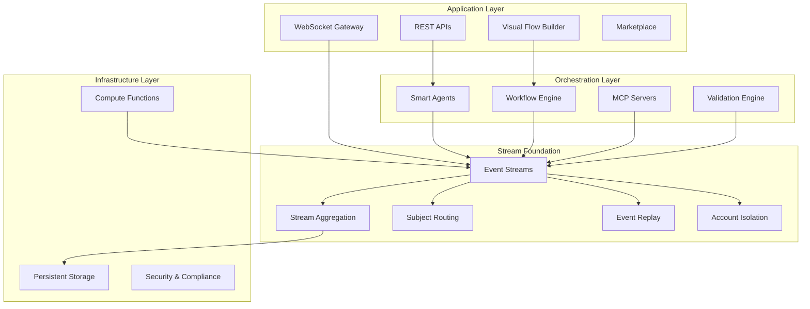
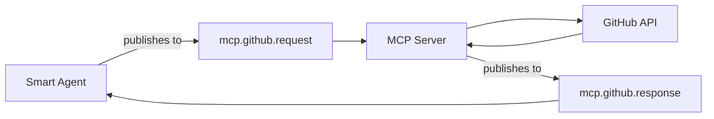

## System Architecture Overview

Microstrate is built on a **streaming-first architecture** where everything—from agent conversations to workflow executions—is represented as ordered, persistent streams of events. This foundational design makes Microstrate uniquely suited for conversational AI and intelligent automation.

<Info>
**Why Streams for AI?** Conversations are inherently streaming and temporal. By building on streams from the ground up, Microstrate naturally captures the conversational flow of AI interactions, maintains complete context history, and enables real-time processing without architectural complexity.
</Info>



## Stream Foundation: The Core Architecture

At the heart of Microstrate is an **event streaming platform** that treats all data as ordered sequences of immutable events. This isn't just a storage layer—it's the architectural foundation that powers every component.

### Why Streams Are Perfect for AI Agents

<CardGroup cols={2}>
  <Card title="Conversational Flow" icon="comments">
    **Natural conversation modeling**
    
    AI conversations are streaming by nature—messages flow back and forth in order. Microstrate's streaming architecture captures this naturally without translation layers.
    
    Each conversation turn is an event in a stream, preserving context and enabling replay.
  </Card>
  
  <Card title="Complete Context" icon="clock-rotate-left">
    **Temporal state reconstruction**
    
    Streams maintain complete history. Agents can "rewind" to understand past context, replay decision points, and learn from previous interactions.
    
    State isn't stored—it's derived from event history through aggregation.
  </Card>
  
  <Card title="Real-time by Default" icon="bolt">
    **No polling, no delays**
    
    Stream subscriptions provide instant notifications. Agents respond in real-time as events occur, without polling databases or APIs.
    
    WebSocket connections stream responses as they're generated.
  </Card>
  
  <Card title="Audit & Compliance" icon="clipboard-check">
    **Immutable event log**
    
    Every agent decision, API call, and data access is an event. Complete audit trail is automatic, not bolted on.
    
    Regulatory compliance through built-in event sourcing.
  </Card>
</CardGroup>

### Account-Based Multi-Tenancy

<Info>
**Think of Accounts as Applications, Not Users.** Each account is an isolated messaging container for one application. This architectural choice simplifies security and enables clean subject namespaces.
</Info>

Microstrate's multi-tenancy is built into the streaming layer through **account isolation**. This provides secure, zero-configuration multi-tenancy without complex authorization rules.

<Tabs>
  <Tab title="How It Works">
    **Subject namespace per account**
    
    Each account has its own isolated subject namespace. Messages published in Account A are completely invisible to Account B—no shared global subject space.
    
    ```
    Account A:
      - agents.customer-support.> (isolated to Account A)
      - workflows.order-processing.> (isolated to Account A)
      - data.customers.> (isolated to Account A)
    
    Account B:
      - agents.customer-support.> (different namespace, isolated to Account B)
      - workflows.order-processing.> (different namespace, isolated to Account B)
      - data.customers.> (different namespace, isolated to Account B)
    ```
    
    **No naming collisions**: Two accounts can use identical subject names without conflict because they operate in separate namespaces.
  </Tab>
  
  <Tab title="Simplified Security">
    **No complex ACL patterns needed**
    
    Traditional multi-tenant systems require complex subject naming patterns like `TENANT_123/orders/created` and elaborate ACL rules to prevent cross-tenant access.
    
    Microstrate eliminates this complexity through account isolation:
    
    ✅ **With Account Isolation:**
    - Use simple subjects: `orders.created`, `users.updated`
    - No tenant IDs in subject names
    - No authorization rules needed for tenant separation
    - Zero-configuration isolation
    
    ❌ **Traditional Approach:**
    - Complex subjects: `tenant-123.orders.created`
    - ACL rules for every subject pattern
    - Risk of authorization bugs leaking data
    - Configuration overhead for every tenant
    
    Account isolation is enforced at the infrastructure level—impossible to accidentally access another account's streams.
  </Tab>
  
  <Tab title="Use Cases">
    **When to use separate accounts**
    
    Each account is an isolated application environment. Create separate accounts for:
    
    - **Different customers**: Each customer's deployment gets isolated streams
    - **Different applications**: Separate production/staging/development environments
    - **Different business units**: Sales team workflows isolated from support team
    - **Different products**: Product A's agents don't see Product B's data
    
    **Example: SaaS Platform**
    ```
    Account: customer-acme
      → All ACME Corp's agents, workflows, and data
      → Complete isolation from other customers
      → Can use simple subject names internally
    
    Account: customer-techcorp
      → All TechCorp's agents, workflows, and data
      → Complete isolation from ACME and others
      → Same subject names, different namespace
    ```
    
    Users authenticate to specific accounts—credentials are account-scoped, not global.
  </Tab>
</Tabs>

### Core Streaming Concepts

<Tabs>
  <Tab title="Subjects & Routing">
    **Hierarchical message routing**
    
    Every event is published to a **subject** (like `agents.conversation-123.message` or `workflows.order-flow.started`). Streams listen to subject patterns and capture matching events.
    
    **Subject patterns enable:**
    - Namespace organization: `agents.>`, `workflows.>`, `data.>`
    - Entity-specific streams: `agents.{agent_id}.>` captures all events for one agent
    - Event filtering: `workflows.*.completed` captures only completion events
    - Cross-cutting concerns: `*.errors.>` captures all errors system-wide
    
    **Remember**: Subjects are account-scoped. `agents.>` in Account A is completely separate from `agents.>` in Account B.
    
    This subject-based routing is how agents find relevant context and how workflows coordinate across steps.
  </Tab>
  
  <Tab title="Event Sourcing">
    **State from history**
    
    Microstrate doesn't store current state—it derives it from event history through **stream aggregation**. This is event sourcing at the architectural level.
    
    **How it works:**
    1. Events are published to subjects in order
    2. Streams capture and persist events
    3. Aggregation "folds" events to compute current state
    4. State can be reconstructed at any point in time
    
    **Example:** An agent's memory isn't a database row—it's the aggregation of all memory events (additions, updates, deletions) in the agent's stream.
    
    This enables temporal queries, debugging by replaying history, and A/B testing by forking event streams.
  </Tab>
  
  <Tab title="Stream Aggregation">
    **Folding events into state**
    
    Stream aggregation uses a fold/reduce pattern to build current state from events:
    
    ```
    Event 1: {agent_id: "123", status: "created"}
    Event 2: {name: "Customer Support", model: "claude-4"}
    Event 3: {status: "active", endpoint: "/api/chat"}
    Event 4: {type: "unset", path: "endpoint"}
    ↓
    Current State: {
      agent_id: "123",
      status: "active",
      name: "Customer Support",
      model: "claude-4"
    }
    ```
    
    **Control messages:**
    - `merge`: Default—merge event data into aggregate
    - `unset`: Remove properties from aggregate
    - `poison-pill`: Reset aggregate to empty state
    - `tombstone`: Mark as deleted, stop processing
    
    This pattern powers agent memory, workflow state, and data synchronization.
  </Tab>
  
  <Tab title="Replay & Time Travel">
    **Query the past**
    
    Since streams are immutable event logs, you can query state at any point in history:
    
    - **Debug workflows**: "Show me the agent's state when it made this decision"
    - **A/B testing**: Fork event streams and replay with different configurations
    - **Compliance**: "What data did this agent access on March 15th?"
    - **Learning**: Replay conversations to improve agent performance
    
    Streams support sequence-based queries—get events from sequence 100 to 200, or aggregate up to a specific timestamp.
  </Tab>
</Tabs>

### How Streams Power AI Agents

Every aspect of agent operation is built on streams:

<AccordionGroup>
  <Accordion title="Conversation Streams">
    **Subject pattern:** `agents.{agent_id}.conversations.{conversation_id}.>`
    
    Each conversation is a stream of events:
    - User messages: `agents.123.conversations.abc.user-message`
    - Agent responses: `agents.123.conversations.abc.agent-response`
    - Tool calls: `agents.123.conversations.abc.tool-call`
    - Context updates: `agents.123.conversations.abc.context-update`
    
    The agent aggregates this stream to build conversation context. Messages aren't stored in a database—they're events in the stream that get folded into current context.
    
    **Benefits:**
    - Real-time streaming responses via WebSocket subscriptions
    - Complete conversation history for context
    - Replay conversations for debugging or training
    - Branch conversations for A/B testing responses
  </Accordion>
  
  <Accordion title="Agent Memory Streams">
    **Subject pattern:** `agents.{agent_id}.memory.>`
    
    Agent memory is a stream of memory operations:
    - Add memory: `{type: "add", key: "user_preference", value: "dark_mode"}`
    - Update memory: `{key: "user_preference", value: "light_mode"}`
    - Remove memory: `{type: "unset", path: "user_preference"}`
    
    The agent's current memory is the aggregation of this stream. Memory persists across conversations and can be queried at any point in history.
    
    **Benefits:**
    - Automatic persistence—no database writes
    - Memory history and evolution tracking
    - Selective forgetting through unset operations
    - Memory replay for debugging or analysis
  </Accordion>
  
  <Accordion title="Workflow Execution Streams">
    **Subject pattern:** `workflows.{workflow_id}.executions.{execution_id}.>`
    
    Workflow execution is a stream of step events:
    - Step started: `{step: "call_api", status: "started"}`
    - Step completed: `{step: "call_api", status: "completed", result: {...}}`
    - State updates: `{variable: "order_total", value: 150.00}`
    - Errors: `{step: "payment", error: "timeout"}`
    
    The workflow engine aggregates this stream to determine current execution state and coordinate next steps.
    
    **Benefits:**
    - Workflow state survives crashes—resume from stream
    - Complete execution audit trail
    - Debug failed workflows by replaying events
    - Monitor workflows in real-time via stream subscriptions
  </Accordion>
  
  <Accordion title="Integration Event Streams">
    **Subject pattern:** `integrations.{integration_id}.events.>`
    
    External system events flow through streams:
    - Webhook received: `{source: "stripe", event: "payment.succeeded"}`
    - API call: `{endpoint: "/users", method: "GET", status: 200}`
    - Data sync: `{table: "customers", action: "insert", record_id: "123"}`
    
    Agents and workflows subscribe to these streams to react to external events.
    
    **Benefits:**
    - Event-driven architecture without message brokers
    - Guaranteed delivery and ordering
    - Event replay for troubleshooting integrations
    - Real-time integration monitoring
  </Accordion>
</AccordionGroup>

## Application Layer

The **Application Layer** provides interfaces to interact with the streaming platform and build intelligent workflows.

<CardGroup cols={2}>
  <Card title="Visual Flow Builder" icon="sitemap">
    **Stream-aware workflow design**
    - Drag-and-drop workflow creation that compiles to stream operations
    - Real-time execution monitoring via stream subscriptions
    - Visual debugging with event timeline
    - Template library powered by stream patterns
  </Card>
  
  <Card title="REST APIs" icon="code">
    **HTTP interface to streams**
    - Publish events via HTTP POST
    - Query stream state via GET (aggregation behind the scenes)
    - WebHook subscriptions to stream subjects
    - OpenAPI specification for all endpoints
  </Card>
  
  <Card title="WebSocket Gateway" icon="bolt">
    **Direct stream subscriptions**
    - Subscribe to subjects for real-time events
    - Stream agent responses as they're generated
    - Live workflow execution monitoring
    - Real-time collaboration via shared stream subscriptions
  </Card>
  
  <Card title="Marketplace" icon="store">
    **Stream pattern templates**
    - Pre-built workflow patterns (stream configurations)
    - Agent templates with proven stream designs
    - Community-shared integration patterns
    - One-click deployment of stream architectures
  </Card>
</CardGroup>

## Orchestration Layer

The **Orchestration Layer** executes workflows and manages agents, all built on stream foundations.

### Smart Agents Engine

<Tabs>
  <Tab title="Agent Runtime">
    **Stream-powered execution**
    
    Each agent instance subscribes to relevant stream subjects and publishes its actions as events:
    
    - **Input streams**: User messages, context updates, tool results
    - **Output streams**: Responses, tool calls, memory updates
    - **State management**: Agent state derived from event aggregation
    - **Context building**: Automatic from conversation and memory streams
    
    Agents are stateless processes—all state comes from streams, enabling instant scaling and crash recovery.
  </Tab>
  
  <Tab title="Validation System">
    **Stream-based validation loops**
    
    Validation operates as a stream processor:
    
    1. Agent publishes response to `agents.{id}.output` subject
    2. Validator subscribes and checks against schema
    3. If invalid, publishes correction request to `agents.{id}.validate` subject
    4. Agent receives correction event and regenerates
    5. Loop continues until valid output (or max retries)
    
    All validation attempts are events in the stream for analysis and improvement.
  </Tab>
  
  <Tab title="Context Management">
    **Streaming context assembly**
    
    Agent context is assembled from multiple streams:
    
    - Conversation stream: Recent messages
    - Memory stream: Relevant stored knowledge
    - Workflow stream: Current execution state
    - Integration streams: External data and events
    
    Context is built in real-time by subscribing to these streams and aggregating relevant events. No database queries needed.
  </Tab>
</Tabs>

### Workflow Engine

The workflow engine is a stream processor that coordinates multi-step processes by publishing and subscribing to stream subjects.

<AccordionGroup>
  <Accordion title="Event-Driven Execution">
    Workflows execute by reacting to stream events:
    
    - **Triggers**: Subscribe to subjects like `webhooks.>` or `schedules.>` to start workflows
    - **Step execution**: Each step publishes completion event, triggering next steps
    - **Parallel branches**: Multiple steps subscribe to same trigger event
    - **Conditional routing**: Steps conditionally publish to different subjects based on data
    - **State transitions**: Workflow state is the aggregation of step events
    
    No central coordinator needed—workflow execution emerges from stream subscriptions.
  </Accordion>

  <Accordion title="Durable Execution">
    Workflow durability comes from streams:
    
    - **Crash recovery**: Aggregate execution stream to restore state
    - **Exactly-once**: Streams guarantee message delivery and ordering
    - **Checkpointing**: Each completed step is an event; resume from any point
    - **Long-running**: Workflows can pause/resume because state is in streams
    
    The workflow engine is stateless—it just processes events from streams.
  </Accordion>

  <Accordion title="Cross-Workflow Communication">
    Workflows communicate via streams:
    
    - **Parent-child**: Parent publishes to `workflows.child-123.control.start`
    - **Data passing**: Publish results to subjects child subscribes to
    - **Synchronization**: Multiple workflows wait on same event subject
    - **Fan-out/fan-in**: One event triggers many workflows; collect responses via subject patterns
  </Accordion>
</AccordionGroup>

### MCP Server Architecture

MCP servers expose external systems to agents through stream interfaces:



**How it works:**

1. Agent publishes tool call to `mcp.{server}.request` subject
2. MCP server subscribes to request stream
3. Server calls external API and publishes result to `mcp.{server}.response` subject
4. Agent subscribes to response stream and receives result
5. All interactions are events in streams for audit and replay

**Benefits:**

- Asynchronous tool calls—agent doesn't block
- Automatic retry via stream redelivery
- Complete tool call history in stream
- Easy to add caching, rate limiting via stream processors

## Infrastructure Layer

The **Infrastructure Layer** provides the streaming platform and supporting services.

### Microstrate Streaming Platform

<Tabs>
  <Tab title="Stream Storage">
    **Persistent event logs**
    
    - **File-based storage**: Optimized for sequential writes and reads
    - **Memory option**: In-memory streams for temporary data
    - **Retention policies**: Automatic cleanup based on age, size, or message count
    - **Compression**: Reduce storage costs while maintaining fast access
    - **Replication**: Multi-replica streams for high availability
    
    Streams are stored as append-only logs, optimized for the streaming use case rather than adapted from databases.
  </Tab>
  
  <Tab title="Subject Routing">
    **High-performance message routing**
    
    - **Wildcard matching**: Fast subject pattern matching at scale
    - **Account isolation**: Subject namespaces isolated per account
    - **Dynamic routing**: Add/remove stream subscriptions without restarts
    - **Fan-out**: One event published to multiple subscribers efficiently
    
    The routing layer ensures events reach subscribers with minimal latency while maintaining complete account separation.
  </Tab>
  
  <Tab title="Stream Aggregation">
    **Real-time state computation**
    
    - **Fold engine**: Efficient event folding with lodash merge
    - **Control messages**: Unset, poison-pill, tombstone operations
    - **Caching**: Cache aggregated results for frequently queried streams
    - **Incremental updates**: Only process new events since last aggregation
    - **Parallel aggregation**: Distribute folding across workers for large streams
    
    Aggregation turns event streams into queryable state without traditional databases.
  </Tab>
  
  <Tab title="Stream Search">
    **Fast event queries**
    
    - **Subject search**: Find events matching subject patterns
    - **Sequence queries**: Get events in specific sequence ranges
    - **Time-based queries**: Filter by event timestamps
    - **Full-text search**: Index and search event payloads
    - **Stream limits**: Return first/last N events efficiently
    
    Search capabilities enable agents to query history and workflows to make data-driven decisions.
  </Tab>
</Tabs>

### Compute & Functions

<Tabs>
  <Tab title="Serverless Functions">
    **Stream-triggered compute**
    
    Functions subscribe to stream subjects and execute when events arrive:
    
    - **Event handlers**: Process events from streams
    - **Stream transformations**: Convert events between formats
    - **Aggregation functions**: Custom folding logic
    - **Side effects**: Call external APIs, send notifications
    
    Functions are stateless—they read from input streams and write to output streams.
  </Tab>
  
  <Tab title="Container Orchestration">
    **Long-running stream processors**
    
    For more complex processing, containers subscribe to streams:
    
    - **Stateful processing**: Maintain in-memory state while processing
    - **Batch aggregation**: Collect events and process in batches
    - **ML inference**: Run models on streaming data
    - **Custom business logic**: Complex workflows as stream processors
  </Tab>
</Tabs>

## Security Architecture

<Info>
Microstrate implements security at the stream level, with account isolation providing the foundation for multi-tenant security.
</Info>

<AccordionGroup>
  <Accordion title="Account Isolation">
    **Infrastructure-level tenant separation**
    
    - **Subject namespace isolation**: Each account has completely separate subject space
    - **Zero-configuration**: No ACL rules needed for tenant separation
    - **Impossible to breach**: Cannot publish/subscribe across accounts—enforced at infrastructure level
    - **User scoping**: Users belong to accounts; credentials are account-specific
    
    **Example of isolation:**
    ```
    Account: customer-a
      User: alice@customer-a.com
      Can access: All subjects in customer-a namespace
      Cannot access: Any subjects in other accounts
    
    Account: customer-b
      User: bob@customer-b.com
      Can access: All subjects in customer-b namespace
      Cannot access: Any subjects in customer-a or other accounts
    ```
    
    This architectural isolation eliminates entire classes of multi-tenant security vulnerabilities.
  </Accordion>

  <Accordion title="Subject-Based Access Control">
    **Fine-grained permissions within accounts**
    
    Within an account, subject-based permissions control access:
    
    - **Publish permissions**: Control who can publish to which subjects
    - **Subscribe permissions**: Control who can read from which subjects
    - **Subject patterns**: Grant access using wildcards like `agents.{user_id}.>`
    - **Dynamic ACLs**: Update permissions without system restart
    
    Example: User can publish to `agents.{their_id}.>` but not other users' agent streams.
  </Accordion>

  <Accordion title="Stream Encryption">
    **End-to-end protection**
    
    - **In-transit**: TLS 1.3 for all stream communication
    - **At-rest**: Encrypted stream storage with key rotation
    - **Per-account keys**: Different encryption keys per account
    - **Key management**: Integration with KMS systems
  </Accordion>

  <Accordion title="Audit Streams">
    **Built-in compliance**
    
    - **Access logging**: All stream accesses recorded as events
    - **Change tracking**: Every data modification is an event with timestamp and actor
    - **Immutable logs**: Can't delete or modify past events
    - **Compliance reporting**: Query audit streams for regulatory reports
  </Accordion>
</AccordionGroup>

## Stream-First Benefits for AI

The streaming architecture provides unique advantages for AI agent systems:

<CardGroup cols={2}>
  <Card title="Natural Conversation Modeling" icon="comments">
    Conversations map directly to event streams. No impedance mismatch between how AI works (sequential, contextual) and how data is stored.
  </Card>
  
  <Card title="Automatic Context Management" icon="memory">
    Agent context is built by aggregating relevant streams. Add knowledge by publishing events—no manual context management.
  </Card>
  
  <Card title="Real-time Everything" icon="bolt">
    Stream subscriptions enable real-time agent responses, workflow monitoring, and event reactions without polling or websocket complexity.
  </Card>
  
  <Card title="Infinite Scalability" icon="expand">
    Stateless agents and workflows scale horizontally. Add instances that subscribe to same streams—load balancing is automatic.
  </Card>
  
  <Card title="Perfect Audit Trail" icon="clipboard-list">
    Every agent action is an immutable event. Compliance and debugging are built-in, not added later.
  </Card>
  
  <Card title="Time Travel Debugging" icon="clock-rotate-left">
    Replay event streams to understand "why did the agent do that?" Debug by aggregating history up to the problem point.
  </Card>
  
  <Card title="Zero-Config Multi-Tenancy" icon="users">
    Account isolation provides secure multi-tenancy without complex ACLs or tenant ID patterns in subjects.
  </Card>
  
  <Card title="Resilience & Recovery" icon="shield">
    Crashes don't lose data—streams persist. Agents and workflows resume by aggregating streams to restore state.
  </Card>
</CardGroup>

## Deployment Models

<CardGroup cols={3}>
  <Card title="Microstrate Cloud" icon="cloud">
    **Managed streaming platform**
    - Global stream infrastructure
    - Automatic scaling and replication
    - 99.9% uptime SLA
    - Pay-per-event pricing
  </Card>
  
  <Card title="Private Cloud" icon="building">
    **Dedicated stream clusters**
    - Isolated stream infrastructure
    - Custom retention and replication
    - Enhanced SLAs
    - Dedicated support
  </Card>
  
  <Card title="Hybrid/On-Premise" icon="server">
    **Self-hosted streams**
    - Deploy streaming platform on your infrastructure
    - Full control over data locality
    - Custom stream configurations
    - Enterprise support included
  </Card>
</CardGroup>

## Performance & Scaling

### Stream-First Performance Characteristics

<CardGroup cols={2}>
  <Card title="Sub-millisecond Latency" icon="gauge-high">
    Events published to streams are delivered to subscribers in under 1ms within the same region.
  </Card>
  
  <Card title="Millions of Events/Second" icon="chart-line">
    Distributed stream architecture handles millions of events per second with linear scaling.
  </Card>
  
  <Card title="Horizontal Scaling" icon="expand">
    Add stream partitions and subscribers to scale throughput without limits.
  </Card>
  
  <Card title="Efficient Storage" icon="hard-drive">
    Compressed, append-only logs use minimal storage while enabling fast queries.
  </Card>
</CardGroup>

### Auto-Scaling

Microstrate automatically scales stream infrastructure:

- **Stream partitioning**: High-volume subjects automatically partition across servers
- **Replica scaling**: Add replicas as subscriber count increases
- **Compute scaling**: Add agent instances and function workers based on event backlog
- **Storage scaling**: Automatically provision storage as stream size grows

## Monitoring & Observability

Comprehensive monitoring is built into the streaming platform.

<Tabs>
  <Tab title="Real-time Metrics">
    - Stream throughput and latency per account
    - Agent performance and quality metrics
    - Workflow execution times and success rates
    - Subject-level publish/subscribe rates
  </Tab>
  
  <Tab title="Logging & Tracing">
    - All logs stored as events in streams
    - Distributed tracing via event correlation IDs
    - Error streams for centralized error tracking
    - Custom dashboards built on stream queries
  </Tab>
  
  <Tab title="Business Intelligence">
    - Aggregate streams for business metrics
    - Query historical data via stream replay
    - Real-time dashboards via stream subscriptions
    - Export to BI tools via stream connectors
  </Tab>
</Tabs>

## Next Steps

<CardGroup cols={2}>
  <Card title="Stream Functions" icon="water" href="/flows/functions/streams">
    Learn how to work with streams in workflows
  </Card>
  
  <Card title="Quick Start Guide" icon="rocket" href="/quickstart">
    Build your first streaming workflow
  </Card>
  
  <Card title="Use Cases" icon="lightbulb" href="/use-cases">
    See streaming architecture in action
  </Card>
  
  <Card title="API Reference" icon="code" href="/api">
    Technical documentation for stream APIs
  </Card>
</CardGroup>