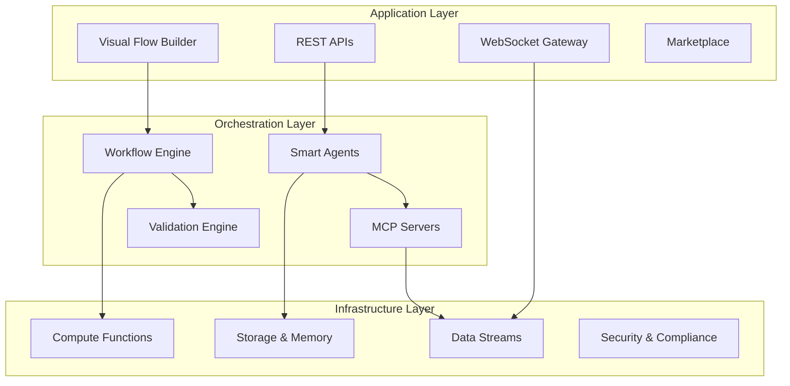
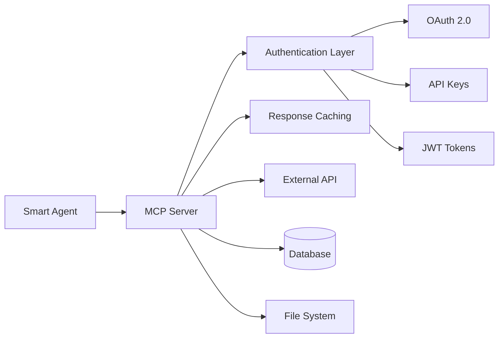
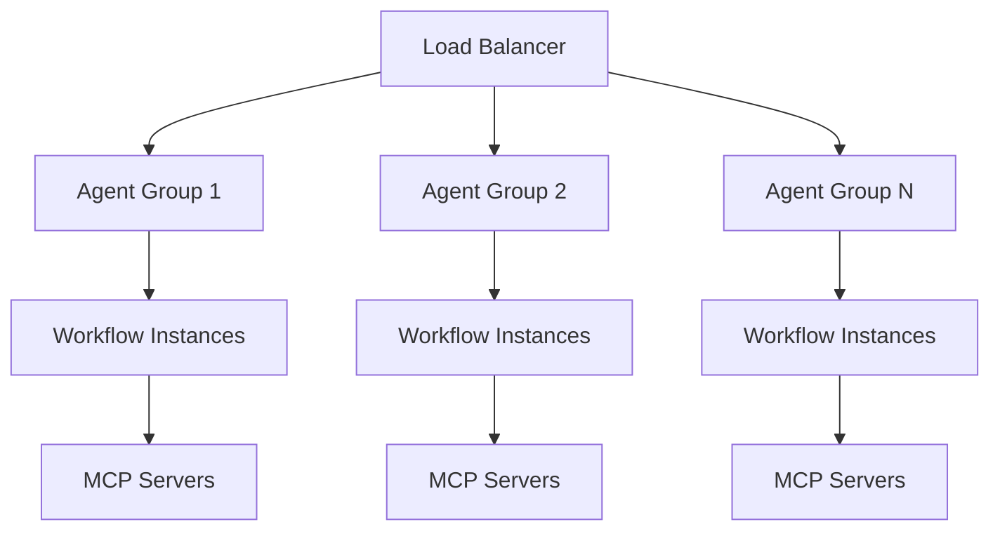

## System Architecture Overview

Microstrate's architecture is designed around three core layers that work together to provide a complete platform for intelligent automation.

## Application Layer

The **Application Layer** provides user interfaces and APIs for building, managing, and monitoring intelligent workflows.

<CardGroup cols={2}>
  <Card title="Visual Flow Builder" icon="sitemap">
    **Drag-and-drop workflow creation**
    - Intuitive interface for non-technical users
    - Real-time testing and validation
    - Version control and collaborative editing
    - Template library integration
  </Card>
  <Card title="REST APIs" icon="code">
    **Comprehensive programmatic access**
    - Full CRUD operations for all resources
    - Webhook support for event-driven automation
    - SDKs for popular programming languages
    - OpenAPI specification compliance
  </Card>
  <Card title="WebSocket Gateway" icon="bolt">
    **Real-time communication**
    - Live workflow execution monitoring
    - Streaming agent responses
    - Real-time collaboration features
    - Event-driven notifications
  </Card>
  <Card title="Marketplace" icon="store">
    **Solution discovery and sharing**
    - Browse and install pre-built solutions
    - Publish and monetize custom workflows
    - Community ratings and reviews
    - Automated dependency management
  </Card>
</CardGroup>

## Orchestration Layer

The **Orchestration Layer** contains the intelligent components that execute workflows and manage agent interactions.

### Smart Agents Engine

<Tabs>
  <Tab title="Agent Runtime">
    **Execution Environment**
    - Isolated agent instances with dedicated resources
    - Automatic scaling based on demand
    - Context preservation across conversations
    - Performance monitoring and optimization
  </Tab>
  <Tab title="Validation System">
    **Output Quality Assurance**
    - Schema-based response validation
    - Automatic correction loops for invalid outputs
    - Custom validation rules and business logic
    - Quality metrics and improvement tracking
  </Tab>
  <Tab title="Context Management">
    **Intelligent Memory System**
    - Relevance-based context inclusion
    - Automatic memory optimization
    - Cross-conversation context sharing
    - Configurable retention policies
  </Tab>
</Tabs>

### Workflow Engine

The workflow engine orchestrates complex multi-step processes involving multiple agents and systems.

<AccordionGroup>
  <Accordion title="Process Orchestration">
    - **Parallel Execution**: Run multiple workflow branches simultaneously
    - **Conditional Logic**: Dynamic routing based on data and decisions  
    - **Error Handling**: Automatic retry, fallback, and escalation patterns
    - **Human Gates**: Seamless human-in-the-loop integration
  </Accordion>

  <Accordion title="State Management">
    - **Persistent State**: Workflow state survives restarts and failures
    - **Checkpointing**: Resume workflows from any point
    - **State Sharing**: Pass data between workflow components
    - **Audit Trail**: Complete execution history and decision tracking
  </Accordion>

  <Accordion title="Integration Framework">
    - **MCP Protocol**: Native Model Context Protocol support
    - **HTTP Connectors**: RESTful API integration capabilities
    - **Custom Functions**: Deploy business logic as serverless functions
    - **Event Triggers**: Webhook and scheduled execution support
  </Accordion>
</AccordionGroup>

### MCP Server Architecture

Model Context Protocol servers provide standardized, secure interfaces to external systems.

<CardGroup cols={3}>
  <Card title="Auto-Generation" icon="magic">
    Generate MCP servers from OpenAPI specs or Postman collections
  </Card>
  <Card title="Security" icon="shield">
    Built-in authentication, encryption, and access control
  </Card>
  <Card title="Performance" icon="zap">
    Intelligent caching, rate limiting, and connection pooling
  </Card>
</CardGroup>

## Infrastructure Layer

The **Infrastructure Layer** provides enterprise-grade compute, storage, and networking capabilities.

### Microstrate Cloud Platform

<Tabs>
  <Tab title="Compute Infrastructure">
    **Serverless Functions & Containers**
    - Auto-scaling based on demand
    - Multiple runtime environments (Node.js, Python, etc.)
    - Sub-second cold start times
    - Built-in monitoring and logging
    
    **Container Orchestration**
    - Kubernetes-based container management
    - Automatic deployment and scaling
    - Health monitoring and automatic recovery
    - Resource optimization and cost control
  </Tab>
  
  <Tab title="Data & Storage">
    **Real-time Data Streams**
    - High-throughput message processing
    - Event sourcing and stream processing
    - Real-time analytics and monitoring
    - Durable message guarantees
    
    **Storage Solutions**
    - Agent memory and context storage
    - Workflow state persistence
    - File and document storage
    - Time-series metrics and logs
  </Tab>
  
  <Tab title="Networking">
    **Global Edge Network**
    - Multiple edge locations for low latency
    - Intelligent routing and load balancing
    - CDN for static assets and templates
    - DDoS protection and security filtering
    
    **API Gateway**
    - Rate limiting and throttling
    - Authentication and authorization
    - Request/response transformation
    - API versioning and backwards compatibility
  </Tab>
</Tabs>

### Security Architecture

<Info>
  Microstrate is built with security-first principles, ensuring enterprise-grade protection for your data and workflows.
</Info>

<AccordionGroup>
  <Accordion title="Data Protection">
    - **Encryption**: End-to-end encryption for data in transit and at rest
    - **Isolation**: Complete separation of customer data and workloads
    - **Access Control**: Role-based permissions and fine-grained access policies
    - **Audit Logging**: Comprehensive activity tracking and compliance reporting
  </Accordion>

  <Accordion title="Compliance & Certifications">
    - **ISO27001**: Information security management certification
    - **GDPR**: Full European data protection compliance
    - **SOC2 Type 2**: Independent security and availability validation (coming soon)
    - **Regional Compliance**: Adapt to local data residency requirements
  </Accordion>

  <Accordion title="Network Security">
    - **TLS 1.3**: Latest encryption standards for all communications
    - **VPC**: Virtual private clouds for enterprise customers
    - **Firewall**: Web application firewall and DDoS protection
    - **Monitoring**: 24/7 security monitoring and threat detection
  </Accordion>
</AccordionGroup>

## Deployment Models

Microstrate supports multiple deployment options to meet your organization's requirements.

<CardGroup cols={3}>
  <Card title="Microstrate Cloud" icon="cloud">
    **Fully Managed SaaS**
    - Multi-tenant shared infrastructure
    - Global edge locations
    - Automatic updates and maintenance
    - Pay-as-you-go pricing
  </Card>
  <Card title="Private Cloud" icon="building">
    **Dedicated Infrastructure**
    - Single-tenant dedicated resources
    - Custom security configurations
    - Enhanced SLA guarantees
    - Advanced compliance options
  </Card>
  <Card title="Hybrid/On-Premise" icon="server">
    **Bring Your Own Infrastructure**
    - Deploy on your cloud or on-premise
    - Full control over data and security
    - Custom networking configurations
    - Enterprise support and consulting
  </Card>
</CardGroup>

## Scaling & Performance

### Auto-Scaling Architecture

Microstrate automatically scales to handle varying workloads without manual intervention.

<CardGroup cols={2}>
  <Card title="Horizontal Scaling" icon="expand">
    Automatically add more agent instances and workflow runners as demand increases
  </Card>
  <Card title="Resource Optimization" icon="gauge">
    Intelligent resource allocation based on workflow complexity and performance requirements
  </Card>
  <Card title="Geographic Distribution" icon="globe">
    Deploy across multiple regions for optimal performance and disaster recovery
  </Card>
  <Card title="Cost Optimization" icon="dollar-sign">
    Scale down automatically during low usage periods to minimize costs
  </Card>
</CardGroup>

## Monitoring & Observability

Comprehensive monitoring and observability are built into every layer of the platform.

<Tabs>
  <Tab title="Real-time Metrics">
    - Workflow execution times and success rates
    - Agent performance and quality metrics
    - System resource utilization
    - API response times and error rates
  </Tab>
  <Tab title="Logging & Tracing">
    - Structured logging for all components
    - Distributed tracing across workflow steps
    - Error tracking and alerting
    - Custom log analysis and dashboards
  </Tab>
  <Tab title="Business Intelligence">
    - Workflow ROI and impact analysis
    - Usage patterns and optimization opportunities
    - Custom reporting and analytics
    - Integration with BI tools and dashboards
  </Tab>
</Tabs>

## Integration Patterns

Common architectural patterns for integrating Microstrate into your existing systems.

<AccordionGroup>
  <Accordion title="Event-Driven Architecture">
    Use webhooks and event streams to trigger workflows based on external events, creating reactive automation systems.
  </Accordion>

  <Accordion title="API-First Integration">
    Leverage comprehensive REST APIs to embed Microstrate capabilities into your existing applications and services.
  </Accordion>

  <Accordion title="Hub and Spoke">
    Position Microstrate as a central automation hub that connects and orchestrates multiple business systems.
  </Accordion>

  <Accordion title="Microservices Gateway">
    Use Microstrate agents as intelligent gateways that provide AI capabilities to existing microservices architectures.
  </Accordion>
</AccordionGroup>

<Card title="Need more technical details?" icon="wrench">
  Explore our [API Documentation](/api) for detailed technical specifications, or check out [Use Cases](/use-cases) to see these architectural patterns in action.
</Card>

## Next Steps

<CardGroup cols={2}>
  <Card title="Use Cases & Examples" icon="lightbulb" href="/use-cases">
    See real-world implementations of this architecture
  </Card>
  <Card title="Quick Start Guide" icon="rocket" href="/quickstart">
    Build your first workflow on this platform
  </Card>
  <Card title="API Reference" icon="code" href="/api">
    Technical documentation for developers
  </Card>
  <Card title="Security Guide" icon="shield" href="/security">
    Detailed security and compliance information
  </Card>
</CardGroup>